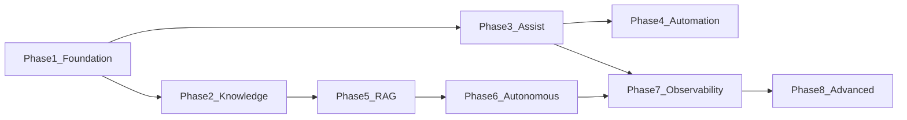
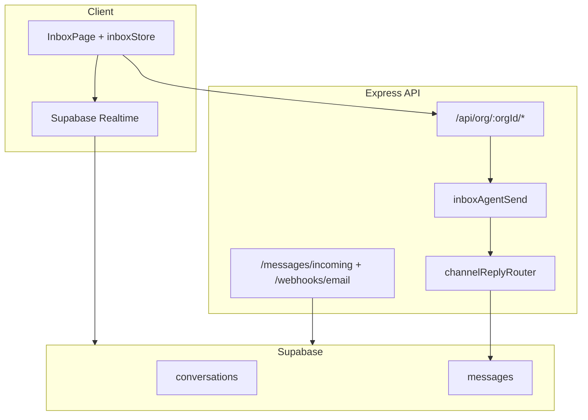
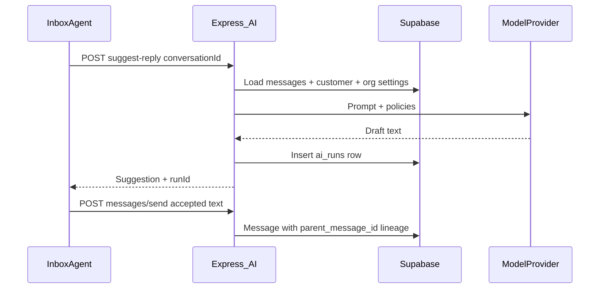
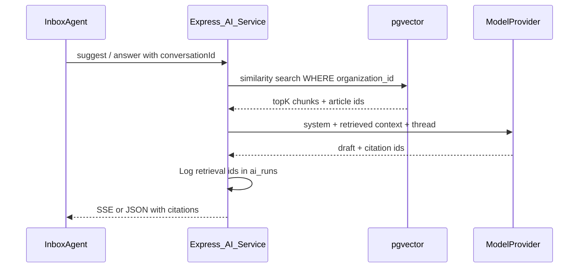
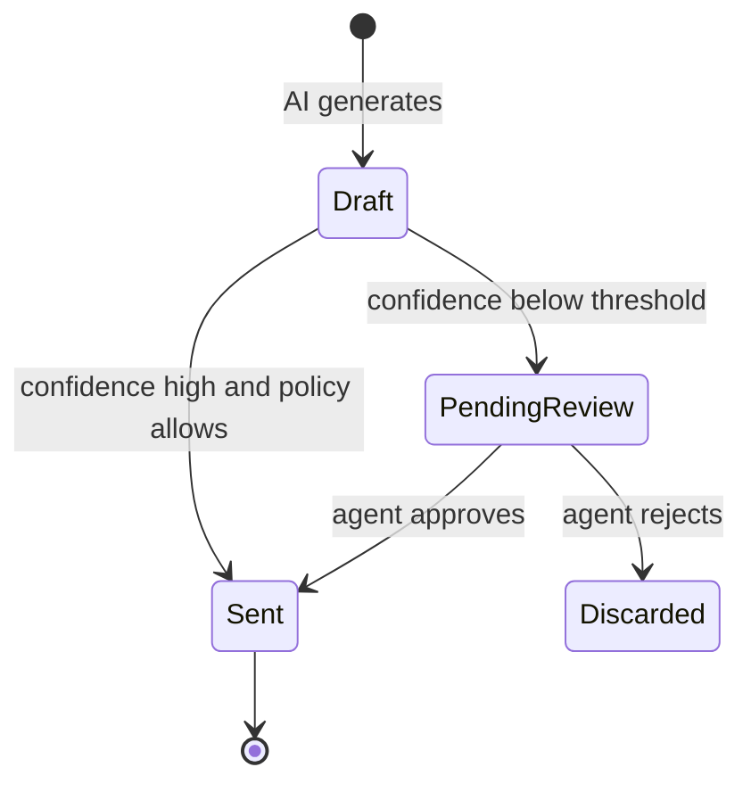
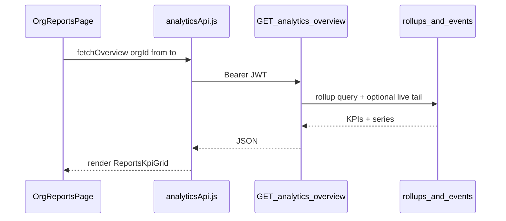
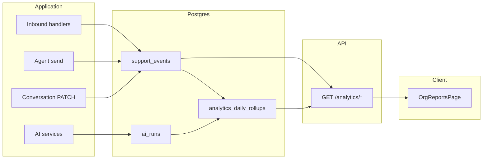

# AI Feature Design Guide

Engineering and product guide for building AI on top of the **AI Support System** monorepo (branded **Support Copilot** in the client). This document maps an eight-phase roadmap to the current codebase, lists prerequisites before each phase, and defines integration patterns so AI work extends the platform instead of bypassing it.

**Audience:** Engineers, product, and technical leads.  
**Stack:** React (Vite) client, Express 5 API, Supabase (Postgres + Auth + Realtime), `@ai-support/shared`.

---

## Table of contents

1. [Executive summary](#1-executive-summary)
2. [Current product baseline](#2-current-product-baseline)
3. [Phase 1 — Core Support Platform Foundation](#3-phase-1--core-support-platform-foundation)
4. [Phase 2 — Knowledge & Search Layer](#4-phase-2--knowledge--search-layer)
5. [Phase 3 — AI Agent Assistance](#5-phase-3--ai-agent-assistance)
6. [Phase 4 — AI Workflow Automation](#6-phase-4--ai-workflow-automation)
7. [Phase 5 — RAG & AI Copilot System](#7-phase-5--rag--ai-copilot-system)
8. [Phase 6 — Autonomous AI Support Agent](#8-phase-6--autonomous-ai-support-agent)
9. [Phase 7 — AI Reliability & Observability](#9-phase-7--ai-reliability--observability)
10. [Phase 8 — Advanced AI Operations Layer](#10-phase-8--advanced-ai-operations-layer)
11. [Cross-cutting technical standards](#11-cross-cutting-technical-standards)
12. [Implementation priority matrix](#12-implementation-priority-matrix)
13. [Suggested first sprint](#13-suggested-first-sprint)
14. [Analytics & Reports — backend, UI, and metrics](#14-analytics--reports--backend-ui-and-metrics)

---

## 1. Executive summary

### Product vision

Marketing and UI already position the product as an **AI-powered support copilot** (landing page, `APP_NAME = 'Support Copilot'`, Fin-style sidebar labels). Operationally, the system today is a **human-first, multi-tenant inbox**: conversations across email and web, agent replies, assignments, realtime updates, and org-scoped security.

AI should be introduced in layers: stabilize the support platform, add knowledge and retrieval, assist agents, automate workflows, then—only with guardrails—send autonomous customer replies.

### Guiding principles

| Principle | Meaning for this codebase |
|-----------|---------------------------|
| **Human-in-the-loop by default** | Phases 3–5 never send customer-visible messages without explicit agent action or Phase 6 approval rules. |
| **Org isolation** | Every AI query and storage row is scoped by `organization_id`; use `requireOrgAccess` and RLS, not global `/api/ai` alone. |
| **Auditability** | Use `messages.is_ai_generated`, `messages.parent_message_id`, and `ai_runs` logs for every model call. |
| **Channel-aware outbound** | AI replies must go through `channelReplyRouter.service.js`, same as human agent sends. |
| **Cost and latency budgets** | Classify on small models; RAG only when needed; stream Copilot UX via SSE. |
| **Feature flags** | Respect `conversations.ai_enabled` and org-level AI settings before any automation. |

### Roadmap at a glance



Phases 3 (assist) can start after Phase 1 is solid; Phase 2 strongly improves Phase 5+ but is not required for a minimal suggest-reply MVP.

---

## 2. Current product baseline

### What is implemented today

| Capability | Status | Key files |
|------------|--------|-----------|
| Multi-org tenancy, JWT auth, RLS | **Complete** | `server/src/middleware/orgAccess.js`, `supabase/migrations/20260512100000_multi_organization_saas.sql` |
| Conversations, messages, inbox filters | **Complete** | `server/src/services/support.service.js`, `server/src/services/conversationInboxFilters.service.js`, `client/src/stores/inboxStore.js` |
| Workspace states (status, priority, assignment) | **Complete** | `shared/src/conversationWorkspace.js`, `supabase/migrations/20260515120000_conversation_workspace_states.sql` |
| Email + web ingress and outbound | **Complete** | `server/src/services/emailWebhook.service.js`, `server/src/controllers/messages.controller.js`, `server/src/services/channelReplyRouter.service.js` |
| Agent send (pending → sent/failed) | **Complete** | `server/src/services/inboxAgentSend.service.js` |
| Realtime inbox + HTTP fallback | **Complete** | `client/src/hooks/useRealtimeInbox.js`, `client/src/services/realtime.js` |
| Internal notes | **Complete** | `shared/src/messageSenderTypes.js` (`internal_note`) |
| Assignment `assigned_to_ai` | **Partial** | DB + manual UI in `client/src/pages/InboxPage.jsx`; no AI worker consumes queue |
| AI schema hooks | **Partial** | `conversations.ai_enabled` wired; `messages.is_ai_generated`, `parent_message_id` unused until Phase 3+ |
| AI API | **Stub** | `server/src/controllers/ai.controller.js`, `POST /api/ai/assist` |
| Copilot / Fin / Knowledge UI | **Placeholder** | `InboxPage.jsx` Copilot tab, `HoverSidebar.jsx`, `settingsNav.js` |
| LLM / embeddings / RAG / KB | **Missing** | No provider SDKs in `server/package.json`; no vector extension in migrations |

### Architecture today



### AI-ready hooks (unused)

These exist so AI can plug in without schema refactors later:

- **`messages.sender_type = 'ai'`** — `shared/src/messageSenderTypes.js`
- **`conversations.assignment_type = 'assigned_to_ai'`** — requires `assigned_to_member_id IS NULL` (DB constraint)
- **`conversations.ai_enabled`** — `supabase/migrations/20260507141500_minimal_future_schema_hooks.sql`
- **`messages.is_ai_generated`**, **`messages.parent_message_id`** — provenance and draft lineage
- **`conversations.metadata`** — GIN index; comment in `20260510140000_conversation_inbox_filters.sql` mentions AI tags/classification (today used for mentions)

### What is not in the repo

- OpenAI / Anthropic / other model SDKs
- `OPENAI_API_KEY` or `LLM_*` in `server/.env.example`
- Knowledge base tables, chunking, embeddings, pgvector
- Job queue / rules engine for automation
- Unified analytics or `support_events` table
- Client calls to `/api/ai/assist`

---

## 3. Phase 1 — Core Support Platform Foundation

**Goal:** Stable multi-channel inbox, conversations, realtime messaging, assignments, permissions, analytics, and automation **infrastructure**—with no LLM dependency.

### Status: mostly complete

| Area | Status | Evidence |
|------|--------|----------|
| Multi-channel inbox | Complete | Email webhook + web `POST /api/org/:orgId/messages/incoming` |
| Conversations lifecycle | Complete | Statuses, reopen rules, `conversationUpdate.service.js` |
| Realtime messaging | Complete | `useRealtimeInbox.js`, publication migrations |
| Assignments | Complete | Member, team, unassigned, `assigned_to_ai` (manual) |
| Permissions | Complete | `requireOrgAccess`, conversation RLS migrations |
| Analytics | Complete | `support_events`, Reports API/UI — see §14 |
| Automation infrastructure | Complete | `automation_jobs`, worker, notify + SLA jobs |
| Org AI settings UI | Complete | `/org/:orgId/settings/ai`, `GET/PATCH .../settings/ai` |
| `ai_enabled` wiring | Complete | Default on create, patch on update, gates `assigned_to_ai` |
| Legacy tickets API | **Removed** | Use conversations API only |

### Phase 1 prerequisites checklist (close before Phase 2+)

Use this as a gate before any model integration:

- [x] **Analytics / events layer** — `support_events`, Reports API/UI per [§14](#14-analytics--reports--backend-ui-and-metrics); emit on lifecycle, outbound, SLA.
- [x] **Automation infrastructure** — Node worker + `automation_jobs` claim RPC; retries, idempotency keys.
- [x] **Org settings API + UI** — `/settings/ai`; toggles for AI phases + automation; `organizations.settings` JSONB.
- [x] **Wire `conversations.ai_enabled`** — Default on create, patch on update; block `assigned_to_ai` when org AI off.
- [x] **Isolate legacy tickets** — `/api/tickets/*` removed; conversations are the only support domain model.
- [x] **Operational hardening** — Redis-only rate limits, agent send limits, deduped failure logs — [operational-hardening.md](./features/operational-hardening.md).

### Phase 1 integration map

| Concern | Existing hook | Action |
|---------|---------------|--------|
| Inbound | `messages.controller.js`, `emailWebhook.service.js` | Emit `support_events` after successful insert |
| Outbound | `inboxAgentSend.service.js` | Emit event on sent/failed |
| Assignment | `conversationUpdate.service.js` | Emit event; respect `ai_enabled` when routing |
| Settings | `client/src/pages/settings/` | New `OrgAiSettingsPage.jsx` + `PATCH /api/org/:orgId/settings/ai` |
| Feature flag | `conversations.ai_enabled` | Read/write in `conversationUpdate` + inbound services |
| **Reports** | New analytics services + routes | `OrgReportsPage.jsx` at `/org/:orgId/reports`; wire `HoverSidebar` “Reports” |

---

## 4. Phase 2 — Knowledge & Search Layer

**Goal:** Knowledge base, semantic-ready search, tagging, internal notes leverage, and document retrieval **infrastructure** (embeddings optional until Phase 5).

### Prerequisites

- Phase 1 checklist complete (especially stable APIs and settings).
- File storage decision: Supabase Storage vs S3-compatible external bucket.
- Search: start with Postgres full-text search; design tables so `embedding vector` can be added later.

### Proposed data model

| Table | Purpose |
|-------|---------|
| `knowledge_sources` | URL, file upload, manual; `organization_id`, sync status |
| `knowledge_articles` | Title, slug, status (draft/published), `source_id` |
| `article_versions` | Immutable content snapshots for audit |
| `knowledge_chunks` | `article_version_id`, `content`, `token_count`, optional `embedding` (Phase 5) |
| `tag_definitions` | Org-scoped tag name, color, rules |
| `conversation_tags` | `conversation_id`, `tag_id` |

### Design notes

- **Internal notes** — Already supported via `sender_type: 'internal_note'`. Use for agent-only context; exclude from customer-facing RAG unless explicitly allowed.
- **Metadata tags** — Extend `conversations.metadata` for AI classification JSON until normalized tags exist.
- **Ingestion pipeline** — Upload → extract text → chunk (fixed size + overlap) → store chunks → (Phase 5) embed async.
- **Client** — Add routes behind sidebar “Knowledge” in `client/src/components/HoverSidebar.jsx`.

### Phase 2 integration map

| Feature | Server | Client |
|---------|--------|--------|
| CRUD articles | New `knowledge.service.js`, org routes | Knowledge list/editor pages |
| Search | `GET /api/org/:orgId/knowledge/search?q=` (FTS) | Search bar in Knowledge + inbox link |
| Link to conversation | Optional `conversation_id` on article feedback | Inbox “related articles” panel (Phase 5) |
| Tags | `tag_definitions` + PATCH conversation | Inbox tag chips, filter extension in `inboxFilters.js` |

---

## 5. Phase 3 — AI Agent Assistance

**Goal:** AI-powered reply suggestions, summaries, translation, tone rewrite, intent detection, sentiment analysis, and auto-tagging **for agents**—no autonomous customer sends.

### Prerequisites

- Phase 1 complete (events, settings, `ai_enabled` optional reads).
- Phase 2 optional but improves suggestion quality.
- Add to `server/package.json`: provider SDK or generic HTTP client.
- Extend `server/src/config/env.js`: `LLM_API_KEY`, `LLM_MODEL`, `LLM_BASE_URL` (provider-agnostic).
- Migration: `ai_runs` table (org, user, conversation, feature, model, tokens, latency, status, prompt_hash, error).
- Org-scoped rate limits on `/api/org/:orgId/ai/*`.

### Features and integration points

| Feature | Server hook | Client hook |
|---------|-------------|-------------|
| **Suggest reply** | `POST /api/org/:orgId/ai/suggest-reply` — build context from `GET .../conversations/:id/messages` | Inbox composer + **Copilot** tab (`InboxPage.jsx` ~806) |
| **Summarize thread** | `POST .../ai/summarize` | Copilot sidebar |
| **Translate** | `POST .../ai/translate` | Composer action menu |
| **Tone rewrite** | `POST .../ai/rewrite` | Composer action menu |
| **Intent / sentiment / auto-tags** | Post-inbound job or inline in `emailWebhook.service.js` / `messages.controller.js` | Write to `conversations.metadata`; optional inbox filter |
| **Health** | Keep `GET /api/ai/health`; add org-scoped readiness | Settings AI page |

### Data contract

When an agent **accepts** a suggestion:

1. Insert draft with `is_ai_generated = true`, `sender_type = 'agent'` (or keep as internal draft row).
2. On send, set `parent_message_id` to draft id; final sent row `is_ai_generated = true` if content unchanged.
3. Log correlation id in `ai_runs`.

Do **not** insert `sender_type: 'ai'` for Phase 3—that is Phase 6 customer-visible AI.

### Phase 3 service layout (new)

```
server/src/services/ai/
  llm.client.js          # Provider adapter, timeouts, retries
  prompts/
    suggestReply.js
    summarize.js
  assist.service.js      # Orchestration, context assembly
  classification.service.js  # Intent, sentiment, tags
```

Extend `server/src/routes/orgWorkspace.routes.js` with `ai.routes` mounted at `/ai`.

### Phase 3 sequence



---

## 6. Phase 4 — AI Workflow Automation

**Goal:** AI-based routing, priority detection, spam filtering, SLA-risk alerts, duplicate detection, and workflow-triggered automations—without full autonomous replies.

### Prerequisites

- Phase 3 classification signals in `conversations.metadata`.
- Durable job runner from Phase 1.
- Idempotency for automation actions (same pattern as `handle_incoming_message`).

### Rule model (proposed)

```
trigger: inbound_message | sla_warning | tag_added | schedule
conditions: metadata.intent, priority, channel, business_hours
actions: set_assignment | set_priority | add_tag | notify | assign_to_ai | enqueue_phase6
```

### Integration map

| Automation | Trigger file | Action file |
|------------|--------------|-------------|
| Auto-assign / route | After inbound insert | `conversationUpdate.service.js` |
| Priority bump | Classification job | `conversationUpdate.service.js` |
| Spam / duplicate block | Pre-insert in ingress | `emailWebhook.service.js`, messages controller |
| SLA alert | Cron / scheduled job | Notification services + `support_events` |
| Inbox segments | New filters | `conversationInboxFilters.service.js`, `client/src/config/inboxFilters.js` |

### Worker options

| Option | Pros | Cons |
|--------|------|------|
| Supabase Edge Functions + `pg_cron` | Close to DB, no extra infra | Cold start, limited runtime |
| BullMQ + Redis on Node | Full control, retries | Ops overhead |
| DB-only (`pg_notify` + listener) | Simple | Harder to scale complex flows |

Recommendation: start with **Supabase Edge Function** for inbound-triggered light rules; move heavy pipelines to a **Node worker** when Phase 5–6 load grows.

---

## 7. Phase 5 — RAG & AI Copilot System

**Goal:** Vector search, embeddings pipeline, contextual retrieval, AI article recommendations, and organization-aware copilots.

### Prerequisites

- Phase 2 KB with chunks populated.
- Migration: `CREATE EXTENSION vector`; `knowledge_chunks.embedding vector(1536)` (dimension per model).
- Background worker: embed new/updated chunks; re-embed on article publish.
- Phase 3 Copilot UI shell wired to streaming endpoint.

### RAG flow



### Integration map

| Component | Location |
|-----------|----------|
| Embed on ingest | Worker calling `ai/embedding.service.js` |
| Retrieve | `ai/rag.service.js` used by `assist.service.js` |
| API | `POST /api/org/:orgId/ai/ask`, `POST .../ai/suggest-reply` (RAG mode) |
| Citations UI | Copilot panel in `InboxPage.jsx` |
| Deprecate global stub | Migrate `POST /api/ai/assist` → org-scoped routes |

### Retrieval policies

- Always filter by `organization_id`.
- Boost published articles; deprioritize draft chunks.
- Include conversation summary (Phase 3) in query expansion.
- Max context tokens budget per org tier (settings).

---

## 8. Phase 6 — Autonomous AI Support Agent

**Goal:** AI-generated **customer-visible** replies with confidence scoring, human fallback, escalation, guardrails, and approval workflows.

### Prerequisites

- Phases 3–5 in production with measured acceptance rates.
- Phase 1 `ai_enabled` and org settings enforced.
- Approval UX in inbox (review queue).
- Observability baseline (Phase 7 `ai_runs`—start logging in Phase 3).

### Outbound path (critical)

Mirror human send—do not invent a parallel path:

```
sendInboxAiOutboundMessage()
  → insert message sender_type: 'ai', is_ai_generated: true
  → channelReplyRouter.service.js
  → EmailAdapter / WebAdapter
  → emailOutboundDbSync (status updates)
```

Reference implementation: `server/src/services/inboxAgentSend.service.js`.

### Assignment and gating

- Queue: `assignment_type = 'assigned_to_ai'` (already in UI and `conversationUpdate.service.js`).
- Gate: `conversations.ai_enabled === true`.
- Low confidence → leave as draft or escalate to human (`assigned_to_agent`).

### Approval workflow



Draft rows: `is_ai_generated = true`, not delivered via channel until approved.

### Safety checklist

- [ ] PII redaction before prompt construction
- [ ] Topic blocklist per org (legal, medical, etc.)
- [ ] Max tokens and cost cap per conversation/day
- [ ] Escalation on negative sentiment or repeated customer frustration
- [ ] Never auto-send when `ai_enabled` is false

---

## 9. Phase 7 — AI Reliability & Observability

**Goal:** Prompt versioning, evaluation pipelines, hallucination tracking, tracing, feedback loops, AI analytics, and debugging.

### Prerequisites

- `ai_runs` populated from Phases 3–6.
- `support_events` from Phase 1.

### Components

| Component | Purpose |
|-----------|---------|
| `prompt_versions` | Immutable templates per feature + version tag |
| `org_ai_settings` | Model, temperature, RAG topK, automation thresholds |
| Eval datasets | Golden conversations; regression on deploy |
| Tracing | OpenTelemetry or Langfuse-style trace ids on `ai_runs` |
| Feedback | Thumbs on suggestions and AI messages → quality metrics |
| Dashboards | Implemented in [§14 Reports UI](#14-analytics--reports--backend-ui-and-metrics) (AI tab + drill-down) |

### Metrics to track

Full definitions and API mapping live in [§14](#14-analytics--reports--backend-ui-and-metrics). Phase 7 adds operational depth (eval regressions, trace viewer); day-to-day AI health is visible on the **Reports → AI** tab from Phase 3 onward.

- Suggestion acceptance rate (Phase 3)
- Auto-send rate vs escalation (Phase 6)
- Retrieval hit rate / empty retrieval rate (Phase 5)
- Customer reply after AI message (CSAT proxy)
- Hallucination reports (agent-flagged)

---

## 10. Phase 8 — Advanced AI Operations Layer

**Goal:** AI QA scoring, agent coaching, workflow generation, voice AI, predictive support, and multi-agent orchestration.

### Prerequisites

- Stable Phase 7 pipelines and historical `ai_runs` + outcomes.

### Capabilities (high level)

| Capability | Approach |
|------------|----------|
| AI QA on closed conversations | Batch job + rubric prompt; store score on conversation |
| Agent coaching | Aggregate successful `ai_runs` + edits (diff draft vs sent) |
| Workflow generation | LLM proposes Phase 4 rules; human approves in settings |
| Voice channel | New adapter parallel to `server/src/adapters/EmailAdapter.js` |
| Predictive support | Forecast volume / SLA risk from `support_events` |
| Multi-agent orchestration | Router agent delegates to retrieval, drafting, policy agents |

---

## 11. Cross-cutting technical standards

### API shape

- Prefer **org-scoped** routes: `/api/org/:orgId/ai/*` with `requireOrgAccess`.
- Keep global `/api/ai/health` for ops; migrate assist to org routes.
- Request body: `{ conversationId, feature, options }`; never trust client-sent `organizationId` in body.

### Service layout

```
server/src/services/ai/
  llm.client.js
  embedding.service.js
  rag.service.js
  classification.service.js
  assist.service.js
  aiOutbound.service.js
  prompts/
server/src/controllers/ai.controller.js   # thin handlers
server/src/routes/orgAi.routes.js         # mounted under org workspace
```

### Tenancy and security

- Filter every DB query with `organization_id` from `req.params.orgId`.
- Service role on server only (`supabaseAdmin`); never expose keys to client.
- Do not log raw message bodies in production; log ids and `prompt_hash`.

### Shared package

Add to `shared/src/` as needed:

- `aiFeatures.js` — enum: `suggest_reply`, `summarize`, `rag_ask`, etc.
- `aiRunStatus.js` — `success`, `error`, `timeout`, `blocked_policy`

### Streaming

- Use SSE from Express for Copilot (`Content-Type: text/event-stream`).
- Client: `EventSource` or fetch reader in Copilot panel.

### Feature flags

- Per-org: `organizations.settings.ai` or `org_ai_settings`.
- Per-conversation: `conversations.ai_enabled`.
- Per-channel: optional `channels.metadata.ai_allowed`.

### Anti-patterns (do not)

| Anti-pattern | Why |
|--------------|-----|
| Send customer email directly from AI service | Bypasses adapters, thread state, status tracking |
| Store API keys in client | Security |
| Skip `is_ai_generated` | Breaks audit and Phase 7 eval |
| Build on `/api/tickets` stubs | Wrong domain model |
| Global `/api/ai/assist` without org scope | Tenancy leak risk |

---

## 12. Implementation priority matrix

| Phase | Must complete before AI work | Can parallelize | Repo status |
|-------|------------------------------|-----------------|-------------|
| **1** Foundation | Yes (all later phases) | — | **Complete** (Phase 1 checklist); multi-instance rate limits / alerts are ops follow-ups |
| **2** Knowledge | Before Phase 5 RAG | With Phase 3 if assist uses thread only | **Missing** |
| **3** Agent assist | After Phase 1 | With Phase 2 | **Missing** (stub API only) |
| **4** Workflow automation | After Phase 3 signals | With Phase 5 infra | **Missing** |
| **5** RAG Copilot | After Phase 2 | After Phase 3 MVP | **Missing** |
| **6** Autonomous agent | After 3–5 + approval UX | — | **Missing** |
| **7** Observability | Start logging in Phase 3; full suite before Phase 6 scale | With Phase 3+ | **Missing** |
| **8** Advanced ops | After Phase 7 | — | **Missing** |

### Per-phase file reference (existing codebase)

| Phase | Server files to extend | Client files to extend |
|-------|------------------------|-------------------------|
| 1 | `conversationUpdate.service.js`, `emailWebhook.service.js`, `messages.controller.js`, `analytics.service.js` | `settings/`, `OrgReportsPage.jsx`, `HoverSidebar` Reports nav |
| 2 | New `knowledge.service.js`, org routes | `HoverSidebar.jsx`, new Knowledge pages |
| 3 | `ai.controller.js` → org AI routes, new `services/ai/*` | `InboxPage.jsx`, `inboxApi.js` |
| 4 | Ingress services, `conversationInboxFilters.service.js` | `inboxFilters.js`, Inbox UI |
| 5 | `services/ai/rag.service.js`, migrations (pgvector) | Copilot citations UI |
| 6 | `aiOutbound.service.js`, `channelReplyRouter.service.js` | Approval queue UI |
| 7 | `ai_runs` queries, eval jobs | Reports AI tab drill-down, feedback widgets on suggestions |
| 8 | New orchestrator service, voice adapter | Coaching / QA views |

---

## 13. Suggested first sprint

Ordered for momentum without skipping foundations:

1. **Phase 1 gaps (week 1–2)**  
   - Wire `conversations.ai_enabled` read/write.  
   - Add `support_events` + daily rollups + Reports API (overview tab only).  
   - Ship `OrgReportsPage` with product KPIs; wire `HoverSidebar` “Reports” → `/org/:orgId/reports`.  
   - Implement `OrgAiSettingsPage` + API for toggles behind `settingsNav` id `ai`.

2. **Phase 3 MVP (week 2–3)**  
   - `ai_runs` migration + `llm.client.js` + `POST .../ai/suggest-reply`.  
   - Wire Copilot tab in `InboxPage.jsx` to org-scoped endpoint (streaming optional).  
   - Insert lineage via `parent_message_id` when agent sends accepted suggestion.

3. **Defer Phase 6** until approval UI, `ai_runs` dashboards, and RAG citation quality are acceptable in production.

4. **Phase 2 in parallel** if team capacity allows—improves suggest-reply before RAG is mandatory.

5. **Reports AI tab (week 3+)** — Enable when `ai_runs` exists; empty state until Phase 3 ships.

---

## 14. Analytics & Reports — backend, UI, and metrics

**Goal:** One org-scoped **Reports** experience that shows **product health** (inbox, channels, team) and **AI performance** (assist, RAG, autonomous agent) with shared date ranges, export, and role-based access. Sidebar label **Reports** already exists in `client/src/components/HoverSidebar.jsx` (`SquareChartGantt` icon) but has no route—this section defines the full stack.

### 14.1 Principles

| Principle | Implementation |
|-----------|----------------|
| **Org-scoped** | All queries filter `organization_id` from URL; `requireOrgAccess` on every analytics route. |
| **Event-sourced + rollups** | Raw `support_events` for drill-down; pre-aggregated `analytics_daily_rollups` for fast dashboards. |
| **Phase-gated UI** | Tabs/sections show “Available when AI assist is enabled” until the backing phase ships; never fake zeros. |
| **No PII in aggregates** | Counts and durations only in rollups; message bodies only in admin drill-down with audit log. |
| **Align with inbox** | Same channel/assignment vocabulary as `shared/src/conversationWorkspace.js` and inbox filters. |

### 14.2 Data model (backend)

#### `support_events` (append-only, Phase 1)

Immutable event log for product and automation triggers.

```sql
-- Proposed migration: analytics_support_events.sql
create table public.support_events (
  id uuid primary key default gen_random_uuid(),
  organization_id uuid not null references public.organizations(id) on delete cascade,
  event_type text not null,
  entity_type text not null,  -- conversation | message | customer | member
  entity_id uuid not null,
  actor_member_id uuid null references public.organization_members(id) on delete set null,
  channel_type text null,     -- email | web | ...
  payload jsonb not null default '{}',
  created_at timestamptz not null default now()
);

create index idx_support_events_org_created
  on public.support_events (organization_id, created_at desc);
create index idx_support_events_org_type_created
  on public.support_events (organization_id, event_type, created_at desc);
```

**`event_type` catalog (product):**

| `event_type` | When emitted | `payload` hints |
|--------------|--------------|-----------------|
| `message.inbound` | Customer message persisted | `channel_type`, `conversation_id`, `message_id` |
| `message.outbound_sent` | Agent/AI message marked sent | `sender_type`, `latency_ms` |
| `message.outbound_failed` | Outbound failed | `error_code` |
| `conversation.created` | New conversation | `channel_type` |
| `conversation.closed` | Status → closed | `resolution_time_sec` |
| `conversation.reopened` | Status reopened | — |
| `conversation.assigned` | Assignment changed | `assignment_type`, `assigned_to_member_id` |
| `conversation.priority_changed` | Priority updated | `priority` |
| `member.first_response` | First agent reply in conversation | `response_time_sec` |

**Emit from:**

- `server/src/services/emailWebhook.service.js` — after inbound persist
- `server/src/controllers/messages.controller.js` — web incoming
- `server/src/services/inboxAgentSend.service.js` — sent/failed
- `server/src/services/conversationUpdate.service.js` — assignment, status, priority

#### `ai_runs` (Phase 3+)

One row per model invocation (assist, classify, RAG, autonomous draft).

```sql
create table public.ai_runs (
  id uuid primary key default gen_random_uuid(),
  organization_id uuid not null references public.organizations(id) on delete cascade,
  conversation_id uuid null references public.conversations(id) on delete set null,
  message_id uuid null references public.messages(id) on delete set null,
  triggered_by_member_id uuid null references public.organization_members(id) on delete set null,
  feature text not null,       -- suggest_reply | summarize | classify | rag_ask | auto_reply
  model text not null,
  status text not null,        -- success | error | timeout | blocked_policy
  prompt_hash text null,
  input_tokens int null,
  output_tokens int null,
  latency_ms int null,
  retrieval_chunk_ids uuid[] null,
  confidence numeric(5,4) null,
  error_code text null,
  created_at timestamptz not null default now()
);
```

#### `ai_feedback` (Phase 3+)

Agent thumbs on suggestions or AI messages.

```sql
create table public.ai_feedback (
  id uuid primary key default gen_random_uuid(),
  organization_id uuid not null references public.organizations(id) on delete cascade,
  ai_run_id uuid null references public.ai_runs(id) on delete cascade,
  message_id uuid null references public.messages(id) on delete cascade,
  member_id uuid not null references public.organization_members(id) on delete cascade,
  rating smallint not null check (rating in (-1, 1)),
  reason text null,
  created_at timestamptz not null default now()
);
```

#### `analytics_daily_rollups` (Phase 1, populated by job)

Pre-computed per org per day for dashboard cards and charts (avoid scanning millions of events on each page load).

```sql
create table public.analytics_daily_rollups (
  organization_id uuid not null references public.organizations(id) on delete cascade,
  date date not null,
  metric_key text not null,
  dimensions jsonb not null default '{}',  -- e.g. {"channel":"email","assignment_type":"assigned_to_ai"}
  value_numeric numeric null,
  value_json jsonb null,
  primary key (organization_id, date, metric_key, dimensions)
);
```

**Example `metric_key` values:** `conversations.created`, `conversations.closed`, `messages.inbound`, `messages.outbound`, `first_response_time.p50`, `resolution_time.p50`, `ai.runs.total`, `ai.suggest_reply.acceptance_rate`, `ai.tokens.total`.

**Rollup job:** Supabase `pg_cron` or Node worker nightly; backfill last 90 days on first deploy.

### 14.3 API (backend)

Mount under org workspace: `/api/org/:orgId/analytics/*`.

| Method | Path | Purpose | Phase |
|--------|------|---------|-------|
| `GET` | `/analytics/overview` | KPI cards + sparkline series for date range | 1 |
| `GET` | `/analytics/conversations` | Volume, status breakdown, channel split | 1 |
| `GET` | `/analytics/team` | Per-member responses, assignments (ADMIN sees all; AGENT sees self) | 1 |
| `GET` | `/analytics/ai` | AI-specific KPIs, feature breakdown, token spend | 3+ |
| `GET` | `/analytics/ai/runs` | Paginated `ai_runs` for drill-down table | 3+ |
| `GET` | `/analytics/export` | CSV export for current tab + range | 1 |
| `GET` | `/analytics/realtime` | Optional: last-24h counters from events (no rollup lag) | 1 |

**Query parameters (all endpoints):**

- `from`, `to` — ISO dates (default: last 7 days)
- `granularity` — `hour` | `day` | `week` (charts)
- `channel` — optional filter: `email` | `web`
- `compare` — optional previous period for delta %

**Response shape (overview example):**

```json
{
  "range": { "from": "2026-05-08", "to": "2026-05-15" },
  "compare": { "from": "2026-05-01", "to": "2026-05-07" },
  "kpis": [
    {
      "id": "conversations_open",
      "label": "Open conversations",
      "value": 42,
      "deltaPercent": -8.2,
      "unit": "count"
    },
    {
      "id": "median_first_response_time",
      "label": "Median first response",
      "value": 384,
      "deltaPercent": 12.1,
      "unit": "seconds"
    }
  ],
  "series": {
    "conversations_created": [{ "t": "2026-05-08", "v": 12 }, "..."]
  },
  "ai": {
    "enabled": true,
    "available": false,
    "message": "AI metrics appear after AI assist is configured."
  }
}
```

**Service layout:**

```
server/src/services/analytics/
  supportEvents.service.js    # insertEvent(), batch insert
  rollups.service.js          # computeDailyRollups(orgId, date)
  overview.service.js         # KPI + series from rollups + live tail
  teamMetrics.service.js
  aiMetrics.service.js        # joins ai_runs, ai_feedback
server/src/controllers/analytics.controller.js
server/src/routes/orgAnalytics.routes.js   # mounted in orgWorkspace.routes.js
```

**Performance:** Overview reads rollups only; drill-down tables read `support_events` / `ai_runs` with cursor pagination (`limit` max 100).

### 14.4 Stats catalog — product vs AI

#### Product metrics (Reports → **Overview** & **Conversations** tabs, Phase 1)

| Metric | Definition | Source |
|--------|------------|--------|
| Open conversations | Count `status` in active set | `conversations` snapshot or rollup |
| New conversations | Created in range | `support_events` / rollup |
| Closed conversations | Closed in range | `support_events` |
| Inbound messages | Customer messages | `message.inbound` events |
| Outbound messages | Agent (+ later AI) sent | `message.outbound_sent` |
| Median first response time | Inbound → first `sender_type=agent` | Event pairing or rollup p50 |
| Median resolution time | Created → `conversation.closed` | Rollup |
| Conversations by channel | email vs web | `dimensions.channel` |
| Conversations by status | open, pending, closed, … | `conversationWorkspace` statuses |
| Assignment distribution | unassigned, agent, team, `assigned_to_ai` | PATCH events |
| Outbound failure rate | failed / (sent + failed) | Outbound events |
| Active agents | Members with ≥1 outbound in range | Team tab |

#### AI metrics (Reports → **AI** tab, phased)

| Metric | Definition | Available |
|--------|------------|-----------|
| AI assist usage | Count `ai_runs` where `feature` = suggest_reply, summarize, rewrite, translate | Phase 3 |
| Suggestion acceptance rate | Suggestions accepted / suggestions shown | Phase 3 (`ai_feedback` + send lineage via `parent_message_id`) |
| Suggestion edit distance | % of accepted suggestions edited before send | Phase 3 |
| Copilot latency p50 / p95 | `ai_runs.latency_ms` by feature | Phase 3 |
| Token usage | Sum `input_tokens` + `output_tokens` by day | Phase 3 |
| Estimated cost | tokens × org price table in settings | Phase 3 |
| Auto-tags applied | Classify runs → tags in `conversations.metadata` | Phase 3–4 |
| Intent / sentiment distribution | Histogram from classification payload | Phase 3–4 |
| RAG queries | `feature = rag_ask` count | Phase 5 |
| Retrieval hit rate | Runs with `retrieval_chunk_ids` length > 0 | Phase 5 |
| Empty retrieval rate | RAG runs with zero chunks | Phase 5 |
| KB articles cited | Top article ids from retrieval | Phase 5 |
| AI conversations handled | `assignment_type = assigned_to_ai` volume | Phase 4–6 |
| AI messages sent | `sender_type = ai` outbound | Phase 6 |
| Auto-send rate | AI outbound without human approval / total AI drafts | Phase 6 |
| Escalation to human | AI queue → `assigned_to_agent` after AI touch | Phase 6 |
| Deflection proxy | Closed after AI reply with no further customer inbound in 24h | Phase 6 |
| Customer reply after AI | Inbound within N hours after AI message | Phase 6 |
| Thumbs up/down rate | `ai_feedback` aggregates | Phase 3+ |
| Hallucination flags | Negative feedback `reason = hallucination` | Phase 7 |
| Policy blocks | `ai_runs.status = blocked_policy` | Phase 6+ |
| Eval regression score | Latest eval job vs baseline | Phase 7 |

#### Knowledge metrics (Reports → **Knowledge** tab, Phase 2+)

| Metric | Definition | Phase |
|--------|------------|-------|
| Published articles | Count by status | 2 |
| Article views / inserts from inbox | Event `knowledge.article_viewed` | 2+ |
| Search queries | KB search API hits | 2 |
| Stale articles | Not updated in N days | 2 |

### 14.5 Reports UI (frontend)

#### Routing and navigation

Add to `client/src/App.jsx` under `OrgWorkspaceLayout`:

```jsx
<Route path="reports" element={<OrgReportsPage />} />
```

Wire `HoverSidebar.jsx` **Reports** item:

```js
navigate(`/org/${orgId}/reports`)
```

Match existing workspace chrome: `OrgWorkspaceLayout` + `WorkspaceNavbar` (same as inbox).

#### Page structure: `OrgReportsPage.jsx`

```
client/src/pages/OrgReportsPage.jsx
client/src/components/reports/
  ReportsDateRangePicker.jsx
  ReportsKpiGrid.jsx
  ReportsLineChart.jsx
  ReportsBarChart.jsx
  ReportsAiTab.jsx
  ReportsTeamTable.jsx
  ReportsExportButton.jsx
client/src/services/analyticsApi.js
client/src/hooks/useAnalyticsOverview.js
```

**Layout (wireframe):**

```
┌─────────────────────────────────────────────────────────────┐
│ Reports          [Last 7 days ▼]  [Compare ○]  [Export CSV] │
├──────────┬──────────────────────────────────────────────────┤
│ Overview │  KPI grid (4–6 cards with delta %)               │
│ Convers. │  ┌─────────────┐ ┌─────────────┐                 │
│ Team     │  │ Line chart  │ │ Donut channel│                │
│ AI       │  └─────────────┘ └─────────────┘                 │
│ Knowledge│  (optional table / drill-down link → inbox)      │
└──────────┴──────────────────────────────────────────────────┘
```

**Tabs:**

| Tab | Content | Min phase |
|-----|---------|-----------|
| **Overview** | Product KPIs + conversation volume trend | 1 |
| **Conversations** | Status/channel/assignment breakdowns | 1 |
| **Team** | Per-agent table; ADMIN all, AGENT self | 1 |
| **AI** | AI KPI grid, feature breakdown, token chart, link to runs table | 3 (empty state before) |
| **Knowledge** | Article counts, search volume | 2 (hidden until KB exists) |

**AI tab empty state (Phase 1–2):**

> Enable AI assist in Settings → AI & Automation to see suggestion acceptance, token usage, and copilot performance.

**Drill-down:** Clicking a KPI opens side panel or `/reports/ai/runs?feature=suggest_reply` with paginated table (`ai_run_id`, conversation link, latency, status, feedback).

#### Visual design

- Reuse inbox dark theme (`bg-[#0b1020]`, cards `bg-[#151b2e]`, borders `#1d253a`) for consistency with `OrgSettingsLayout`.
- KPI cards: large value, small label, green/red delta vs compare period.
- Charts: lightweight library (e.g. Recharts) or CSS-only sparklines for v1.

#### Client data flow



### 14.6 Permissions

| Role | Overview / Conversations | Team tab | AI tab | Export | `ai_runs` drill-down |
|------|--------------------------|----------|--------|--------|----------------------|
| **ADMIN** | Full org | All members | Full | Yes | Full |
| **AGENT** | Full org | Own row only | Usage + own feedback | Own scope optional | Own `triggered_by_member_id` only |

Enforce in `analytics.controller.js` via `req.orgMembership.role` from `orgAccess` middleware.

### 14.7 Event → metric pipeline



### 14.8 Implementation order

| Step | Deliverable | Phase |
|------|-------------|-------|
| 1 | `support_events` migration + `supportEvents.service.js` + emitters | 1 |
| 2 | `analytics_daily_rollups` + nightly job | 1 |
| 3 | `GET /analytics/overview`, `/conversations`, `/team` | 1 |
| 4 | `OrgReportsPage` Overview + Conversations + Team tabs; sidebar link | 1 |
| 5 | `ai_runs` + `ai_feedback` migrations; emit from AI services | 3 |
| 6 | `GET /analytics/ai` + AI tab UI | 3 |
| 7 | Knowledge tab + events | 2 |
| 8 | Export CSV, compare period, eval widgets | 7 |

### 14.9 Shared types

Add to `shared/src/`:

- `supportEventTypes.js` — enum mirroring `event_type` catalog
- `analyticsMetricKeys.js` — rollup keys for server/client parity
- `analyticsRange.js` — helpers for `from`/`to` validation (Zod on server)

---

## Appendix A — Key file index

| Concern | Path |
|---------|------|
| API bootstrap | `server/src/app.js` |
| Org workspace routes | `server/src/routes/orgWorkspace.routes.js` |
| AI stub | `server/src/controllers/ai.controller.js`, `server/src/routes/ai.routes.js` |
| Support core | `server/src/services/support.service.js` |
| Agent outbound | `server/src/services/inboxAgentSend.service.js` |
| Channel routing | `server/src/services/channelReplyRouter.service.js` |
| Email inbound | `server/src/services/emailWebhook.service.js` |
| Web inbound | `server/src/controllers/messages.controller.js` |
| Conversation PATCH | `server/src/services/conversationUpdate.service.js` |
| Inbox filters | `server/src/services/conversationInboxFilters.service.js` |
| Inbox UI | `client/src/pages/InboxPage.jsx` |
| Inbox state | `client/src/stores/inboxStore.js` |
| Realtime | `client/src/hooks/useRealtimeInbox.js` |
| Sender types | `shared/src/messageSenderTypes.js` |
| Assignment types | `shared/src/conversationWorkspace.js` |
| AI schema hooks | `supabase/migrations/20260507141500_minimal_future_schema_hooks.sql` |
| Workspace states | `supabase/migrations/20260515120000_conversation_workspace_states.sql` |
| Reports sidebar (unwired) | `client/src/components/HoverSidebar.jsx` |
| Settings shell | `client/src/pages/OrgSettingsLayout.jsx`, `client/src/pages/settings/settingsNav.js` |

### Analytics (to implement)

| Concern | Path |
|---------|------|
| Events insert | `server/src/services/analytics/supportEvents.service.js` |
| Rollups | `server/src/services/analytics/rollups.service.js` |
| Metrics API | `server/src/controllers/analytics.controller.js`, `server/src/routes/orgAnalytics.routes.js` |
| Reports UI | `client/src/pages/OrgReportsPage.jsx`, `client/src/services/analyticsApi.js` |
| Migrations | `supabase/migrations/*_analytics_support_events.sql`, `*_ai_runs.sql`, `*_analytics_daily_rollups.sql` |

---

## Appendix B — Environment variables (future)

Add to `server/.env.example` when implementing Phase 3+ (do not commit secrets):

| Variable | Purpose |
|----------|---------|
| `LLM_API_KEY` | Provider API key |
| `LLM_MODEL` | Default chat model |
| `LLM_BASE_URL` | Optional compatible API base |
| `EMBEDDING_MODEL` | Phase 5 embeddings |
| `AI_RATE_LIMIT_PER_ORG` | Requests per minute |

Validate in `server/src/config/env.js` at startup when `AI_FEATURES_ENABLED=true`.

---

*Last updated: Phase 1 checklist (analytics, automation, org AI settings, `ai_enabled`) marked complete; §14 Analytics & Reports catalog unchanged.*
