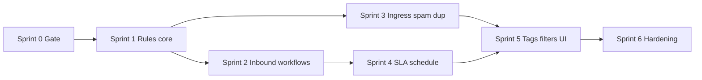
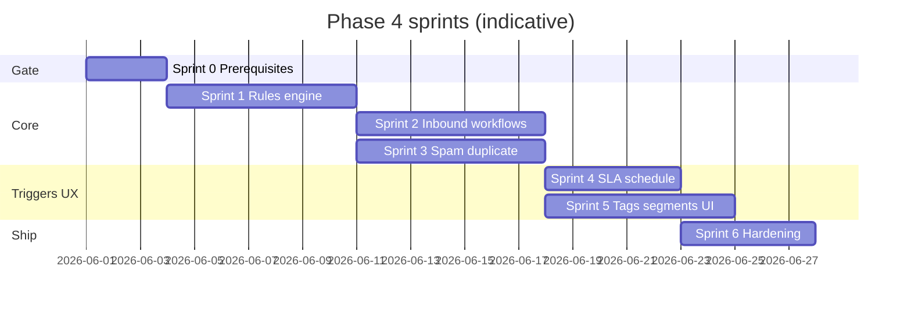

# Phase 4 — AI Workflow Automation — Implementation sprints

Parent: [AI-FEATURE-DESIGN.md](./AI-FEATURE-DESIGN.md) §6  

Prerequisites:

- Phase 3: classification signals (`intent`, `sentiment`, auto-tags, etc.) in `conversations.metadata` (see [phase-3-sprints.md](./phase-3-sprints.md) Sprint 4).
- Phase 1: durable `automation_jobs` worker, idempotent ingress patterns (`handle_incoming_message` style dedupe).

Last updated: 2026-05-20

---

## Phase 4 goal (from design §6)

**AI-based routing, priority detection, spam filtering, SLA-risk alerts, duplicate detection, and workflow-triggered automations** — **without** customer-visible autonomous replies (Phase 6).

---

## Rule model (target)

Triggers, conditions, and actions aligned with [AI-FEATURE-DESIGN.md](./AI-FEATURE-DESIGN.md) §6:

| Concept | Examples |
|---------|----------|
| **Triggers** | `inbound_message`, `sla_warning`, `tag_added`, `schedule` |
| **Conditions** | `metadata.intent`, priority, channel, business hours |
| **Actions** | `set_assignment`, `set_priority`, `add_tag`, `notify`, `assign_to_ai`, `enqueue_phase6` (stub until Phase 6) |

Integration touchpoints from the design:

| Automation | Typical trigger surface | Typical action surface |
|------------|-------------------------|-------------------------|
| Auto-assign / route | After inbound insert (async job) | `conversationUpdate.service.js` |
| Priority bump | Classification / rules job | `conversationUpdate.service.js` |
| Spam / duplicate handling | Ingress (pre-insert or policy branch) | `emailWebhook.service.js`, `messages.controller.js` |
| SLA alert | Cron / scheduled job | Notifications + `support_events` |
| Inbox segments | Metadata / tags from rules | `conversationInboxFilters.service.js`, `client/src/config/inboxFilters.js` |

**Worker stance:** Prefer the **existing Node `automation_jobs` worker** for evaluate + mutate flows (already required for retries, org-scoped payloads, and parity with Phase 3’s `ai.classify_inbound`). Edge Functions remain an option for **very light** rules later; avoid splitting execution paths until load demands it.

---

## Sprint overview

Sprints 2–3 can **partially parallelize** once Sprint 1 defines the rule payload and job contract (different owners: post-inbound worker vs ingress adapters).

---

## Sprint 0 — Prerequisites gate ✅ (2026-05-20)

**Goal:** Confirm Phase 4 inputs and platform guarantees before building the rule engine.

**Checklist** — see [phase-4-prerequisites.md](./phase-4-prerequisites.md)

- [x] **`conversations.metadata`** — `metadata.ai` + `parseConversationMetadataAi` / `getConversationAiSignals`
- [x] **`automation_jobs`** — `ai.workflow_inbound`, `ai.workflow_tag_added`, `ai.workflow_sla` + stub handlers; registration doc in prerequisites
- [x] **Idempotency** — `workflow*IdempotencyKey` helpers; reuse `automation_jobs.idempotency_key` unique index
- [x] **AuthZ** — `PATCH .../settings/ai` is `ADMIN`-only; Sprint 1+ workflow rule APIs must use `requireRole('ADMIN')`
- [x] **Feature flags** — `workflowAiGates.service.js`; `workflow_automation_enabled` org toggle; `assign_to_ai` gates centralized

**Exit:** Phase 4 start — prerequisites complete; **Sprint 1 unblocked**.

---

## Sprint 1 — Rules storage & evaluation core ✅ (2026-05-20)

**Goal:** Persist workflow rules per org and evaluate conditions deterministically (no LLM required for evaluation).

**Scope**

- [x] **Storage:** `organizations.settings.workflow` — schema in `supabase/migrations/20260520120000_workflow_rules_settings.sql`
- [x] **Rule shape:** `shared/src/workflowRules.js` — triggers, condition tree, actions, caps
- [x] **Services:** `workflowRules.service.js`, `workflowEvaluate.service.js`, `workflowLog.service.js`
- [x] **API:** `GET/PUT /api/org/:orgId/ai/workflows/rules` (PUT **ADMIN**), `POST .../workflows/dry-run`
- [x] **Logging:** JSON `logWorkflowEvent` (org/conversation/rule_id; no message bodies)
- [x] **Worker:** `ai.workflow_inbound` evaluates rules (match only; actions in Sprint 2)

**Exit:** Rules saved via API; dry-run returns `matched`; inbound worker logs matches.

---

## Sprint 2 — `inbound_message` workflows (worker-driven) ✅ (2026-05-20)

**Goal:** Apply rules **after** a customer message is stored, without blocking the HTTP ingress path.

**Scope**

- [x] Enqueue via `scheduleInboundPostCustomerMessage` from `messages.controller.js` / `emailWebhook.service.js` (chains classify → workflow)
- [x] `workflowApply.service.js` + `updateConversationFromAutomation` — priority, assignment, tags, notify, `assign_to_ai` gates
- [x] `WorkflowFatalError` → job `dead` (no infinite retry on bad payloads)
- [x] `support_events`: `workflow.action_applied`, `workflow.action_skipped`, `workflow.action_failed`

**Exit:** Inbound customer message → worker applies matching rules; inbox + events reflect changes.

---

## Sprint 3 — Spam & duplicate handling at ingress ✅ (2026-05-20)

**Goal:** Reduce noise and merges obvious duplicates **before or at** ingestion, aligned with design “spam / duplicate block” rows.

**Scope**

- [x] **Spam:** heuristics in `ingressHeuristics.js`; default `flag` → `metadata.ingress.spam_suspected` (Spam inbox filter); optional `reject` → HTTP 422
- [x] **Duplicate:** content hash + window in `ingressDuplicate.js`; `suppress` returns existing ids (no RPC / no automation enqueue)
- [x] **Integration:** `ingressPolicy.service.js` used by `messages.controller.js` + `emailWebhook.service.js`
- [x] **Settings:** `organizations.settings.ingress` + UI on org AI settings page
- [x] **Events:** `ingress.spam_flagged`, `ingress.spam_rejected`, `ingress.duplicate_suppressed`

**Exit:** Flagged spam visible in Spam sidebar; duplicates suppressed without extra queue jobs.

---

## Sprint 4 — `sla_warning` & `schedule` triggers ✅ (2026-05-20)

**Goal:** Close the SLA-risk alerting loop using existing SLA/cron posture (Phase 1 automation).

**Scope**

- [x] **`sla_warning`:** `sla.scan_org` enqueues `ai.workflow_sla` per breached conversation → rules applied (`notify`, priority, etc.)
- [x] **`schedule`:** `POST /api/internal/cron/workflow-schedule-scan` → `ai.workflow_schedule_org` for orgs with `workflow.schedule.enabled` + `schedule` rules
- [x] **Business hours:** `workflow.schedule` + `businessHours.service.js`; condition field `business_hours`
- [x] **Visibility:** `metadata.ingress.sla_at_risk`; Spam filter includes SLA-risk rows; `workflow.sla_warning_applied` event

**Exit:** SLA breach triggers workflow actions; schedule cron path runs business-hours rules on unassigned active conversations.

---

## Sprint 5 — `tag_added` triggers, inbox segments, operator UX ✅ (2026-05-20)

**Goal:** Completing the trigger matrix (`tag_added`) and making automation **visible** in the inbox.

**Scope**

- [x] **`tag_added`:** `tags.service.js` → `scheduleWorkflowTagsAdded` → `ai.workflow_tag_added` → `runTagAddedWorkflowAutomation` (`workflow.tag_added_applied` event)
- [x] **Filters:** `sla_risk`, `ingress_spam`, `ai_intent` (+ `aiIntent` query) in `conversationInboxFilters.service.js`; sidebar in `inboxFilters.js`
- [x] **Client:** list badges via `getConversationAutomationBadges`; intent picker when `ai_intent` filter active

**Exit:** Agents can slice inbox by Phase 4–driven fields; tag-triggered workflows run reliably.

---

## Sprint 6 — Production hardening & boundaries ✅ (2026-05-20)

**Goal:** Operational safety, observability, and crisp separation from Phase 6.

**Scope**

- [x] **Settings UI:** `OrgWorkflowSettingsPage` — rule enable/order, schedule, dry-run, test notification, metrics panel
- [x] **`enqueue_phase6`:** guarded skip + `logWorkflowEvent(phase6_enqueue_blocked)`; checks `autonomous_replies_enabled` but never sends
- [x] **Metrics:** `GET .../ai/workflows/metrics`; Reports overview includes workflow KPIs
- [x] **Documentation:** [workflow-automation.md](../features/workflow-automation.md), [IMPLEMENTED-FEATURES.md](../IMPLEMENTED-FEATURES.md), [ai-capabilities.md](../features/ai-capabilities.md)

**Exit:** Phase 4 is observable, rate-safe, multi-tenant correct, and **cannot** silently send customer-visible AI mail (still Phase 6).

---

## Sprint map (timeline view)

Dates are placeholders; replace with quarter planning dates.

---

## Definition of done — full Phase 4

| Area | Done when |
|------|-----------|
| **Triggers** | `inbound_message`, `sla_warning`, `tag_added`, `schedule` each have at least one supported, tested path |
| **Actions** | `set_assignment`, `set_priority`, `add_tag`, `notify`, `assign_to_ai` work via existing domain services without bypassing tenancy |
| **Ingress** | Spam/duplicate policies applied at ingress with idempotency and bounded cost |
| **Safety** | No customer-visible **`sender_type: 'ai'`** sends from Phase 4 paths; gates on `ai_enabled` / org settings |
| **Ops** | Jobs retries/dead-lettering; structured logs; no unbounded enqueue on duplicates |

---

## Explicitly out of scope

- **Phase 6** autonomous outbound replies and approval-queue send pipeline.
- **Phase 8** LLM-generated rule proposals (“workflow generation”) — Phase 4 rules are **human-authored** unless you consciously add a separate experimental sprint later.
- **Phase 5** RAG-heavy retrieval as a prerequisite for routing (classification metadata from Phase 3 is sufficient for v1 routing rules).
