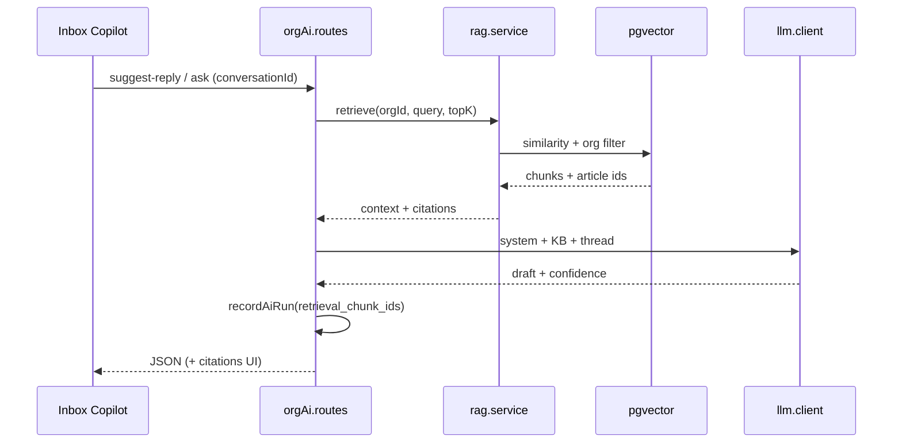
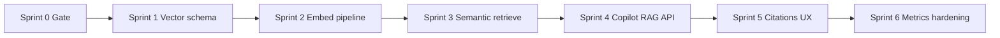
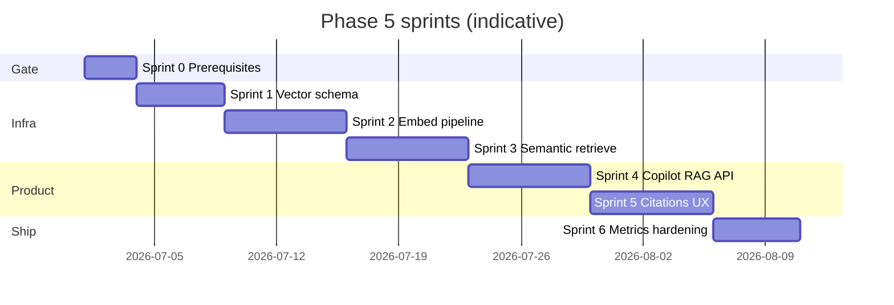

# Phase 5 — RAG & AI Copilot System — Implementation sprints

Parent: [AI-FEATURE-DESIGN.md](./AI-FEATURE-DESIGN.md) §7  

Prerequisites:

- **Phase 2:** Knowledge base with published articles and `knowledge_chunks` (FTS ingest via `knowledge.ingest_source` worker).
- **Phase 3:** Org-scoped Copilot (`suggest-reply`, `summarize`), `ai_runs` with `retrieval_chunk_ids`, keyword retrieval in `knowledgeContext.js`.
- **Phase 4:** Optional — classification metadata improves query expansion; not required for v1 semantic search.

Last updated: 2026-05-20

---

## Phase 5 goal (from design §7)

**Vector search, embeddings pipeline, contextual retrieval, AI article recommendations, and organization-aware copilots** — agents get **cited** knowledge in the inbox without autonomous customer sends (Phase 6).

---

## RAG model (target)

| Layer | Today (pre–Phase 5) | Target |
|-------|---------------------|--------|
| **Index** | FTS `content_tsv` on chunks | + `embedding vector(N)` per chunk |
| **Ingest** | `knowledge.ingest_source` → chunks | + async `ai.embed_chunk` (or inline batch in ingest handler) |
| **Retrieve** | `retrieveKnowledge({ mode: 'keyword' })` only | `semantic` + `hybrid` (keyword ∪ vector rerank) |
| **Consume** | `suggest-reply` + optional `useKnowledge` | Same + structured **citations**; new `POST .../ai/ask` (`rag_ask`) |
| **Audit** | `ai_runs.retrieval_chunk_ids` | Populate on every RAG-backed run |

**Worker stance:** Keep **embedding** and **heavy backfill** on the existing `automation_jobs` worker (same as classify / ingest). HTTP handlers only retrieve + call LLM (bounded latency, rate limits).

---

## Sprint overview

Sprints 4–5 can start on **keyword-only** citations while 2–3 land; full value needs 2–3 complete.

---

## Sprint 0 — Prerequisites gate

**Goal:** Confirm Phase 5 inputs before enabling pgvector and embedding spend.

**Checklist**

- [ ] **Knowledge content** — At least one **published** article with chunks per test org (`knowledge_articles.status = published`, chunks from ingest or editor).
- [ ] **Phase 3 Copilot** — `assist_enabled` + `ai_enabled`; `POST .../ai/suggest-reply` works; `knowledgeContext.js` returns keyword chunks when `useKnowledge: true`.
- [ ] **`ai_runs`** — Table exists; `retrieval_chunk_ids` column writable (already in Phase 3 migrations).
- [ ] **Worker** — `npm run worker:automation` processes `knowledge.ingest_source` (root `npm run dev` includes worker).
- [ ] **Supabase** — Plan for `CREATE EXTENSION vector` (or hosted equivalent); confirm embedding dimension (e.g. 1536 for `text-embedding-3-small`).
- [ ] **Env** — Document `EMBEDDING_MODEL`, embedding API key strategy (dedicated key or reuse `LLM_API_KEY` + embedding endpoint on provider).
- [ ] **Tenancy** — All retrieval queries filter `organization_id`; no cross-org chunk ids in prompts.

**Exit:** Gate doc signed off; test org has publishable KB content; embedding provider credentials available in non-prod.

---

## Sprint 1 — Vector schema & embedding client

**Goal:** Database and server can store/query vectors; no user-facing change yet.

**Scope**

- **Migration:** `CREATE EXTENSION IF NOT EXISTS vector`; `knowledge_chunks.embedding vector(D)` (fixed `D` per model); index (IVFFlat or HNSW per volume guidance).
- **RPC stub:** `search_knowledge_chunks_vector(p_organization_id, p_query_embedding, p_limit)` — org-scoped, published articles only.
- **`embedding.service.js`:** Embed single string / batch; timeouts; map provider errors.
- **`env.js` + `.env.example`:** `EMBEDDING_MODEL`, optional `EMBEDDING_BASE_URL`; fail closed when RAG enabled but embedding not configured.
- **Shared:** `EMBEDDING_DIMENSION`, feature flag helpers if needed.

**Key files (target)**

| Layer | Path |
|-------|------|
| Migration | `supabase/migrations/*_knowledge_embeddings_pgvector.sql` |
| Embed | `server/src/services/ai/embedding.service.js` |
| Config | `server/src/config/env.js` |

**Exit:** Manual script or test can embed one string and insert/update a chunk row; vector RPC returns rows for a known query embedding.

---

## Sprint 2 — Embeddings worker pipeline

**Goal:** New and updated chunks get embeddings without blocking HTTP.

**Scope**

- **Job type:** `ai.embed_chunk` (add to `shared/src/automationJobTypes.js` or `workflowAutomationJobTypes` sibling list).
- **Enqueue:** After `knowledge.ingest_source` completes chunking; on article **publish** / version bump (re-embed all chunks for that version).
- **Handler:** `jobHandlers/embedKnowledgeChunk.js` — load chunk text, call `embedding.service`, update `knowledge_chunks.embedding`.
- **Idempotency:** `embed:{orgId}:{chunkId}:{contentHash}` or version id — skip if unchanged.
- **Backfill:** One-off `ai.embed_org_backfill` or admin script to embed existing published chunks (batch + rate limit).
- **Gates:** Respect org `ai_enabled`; optional `organizations.settings.ai.rag_embeddings_enabled` (default off until ready).

**Exit:** Publish article → worker fills embeddings for all chunks; re-publish replaces embeddings; backfill completes for pilot org.

---

## Sprint 3 — Semantic & hybrid retrieval

**Goal:** `retrieval.service.js` and `rag.service.js` return ranked chunks for copilot consumption.

**Scope**

- **`rag.service.js`:** Query embedding → vector search → merge with keyword hits (`hybrid`); boost **published**; cap `topK` and token budget for context assembly.
- **Extend `retrieveKnowledge`:** Implement `mode: 'semantic' | 'hybrid'` (remove “later phase” stub).
- **Query expansion (light):** Optional: prepend conversation subject / `metadata.ai.intent` / last customer message to search query (from `conversationContext` + classification).
- **Internal notes policy:** Exclude `sender_type: 'internal_note'` from RAG context unless org setting allows (design §4).
- **Tests:** Unit tests with mocked embeddings; integration test against seed chunks if CI supports pgvector.

**Exit:** `retrieveKnowledge({ mode: 'hybrid' })` returns stable ranked results per org; empty retrieval handled without LLM hallucination guard (cite-only-if-retrieved policy in prompts).

---

## Sprint 4 — Copilot RAG API & logging

**Goal:** Agents get knowledge-backed answers with citation metadata in API responses.

**Scope**

- **`knowledgeContext.js`:** Default to `hybrid` when embeddings enabled; fall back to keyword if embedding missing or flag off.
- **`suggest-reply`:** Response shape includes `citations: [{ articleId, articleTitle, chunkId, snippet }]` (extend existing JSON parser).
- **`POST /api/org/:orgId/ai/ask`:** New org-scoped endpoint (`rag_ask` in `ai_runs.feature`); body `{ conversationId?, query, useKnowledge? }`; rate limit (heavy tier).
- **Prompts:** System instructions — answer from retrieved context only; include citation ids; UNTRUSTED_CONTEXT wrappers (Phase 3 guardrails).
- **`recordAiRun`:** Always set `retrieval_chunk_ids` when chunks used; log empty retrieval explicitly.
- **Org settings:** `organizations.settings.ai` — `rag_top_k`, `rag_hybrid_enabled`, `rag_embeddings_enabled` (merge in `mergeOrgAiSettings`).
- **Deprecate (optional):** Document migration path off global `POST /api/ai/assist` → org routes only.

**Exit:** `suggest-reply` and `ask` return drafts + citations; `ai_runs` rows show `retrieval_chunk_ids`; dry org with no KB returns safe empty-citation behavior.

---

## Sprint 5 — Inbox UX: citations & related articles

**Goal:** Make RAG visible and trustworthy in the product UI.

**Scope**

- **Copilot panel** (`InboxPage.jsx`): Show citation list under suggest-reply / ask; link to `/org/:orgId/knowledge/:articleId`.
- **Related articles** (design §4): Sidebar or collapsible panel on conversation — `GET` search using thread summary or last customer message (hybrid retrieve, display-only).
- **`useKnowledge` toggle:** Expose in Copilot (default on when `assist_enabled`).
- **Loading / empty states:** “No articles matched”, “Embeddings indexing…” when chunks lack vectors.
- **Org AI settings UI:** Toggles for RAG / top-K (ADMIN); link to Knowledge list.

**Exit:** Agent sees which articles grounded a suggestion; can open cited article; related articles panel useful on at least one test thread.

---

## Sprint 6 — Observability, limits & production boundaries

**Goal:** Operable RAG in multi-tenant production; clear separation from Phase 6.

**Scope**

- **Reports / analytics:** Per [AI-FEATURE-DESIGN.md](./AI-FEATURE-DESIGN.md) §14 — RAG query count (`rag_ask`), **retrieval hit rate**, **empty retrieval rate**, top cited articles (from `ai_runs.retrieval_chunk_ids`).
- **Metrics API:** Extend `GET .../analytics/ai` or knowledge tab with RAG KPIs.
- **Rate limits:** `rag_ask` + embedding-heavy paths on Redis org limits (see [operational-hardening.md](../features/operational-hardening.md)).
- **Cost controls:** Max chunks per request; max embed batch size; optional daily embed cap per org (log-only v1).
- **Streaming (optional / defer):** Wire [ai-streaming.md](./ai-streaming.md) only after non-streaming RAG stable — not a Phase 5 blocker.
- **Documentation:** `docs/features/knowledge-base.md`, [ai-capabilities.md](../features/ai-capabilities.md), `IMPLEMENTED-FEATURES.md`; optional `phase-5-prerequisites.md` if gate grows.

**Exit:** Dashboards show retrieval health; RAG can be disabled per org; no autonomous customer sends from Phase 5 paths.

---

## Sprint map (timeline view)

Dates are placeholders; adjust for team capacity and embedding provider setup.

---

## Definition of done — full Phase 5

| Area | Done when |
|------|-----------|
| **Embeddings** | Published chunks have vectors; re-publish re-embeds; backfill path documented |
| **Retrieval** | Org-scoped hybrid search; published boost; empty retrieval handled safely |
| **Copilot** | `suggest-reply` + `ask` return citations; `retrieval_chunk_ids` on `ai_runs` |
| **UX** | Inbox shows citations; related articles panel shipped or explicitly deferred with doc |
| **Safety** | No customer-visible AI sends; guardrails + tenancy unchanged from Phase 3 |
| **Ops** | Reports/metrics for hit rate and empty retrieval; rate limits on costly endpoints |

---

## Explicitly out of scope

- **Phase 6** autonomous outbound replies, approval queue, `sender_type: 'ai'` delivery.
- **Phase 8** workflow generation, multi-agent orchestration.
- **Customer-facing help center** / public KB site (Phase 2 noted as future).
- **Full SSE streaming** — tracked in [ai-streaming.md](./ai-streaming.md); optional stretch only.
- Using RAG as **workflow routing** input (Phase 4 uses `metadata.ai.intent` from classification; sufficient for v1 rules).

---

## Existing code to extend (inventory)

| Area | Current path | Phase 5 change |
|------|----------------|------------------|
| Keyword retrieval | `server/src/services/knowledge/retrieval.service.js` | Add semantic/hybrid |
| Copilot KB context | `server/src/services/ai/context/knowledgeContext.js` | Hybrid + citations |
| Suggest reply | `server/src/services/ai/assist.service.js` | Citation payload |
| AI runs | `server/src/services/ai/aiRuns.service.js` | Already has `retrieval_chunk_ids` |
| Ingest worker | `jobHandlers/knowledgeIngestSource.js` | Enqueue embed jobs |
| KB search RPC | `supabase/migrations/20260517160000_knowledge_search_rpc.sql` | Add vector RPC sibling |
| Org AI routes | `server/src/routes/orgAi.routes.js` | `POST /ask` |
| Reports | `OrgReportsPage.jsx`, `analytics.controller.js` | RAG KPIs |

---

## Related docs

- [phase-2-knowledge-base.md](./phase-2-knowledge-base.md) — articles, chunks, FTS, ingest
- [phase-3-sprints.md](./phase-3-sprints.md) — Copilot MVP (keyword KB today)
- [phase-4-sprint.md](./phase-4-sprint.md) — workflow automation (parallel track, not a blocker)
- [ai-streaming.md](./ai-streaming.md) — deferred SSE
- [knowledge-base.md](../features/knowledge-base.md) — feature deep dive (update when Phase 5 ships)
