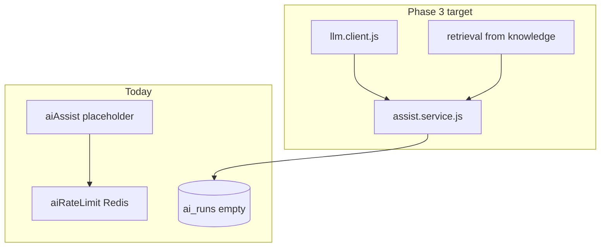

# AI stubs & Phase 3 prerequisites (partial)

## Overview

Infrastructure for **agent copilot** (suggest reply, summarize, etc.) is partially in place: org-scoped stub routes, Redis rate limits, `ai_runs` **schema**, and inbox UI labels. **No LLM provider**, **no `ai_runs` writes**, and **no** `suggest-reply` / `summarize` / `rewrite` endpoints yet.

## Shipped today

| Item | Status |
|------|--------|
| `POST /api/org/:orgId/ai/assist` | Stub JSON (`ai.controller.js`) |
| `POST /api/ai/assist` | Legacy global stub; per-user rate limit only |
| `GET /api/ai/health`, `GET .../ai/health` | Health checks |
| Org AI rate limits | `orgAiAssistRateLimit` on org `/assist` (org + user caps) |
| `ai_runs`, `ai_feedback` tables | Migration `20260516100000_analytics_tables.sql` |
| Reports AI tab | Reads `ai_runs`; empty → “not configured” |
| Org AI settings toggles | Phase flags in UI (assist, auto-tag, etc.) — **not wired to LLM** |
| Inbox Copilot tab, AI bubble styles, assign-to-AI | UI only |

## Not shipped (Phase 3 prerequisites)

| Item | Status |
|------|--------|
| Provider SDK or HTTP client in `server/package.json` | Missing |
| `LLM_API_KEY`, `LLM_MODEL`, `LLM_BASE_URL` in `env.js` / `.env.example` | Missing |
| `server/src/services/ai/llm.client.js` | Missing |
| Insert rows into `ai_runs` on model calls | Missing |
| `POST .../ai/suggest-reply`, `/summarize`, `/translate`, `/rewrite` | Missing |
| Wire Copilot tab to real suggestions | Missing |
| RAG mode using Phase 2 retrieval in assist flow | Missing |

## Architecture (current vs target)

## Key files

| Layer | Path |
|-------|------|
| Stub | `server/src/controllers/ai.controller.js` |
| Routes | `server/src/routes/orgAi.routes.js`, `server/src/routes/ai.routes.js` |
| Rate limits | `server/src/middleware/aiRateLimit.js`, `server/src/config/rateLimit.config.js` |
| Metrics read | `server/src/services/analytics/metricsQueries.js` |
| Env | `server/src/config/env.js` (no LLM vars yet) |

## `ai_runs` schema (ready, unused)

Columns include: `organization_id`, `conversation_id`, `triggered_by_member_id`, `feature`, `model`, `status`, `prompt_hash`, `input_tokens`, `output_tokens`, `latency_ms`, `retrieval_chunk_ids`, `error_code`.

## Connections

| Feature | Relationship |
|---------|----------------|
| [Phase 1](./phase-1-foundation.md) | Events, settings, `ai_enabled` gates |
| [Phase 2 knowledge](./phase-2-knowledge-base.md) | Improves suggestion quality when RAG wired |
| [Org AI settings](../features/org-ai-settings.md) | Feature flags |
| [Operational hardening](../features/operational-hardening.md) | `RATE_LIMIT_AI_*` env vars |

## Status

**Partial** — safe to demo settings and stub assist; do not document LLM-powered copilot as production-ready until Phase 3 ships.
