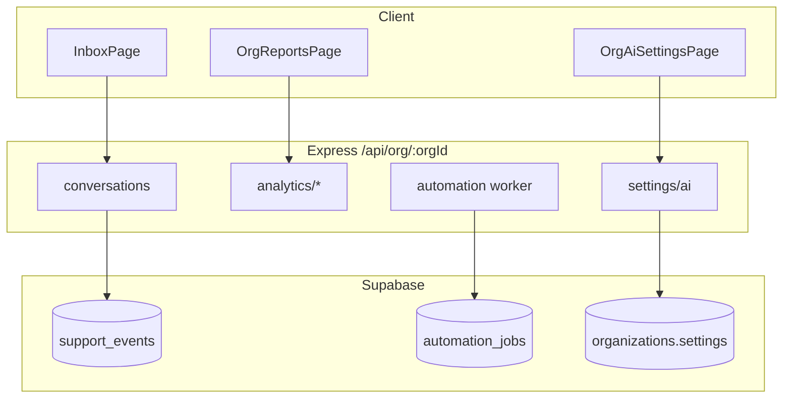

# Phase 1 — Core support platform foundation (shipped)

## Overview

Phase 1 delivers a stable multi-channel inbox, realtime messaging, assignments, permissions, **product telemetry**, **automation infrastructure**, and **org AI settings**—without any LLM provider. This is the gate for Phase 2+ and Phase 3 model integration.

## Capabilities

- Multi-channel inbox (web + email inbound/outbound)
- Conversations lifecycle, filters, assignment types including `assigned_to_ai` (manual UI only)
- Supabase Realtime for inbox + typing
- **`support_events`** append-only telemetry with Reports UI
- **`automation_jobs`** queue + worker (`notify.*`, `sla.scan_org`, later `knowledge.ingest_source`)
- **Org AI & automation settings** — `GET/PATCH /api/org/:orgId/settings/ai`
- **`conversations.ai_enabled`** — org default on create, per-conversation patch, blocks AI assignment when org AI off
- **Operational hardening** — Redis rate limits (ingress, webhooks, AI stub routes, agent send)
- Legacy `/api/tickets/*` removed; conversations are the only support model

## Architecture

## Key files

| Layer | Path |
|-------|------|
| Events | `server/src/services/analytics/supportEvents.service.js`, `shared/src/supportEventTypes.js` |
| Reports | `server/src/services/analytics/overview.service.js`, `client/src/pages/OrgReportsPage.jsx` |
| Automation | `server/src/workers/automationWorker.js`, `server/src/services/automation/*` |
| AI settings | `server/src/services/orgSettings.service.js`, `shared/src/orgSettings.js`, `client/src/pages/OrgAiSettingsPage.jsx` |
| `ai_enabled` | `server/src/services/conversationUpdate.service.js`, `server/src/services/support.service.js` |
| Migrations | `20260516100000_analytics_tables.sql`, `20260516110000_automation_jobs.sql` |

## API (AI-related subset)

| Method | Path | Notes |
|--------|------|--------|
| GET/PATCH | `/api/org/:orgId/settings/ai` | Org AI + automation JSON (`requireOrgAccess`; PATCH ADMIN) |
| GET | `/api/org/:orgId/analytics/overview` | Includes rollups from `support_events` |
| GET | `/api/ai/health` | Global health stub |

## Database

- `support_events` — org-scoped product events
- `ai_runs`, `ai_feedback` — **schema only** until Phase 3 writes rows
- `organizations.settings` — JSONB for `ai` and `automation` toggles
- `conversations.ai_enabled` — boolean per thread

## Connections

| Feature | Relationship |
|---------|----------------|
| [Phase 2 knowledge](./phase-2-knowledge-base.md) | Built on stable org APIs and worker queue |
| [AI stubs](./ai-stubs-and-phase-3-prerequisites.md) | Phase 3 adds LLM on top of Phase 1 gates |
| [Analytics](../features/analytics-and-reports.md) | Reports consume `support_events` |
| [Notifications](../features/notifications-and-automation.md) | Worker and SLA jobs |

## Status

**Complete** for Phase 1 checklist in [AI-FEATURE-DESIGN.md](./AI-FEATURE-DESIGN.md) §3. No LLM calls in this phase.
