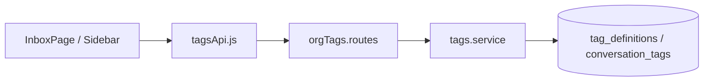

# Phase 2 — Conversation tags (shipped)

## Overview

Org-scoped **tag definitions** and **conversation tagging** for inbox organization and filtering. Supports future AI auto-tagging (Phase 3+) without schema changes.

## Capabilities

- CRUD tag definitions (ADMIN for create/update/delete)
- List tags; get/set tags on a conversation
- Inbox **tag filter** via `?tagId=` on conversation list API
- UI: `ConversationTagsPanel` on active thread; tag filter in inbox sidebar
- Patch conversation accepts `tagIds` array

## Architecture

## Key files

| Layer | Path |
|-------|------|
| Routes | `server/src/routes/orgTags.routes.js` |
| Controller | `server/src/controllers/tags.controller.js` |
| Service | `server/src/services/tags.service.js` |
| Inbox filter | `server/src/services/conversationInboxFilters.service.js` |
| Client | `client/src/services/tagsApi.js`, `client/src/components/inbox/ConversationTagsPanel.jsx` |
| Migration | `20260517150000_knowledge_base.sql` (tag tables in same migration) |

## API

| Method | Path | Auth |
|--------|------|------|
| GET | `/api/org/:orgId/tags` | Member |
| POST | `/api/org/:orgId/tags` | ADMIN |
| PATCH/DELETE | `/api/org/:orgId/tags/:tagId` | ADMIN |
| GET/PUT | `/api/org/:orgId/tags/conversations/:conversationId` | Member |

Conversations list: `GET .../conversations?tagId=<uuid>` (with existing filter params).

## Database

- `tag_definitions` — `organization_id`, name, color, optional rules JSON
- `conversation_tags` — many-to-many `conversation_id` + `tag_id`

## Connections

| Feature | Relationship |
|---------|----------------|
| [Support inbox](../features/support-inbox.md) | Filters and thread panel |
| [Phase 2 knowledge](./phase-2-knowledge-base.md) | Same Phase 2 delivery; separate concern |
| [AI stubs](./ai-stubs-and-phase-3-prerequisites.md) | Future `classification.service` may write tags |

## Status

**Shipped.** AI-driven auto-tagging not implemented.
