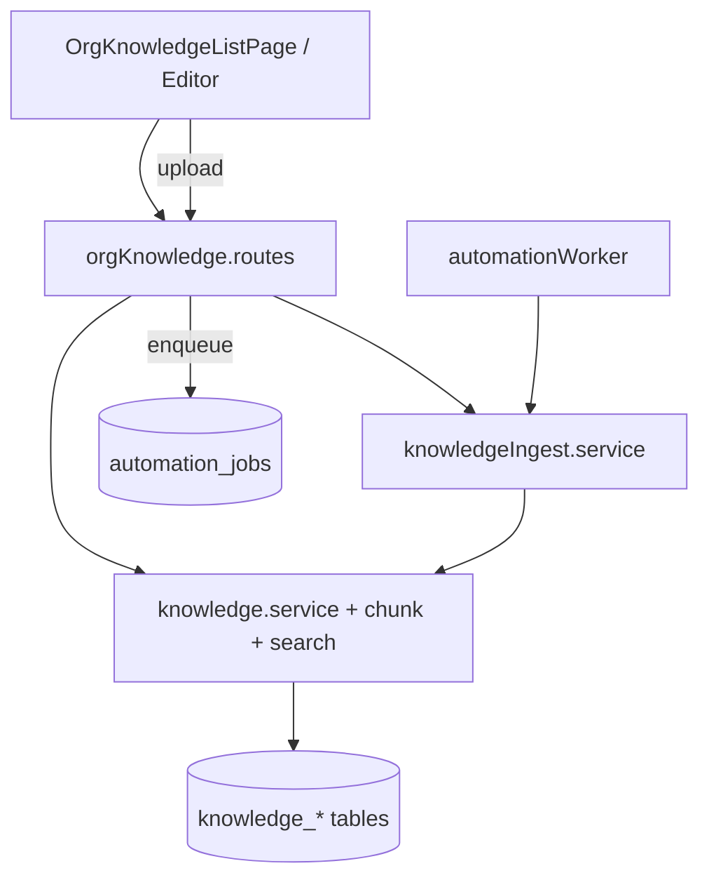

# Phase 2 — Knowledge base & search (shipped)

## Overview

Org-scoped **knowledge articles**, immutable **versions**, **full-text chunk search**, **file ingestion** (txt/md/pdf), and **Reports knowledge metrics**. Embeddings and inbox “related articles” are deferred to later phases; tables and chunk pipeline are RAG-ready.

## Capabilities

### Articles & versions

- CRUD articles (draft → publish workflow)
- Immutable `article_versions`; publish replaces chunks for published version
- Slug uniqueness per org; visibility `public` | `internal` | `restricted`
- **Archive (soft delete)** — `DELETE .../articles/:articleId` (ADMIN) sets `archived` + `deleted_at`
- Client: list, editor, status filters (All / Drafts / Published / Archived)

### Chunking & search

- Chunks ~2400 chars, 15% overlap (`knowledgeChunk.service.js`)
- Postgres FTS via `content_tsv` + RPC `search_knowledge_chunks`
- `GET /api/org/:orgId/knowledge/search?q=` with org + user Redis rate limits
- Retrieval helpers: `retrieval.service.js`, `contextAssembly.service.js` (for future Phase 3/5)

### File ingestion

- `POST .../knowledge/sources/upload` — multer, max 512 KB (`.txt`, `.md`, `.pdf`)
- Job type `knowledge.ingest_source` on `automation_jobs` (worker required)
- Source lifecycle: `pending` → `processing` → `processed` | `failed`
- `POST .../sources/:sourceId/sync` — re-queue failed/pending ingest
- Events: `knowledge.ingest_completed`, `knowledge.ingest_failed`, `knowledge.article_published`, `knowledge.search`

### Analytics

- `GET /api/org/:orgId/analytics/knowledge` — published/draft counts, search/ingest events in range
- Reports **Knowledge** tab on `OrgReportsPage.jsx`

## Architecture

## Key files

| Layer | Path |
|-------|------|
| Routes | `server/src/routes/orgKnowledge.routes.js` |
| Controller | `server/src/controllers/knowledge.controller.js` |
| Services | `server/src/services/knowledge/*.js` |
| Job handler | `server/src/services/automation/jobHandlers/knowledgeIngestSource.js` |
| Rate limits | `server/src/middleware/knowledgeRateLimit.js` |
| Client API | `client/src/services/knowledgeApi.js` |
| Pages | `client/src/pages/OrgKnowledgeListPage.jsx`, `OrgKnowledgeEditorPage.jsx` |
| Shared | `shared/src/knowledgeArticle.js`, `shared/src/knowledgeIngest.js` |
| Migrations | `20260517150000_knowledge_base.sql`, `20260517160000_knowledge_search_rpc.sql` |

## API

| Method | Path | Auth |
|--------|------|------|
| GET | `/knowledge/articles` | Member |
| POST | `/knowledge/articles` | Member |
| GET/PATCH | `/knowledge/articles/:articleId` | Member |
| DELETE | `/knowledge/articles/:articleId` | **ADMIN** (archive) |
| POST | `/knowledge/articles/:articleId/versions` | Member |
| POST | `/knowledge/articles/:articleId/publish` | Member |
| POST | `/knowledge/articles/:articleId/reindex` | **ADMIN** |
| GET | `/knowledge/search` | Member + rate limit |
| GET | `/knowledge/sources` | Member |
| POST | `/knowledge/sources/upload` | Member + rate limit |
| POST | `/knowledge/sources/:sourceId/sync` | Member |

All paths prefixed with `/api/org/:orgId`.

## Database

| Table | Purpose |
|-------|---------|
| `knowledge_sources` | File/manual ingest origin, `source_metadata` (checksum, fileName; `contentBase64` stripped on list API) |
| `knowledge_articles` | Title, slug, status, visibility, `source_id` |
| `article_versions` | Immutable content snapshots |
| `knowledge_chunks` | Searchable segments + `content_tsv` |
| RPC | `search_knowledge_chunks(organization_id, query, limit, ...)` |

## Client routes

| Route | Page |
|-------|------|
| `/org/:orgId/knowledge` | List + search + file import |
| `/org/:orgId/knowledge/new` | New article |
| `/org/:orgId/knowledge/:articleId` | Editor |

Sidebar **Knowledge** link in `HoverSidebar.jsx`.

## Connections

| Feature | Relationship |
|---------|----------------|
| [Phase 1](./phase-1-foundation.md) | Worker queue, `support_events`, org scope |
| [Conversation tags](./phase-2-conversation-tags.md) | Complementary Phase 2 metadata |
| [AI stubs](./ai-stubs-and-phase-3-prerequisites.md) | RAG will call retrieval + `contextAssembly` in Phase 3/5 |
| [Analytics](../features/analytics-and-reports.md) | Knowledge tab metrics |

## Operational notes

- Run **`npm run worker:automation`** (included in root `npm run dev`) for file ingest jobs.
- Apply migrations `20260517150000_*` and `20260517160000_*` before using Knowledge APIs.
- Ingest stores file bytes in `source_metadata.contentBase64` until processed; list API omits base64 from responses.

## Status

**Shipped** (Sprints 1–3 per [phase-2-plan.md](./phase-2-plan.md)). **Not shipped:** vector embeddings, inbox “related articles” panel, customer-facing help center.
