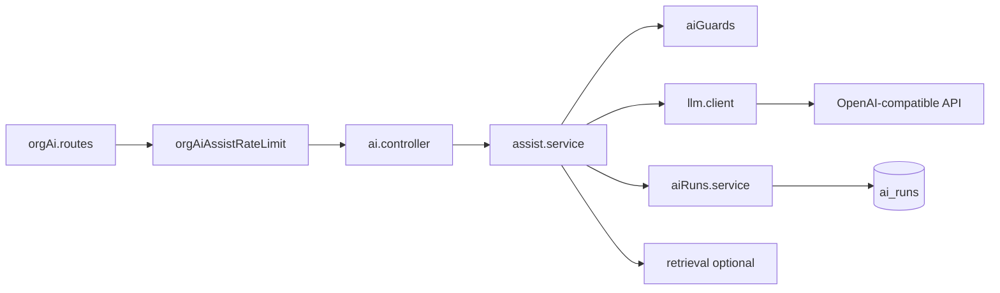

# Phase 3 — Prerequisites (shipped)

## Overview

Infrastructure required before and alongside copilot endpoints: **LLM configuration**, **OpenAI-compatible client**, **`ai_runs` logging**, and **org-scoped rate limits** on all `/api/org/:orgId/ai/*` routes.

Agent-facing endpoints (`suggest-reply`, `summarize`, `translate`, `rewrite`) are implemented; inbox UI wiring may still be partial.

## Capabilities

| Item | Status |
|------|--------|
| `openai` npm package + `llm.client.js` | Shipped — OpenAI-compatible `baseURL` |
| `LLM_API_KEY`, `LLM_MODEL`, `LLM_BASE_URL`, timeouts | `server/src/config/env.js` + `.env.example` |
| `ai_runs` inserts | `recordAiRun()` on every model call |
| Org rate limits | `router.use(orgAiAssistRateLimit)` on all org AI routes |
| `POST .../ai/assist` | Generic copilot prompt |
| `POST .../ai/suggest-reply` | Thread + optional knowledge RAG |
| `POST .../ai/summarize` | Thread summary |
| `POST .../ai/translate` | Text + `targetLanguage` |
| `POST .../ai/rewrite` | Text + `tone` |
| `GET .../ai/health` | `llmConfigured` flag |

## Architecture



## Key files

| Layer | Path |
|-------|------|
| Client | `server/src/services/ai/llm.client.js` |
| Orchestration | `server/src/services/ai/assist.service.js` |
| Logging | `server/src/services/ai/aiRuns.service.js` |
| Guards | `server/src/services/ai/aiGuards.service.js` |
| Prompts | `server/src/services/ai/prompts/*.js` |
| Controller | `server/src/controllers/ai.controller.js` |
| Routes | `server/src/routes/orgAi.routes.js` |
| Shared | `shared/src/aiFeatures.js` |
| Env | `server/src/config/env.js`, `server/.env.example` |

## API

All under `/api/org/:orgId/ai` (member auth + org access + rate limits).

| Method | Path | Body |
|--------|------|------|
| GET | `/health` | — |
| POST | `/assist` | `{ prompt?, conversationId? }` |
| POST | `/suggest-reply` | `{ conversationId, useKnowledge?, tone?, length? }` → `{ reply, confidence, detectedLanguage, runId, … }` |
| POST | `/summarize` | `{ conversationId, type?: short\|detailed\|timeline }` → `{ summary: {…}, type, runId, … }` |
| POST | `/translate` | `{ text, targetLanguage? }` |
| POST | `/rewrite` | `{ text, tone? }` |

**503** when `LLM_API_KEY` unset. **403** when org `ai_enabled` / `assist_enabled` off or conversation `ai_enabled` false.

## Environment

```env
LLM_API_KEY=sk-...
LLM_MODEL=gpt-4o-mini
LLM_BASE_URL=https://api.openai.com/v1
LLM_TIMEOUT_MS=60000
LLM_MAX_OUTPUT_TOKENS=1024
LLM_MAX_PROMPT_CHARS=32000
```

Compatible with Azure OpenAI, Groq, Together, etc. when they expose an OpenAI-compatible `/v1/chat/completions` URL.

## Connections

| Feature | Relationship |
|---------|----------------|
| [Phase 1](./phase-1-foundation.md) | Settings gates, events |
| [Phase 2 knowledge](./phase-2-knowledge-base.md) | RAG in `suggest-reply` |
| [AI capabilities](../features/ai-capabilities.md) | Product-facing summary |

## Status

**Prerequisites complete.** Sprint 1 (structured suggest/summarize, PII scrub, token budget) shipped — see [phase-3-sprints.md](./phase-3-sprints.md). Classification jobs and inbox Copilot UI are follow-ups.
