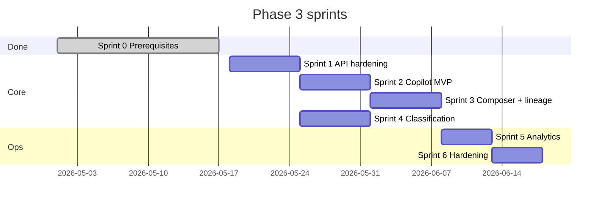

# Phase 3 — Implementation sprints

Parent: [phase-3-plan.md](./phase-3-plan.md) | [AI-FEATURE-DESIGN.md](./AI-FEATURE-DESIGN.md) §5  
Prerequisites: [phase-3-prerequisites.md](./phase-3-prerequisites.md) (Sprint 0 ✅)

Last updated: 2026-05-18

---

## Analysis summary

### Already shipped (treat as **Sprint 0**)

Per [phase-3-prerequisites.md](docs/ai-features/phase-3-prerequisites.md) and the codebase:

| Plan item | Status |
|-----------|--------|
| `llm.client.js`, `LLM_*` env | Done (OpenAI SDK, compatible `baseURL`) |
| `ai_runs` table + inserts | Done (`recordAiRun`) |
| Org rate limits on `/ai/*` | Done (`router.use(orgAiAssistRateLimit)`) |
| Endpoints: assist, suggest-reply, summarize, translate, rewrite | Done (basic prompts, plain text responses) |
| RAG in suggest-reply | Partial (keyword retrieval only) |
| `messages.is_ai_generated`, `parent_message_id` | Schema only — **not wired on send** |
| `ai_feedback` table | Schema only — **no API** |
| Classification / sentiment / auto-tags | **Not started** |
| Inbox Copilot UI | **Label only** — no API calls |
| Structured JSON LLM outputs, guardrails, PII filter, token budget | **Not started** |
| Streaming (SSE) | **Not started** |
| Per-feature rate limits | Single org+user cap for all `/ai/*` |
| Async classification jobs | **Not started** (plan §6.5–6.7) |

The plan’s folder layout (`context/`, `parsers/`, `classification.service.js`, etc.) is **aspirational**; you have a flatter `server/src/services/ai/` today. Sprints should **evolve** structure, not block on a big rename in Sprint 1.

---

## Recommended sprints (complete Phase 3)

### Sprint 0 — Prerequisites ✅ (done)

**Goal:** LLM + audit + routes + guards.

**Deliverables:** Already in repo.

**Exit:** `GET .../ai/health` → `llmConfigured: true` with key set; `ai_runs` row on `POST .../ai/assist`.

---

### Sprint 1 — API contract hardening & context quality ✅

**Goal:** Make server responses match the plan’s production shape before heavy UI work.

**Scope**

- **Structured outputs:** JSON-mode (or strict parse) for `suggest-reply`, `summarize` per plan §6.1–6.2 (`reply`, `confidence`, `summary` object).
- **Request options:** `tone`, `length` on suggest-reply; `type: short | detailed | timeline` on summarize.
- **Context builder:** Extend `conversationContext.service.js` with customer name, channel, existing tags; org tone from `organizations.settings` (or placeholder style guide).
- **Token budget:** `truncateConversation` / max chars before LLM (plan §7.4).
- **PII scrub:** `piiFilter.js` on outbound prompt text (plan §7.3).
- **Errors:** `ai.errors.js` + consistent `{ error }` / status codes.
- **Shared:** Document response types in `shared` if client needs them.

**Files (indicative):** `assist.service.js`, `prompts/*`, new `utils/piiFilter.js`, `utils/tokenBudget.js`, `parsers/suggestion.parser.js`.

**Tests:** Unit tests for PII filter, truncation, JSON parse failures.

**Exit:** Postman/curl gets structured JSON; long threads don’t exceed token cap; failed parse → 502 + `ai_runs` error row.

---

### Sprint 2 — Inbox Copilot MVP (suggest + summarize)

**Goal:** Agents get value in the inbox without composer polish yet.

**Scope**

- **`client/src/services/aiApi.js`:** `suggestReply`, `summarize`, `getAiHealth`.
- **Copilot panel** in `InboxPage.jsx` (replace placeholder tab):
  - “Suggest reply” → insert into composer (don’t auto-send).
  - “Summarize thread” → show bullets in sidebar.
  - Loading / error states; respect org `assist_enabled` (disable when off).
  - Show `runId`, optional confidence badge.
- **Gate:** Only when conversation selected + `ai_enabled`.

**Exit:** Agent can suggest and summarize from inbox; drafts are editable; no autonomous send.

---

### Sprint 3 — Composer AI actions (translate, rewrite, accept flow)

**Goal:** Complete plan §6.3–6.4 + §12 message lineage start.

**Scope**

- Composer menu: **Translate**, **Rewrite tone** (dropdown: professional, friendly, empathetic, concise).
- Side-by-side or replace-in-composer UX (plan §15 — don’t overwrite without confirmation).
- **`POST .../ai/feedback`** (or extend messages flow): record accept / edit / reject linked to `ai_run_id`.
- **On send:** If text came from AI run, set `is_ai_generated: true`, `parent_message_id` when applicable (plan §6, design §5 data contract).
- Server: `ai_feedback` insert service + optional `support_events` (`ai.suggestion_accepted`, etc.).

**Exit:** Full four copilot APIs used from UI; sending marks AI lineage; feedback row exists for one acceptance path.

---

### Sprint 4 — Async classification (intent, sentiment, auto-tags)

**Goal:** Plan §6.5–6.7 without blocking inbound HTTP.

**Scope**

- `prompts/classify.js` + `classification.service.js`.
- New job type: `ai.classify_inbound` (or `ai.classify_conversation`) on `automation_jobs`.
- Enqueue from `messages.controller` / `emailWebhook.service.js` after customer message stored (fire-and-forget).
- Worker handler: LLM → parse → merge into `conversations.metadata` (`intent`, `sentiment`, `score`, `auto_tags`, `language`).
- Respect org `auto_tag_enabled`; optional apply to `conversation_tags` when tag definitions match.
- **Do not** block inbound on LLM failure.

**Exit:** New customer message → metadata updated within worker SLA; inbox can display intent/sentiment in Copilot (read-only).

---

### Sprint 5 — Observability, analytics & settings UX

**Goal:** Plan §11–12, §14 (partial), production operability.

**Scope**

- **Per-feature rate limits** (optional): tighter caps on suggest/summarize vs rewrite (extend `rateLimit.config.js` + route-specific middleware).
- **Reports:** AI tab drill-down — `GET .../analytics/ai/runs` paginated `ai_runs` (if not exists).
- **Settings:** `OrgAiSettingsPage` — show `llmConfigured`, link to env docs; test assist button calling `/ai/health`.
- **Metrics:** Acceptance rate from `ai_feedback`; token totals from `ai_runs` in `metricsQueries.js`.
- **Logging:** Structured JSON logs on AI failure (`organization_id`, `feature`, `runId`).

**Exit:** Admin sees AI usage in Reports; failed runs diagnosable; feedback drives acceptance KPI.

---

### Sprint 6 — Production hardening (optional but “complete” Phase 3)

**Goal:** Plan §7 guardrails, §10 streaming, §13 queue posture — pick what fits timeline.

**Scope (prioritize)**

1. **`ai.guardrails.js`:** Policy blocks (refund promises, “I am the company”); `blocked_policy` status on `ai_runs`.
2. **Prompt injection:** Strict role separation in all prompts (plan §7.1).
3. **Refactor** (incremental): `context/knowledgeContext.js` wrapping existing RAG; split `summary.service.js` if `assist.service.js` grows.
4. **Streaming (nice-to-have):** SSE `POST .../ai/suggest-reply/stream` + client stream renderer (plan §10).
5. **Defer:** BullMQ second queue (you already have `automation_jobs` — use that, not new BullMQ unless scale demands).

**Exit:** Documented guardrails; injection test cases; streaming behind feature flag OR explicitly deferred in doc.

---

## Sprint map (timeline view)

Sprint 4 can **parallel** Sprint 2–3 after Sprint 1 (different owners: backend worker vs frontend).

---

## Definition of done — full Phase 3

Aligned with plan §20 and [AI-FEATURE-DESIGN.md](docs/ai-features/AI-FEATURE-DESIGN.md) §5:

| Area | Done when |
|------|-----------|
| Backend | All 5 endpoints production-grade; classification async; `ai_runs` + `ai_feedback`; guardrails + token budget |
| Frontend | Copilot sidebar + composer AI actions; no auto-send |
| Safety | No `sender_type: 'ai'` customer sends; org/conversation gates enforced |
| Ops | Rate limits, logs, Reports AI metrics, env documented |

**Explicitly out of scope (plan §18):** autonomous replies, vector DB overhaul, multi-agent workflows.
