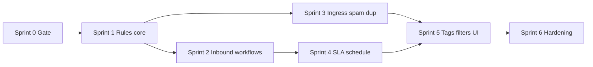
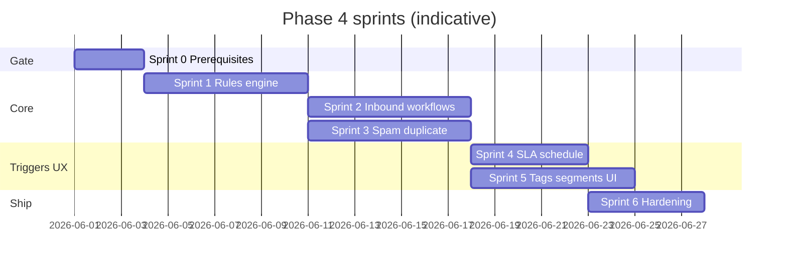

# Phase 4 — AI Workflow Automation — Implementation sprints

Parent: [AI-FEATURE-DESIGN.md](./AI-FEATURE-DESIGN.md) §6  

Prerequisites:

- Phase 3: classification signals (`intent`, `sentiment`, auto-tags, etc.) in `conversations.metadata` (see [phase-3-sprints.md](./phase-3-sprints.md) Sprint 4).
- Phase 1: durable `automation_jobs` worker, idempotent ingress patterns (`handle_incoming_message` style dedupe).

Last updated: 2026-05-20

---

## Phase 4 goal (from design §6)

**AI-based routing, priority detection, spam filtering, SLA-risk alerts, duplicate detection, and workflow-triggered automations** — **without** customer-visible autonomous replies (Phase 6).

---

## Rule model (target)

Triggers, conditions, and actions aligned with [AI-FEATURE-DESIGN.md](./AI-FEATURE-DESIGN.md) §6:

| Concept | Examples |
|---------|----------|
| **Triggers** | `inbound_message`, `sla_warning`, `tag_added`, `schedule` |
| **Conditions** | `metadata.intent`, priority, channel, business hours |
| **Actions** | `set_assignment`, `set_priority`, `add_tag`, `notify`, `assign_to_ai`, `enqueue_phase6` (stub until Phase 6) |

Integration touchpoints from the design:

| Automation | Typical trigger surface | Typical action surface |
|------------|-------------------------|-------------------------|
| Auto-assign / route | After inbound insert (async job) | `conversationUpdate.service.js` |
| Priority bump | Classification / rules job | `conversationUpdate.service.js` |
| Spam / duplicate handling | Ingress (pre-insert or policy branch) | `emailWebhook.service.js`, `messages.controller.js` |
| SLA alert | Cron / scheduled job | Notifications + `support_events` |
| Inbox segments | Metadata / tags from rules | `conversationInboxFilters.service.js`, `client/src/config/inboxFilters.js` |

**Worker stance:** Prefer the **existing Node `automation_jobs` worker** for evaluate + mutate flows (already required for retries, org-scoped payloads, and parity with Phase 3’s `ai.classify_inbound`). Edge Functions remain an option for **very light** rules later; avoid splitting execution paths until load demands it.

---

## Sprint overview

Sprints 2–3 can **partially parallelize** once Sprint 1 defines the rule payload and job contract (different owners: post-inbound worker vs ingress adapters).

---

## Sprint 0 — Prerequisites gate ✅ (2026-05-20)

**Goal:** Confirm Phase 4 inputs and platform guarantees before building the rule engine.

**Checklist** — see [phase-4-prerequisites.md](./phase-4-prerequisites.md)

- [x] **`conversations.metadata`** — `metadata.ai` + `parseConversationMetadataAi` / `getConversationAiSignals`
- [x] **`automation_jobs`** — `ai.workflow_inbound`, `ai.workflow_tag_added`, `ai.workflow_sla` + stub handlers; registration doc in prerequisites
- [x] **Idempotency** — `workflow*IdempotencyKey` helpers; reuse `automation_jobs.idempotency_key` unique index
- [x] **AuthZ** — `PATCH .../settings/ai` is `ADMIN`-only; Sprint 1+ workflow rule APIs must use `requireRole('ADMIN')`
- [x] **Feature flags** — `workflowAiGates.service.js`; `workflow_automation_enabled` org toggle; `assign_to_ai` gates centralized

**Exit:** Phase 4 start — prerequisites complete; **Sprint 1 unblocked**.

---

## Sprint 1 — Rules storage & evaluation core

**Goal:** Persist workflow rules per org and evaluate conditions deterministically (no LLM required for evaluation).

**Scope**

- **Storage:** `organizations.settings` JSON subtree **or** dedicated table (preferred if versioning/audit matters) — schemas documented in a migration comment.
- **Rule shape:** validates triggers, condition tree (intent/priority/channel/business_hours), ordered actions with safe caps (max actions per run).
- **Services:** `workflowRules.service.js` (load + validate), `workflowEvaluate.service.js` (pure evaluator + unit tests).
- **API (org-scoped):** `GET/PATCH .../settings/ai` extension **or** `GET/POST/PATCH .../ai/workflows/rules` — **never** trust body `organizationId`; use `:orgId` + `requireOrgAccess`.
- **Logging:** structured logs with `organization_id`, `conversation_id`, `rule_id`, `action` — no raw message bodies in production.

**Exit:** Rules can be saved and evaluated in isolation (dry-run endpoint or worker-only first is acceptable).

---

## Sprint 2 — `inbound_message` workflows (worker-driven)

**Goal:** Apply rules **after** a customer message is stored, without blocking the HTTP ingress path.

**Scope**

- New job type(s), e.g. `ai.workflow_inbound` (name to match repo conventions), enqueued from `messages.controller.js` / `emailWebhook.service.js` after successful insert — **fire-and-forget enqueue** with safe `catch`.
- Worker handler pipeline: load rules → evaluate → apply actions via **`conversationUpdate.service.js`** (assignment, priority, tags, notifications).
- **Guardrails:** fail closed on auth errors; degrade on missing settings (defaults + single warn); never infinite retry on bad rule payloads (`dead` state + reason).
- **`assign_to_ai`:** only when org + conversation AI gates allow; respect DB constraint (`assigned_to_member_id` null).

**Emit:** `support_events` for automation applied / skipped / failed where product analytics need it (Reports alignment).

**Exit:** Configured org sees assignment/priority/tag changes shortly after inbound message, observable in inbox + events.

---

## Sprint 3 — Spam & duplicate handling at ingress

**Goal:** Reduce noise and merges obvious duplicates **before or at** ingestion, aligned with design “spam / duplicate block” rows.

**Scope**

- **Spam:** policy signal (provider, heuristic, or lightweight classifier job result); actions = reject with 4xx **or** accept with flagged `metadata` + segment route (prefer non-destructive default until org opts into hard reject).
- **Duplicate:** fuzzy match on thread keys / recent conversation correlation; link or suppress per org policy.
- **Integration:** `emailWebhook.service.js` and web ingress in `messages.controller.js` share a small **`ingressPolicy.service.js`** or similar.
- **Idempotency & rate limits:** public ingress stays bounded; duplicates must not amplify queue depth.

**Exit:** Measurable drop in spam/duplicate tickets or clear operator visibility (badge/filter) — pick one primary success metric per org policy.

---

## Sprint 4 — `sla_warning` & `schedule` triggers

**Goal:** Close the SLA-risk alerting loop using existing SLA/cron posture (Phase 1 automation).

**Scope**

- **`sla_warning`:** hook where SLA breach/near-breach is already detected → enqueue workflow job → `notify` + optional `set_priority` / `set_assignment`.
- **`schedule`:** time-window rules (e.g. business hours routing, nightly digests if product requires) — start with **one** cron-style evaluator that loads orgs with schedules enabled to avoid scan storms.
- **Secrets:** cron/scheduler auth (`AUTOMATION_CRON_SECRET`) unchanged; document new cron entry if needed.

**Exit:** SLA-risk path emits notifications + audit events; at least one schedule-based rule path demonstrable in staging.

---

## Sprint 5 — `tag_added` triggers, inbox segments, operator UX

**Goal:** Completing the trigger matrix (`tag_added`) and making automation **visible** in the inbox.

**Scope**

- **`tag_added`:** when tags change on a conversation (service layer hook), enqueue evaluation with dedupe semantics.
- **Filters:** extend `conversationInboxFilters.service.js` + `inboxFilters.js` for segments driven by automation metadata (“SLA risk”, “spam flagged”, “auto-routed intent=X”).
- **Client:** badge or segment labels consistent with Reports/event naming.

**Exit:** Agents can slice inbox by Phase 4–driven fields; tag-triggered workflows run reliably.

---

## Sprint 6 — Production hardening & boundaries

**Goal:** Operational safety, observability, and crisp separation from Phase 6.

**Scope**

- **Settings UI:** org admin manages rules toggles order, simulation/dry-run, test notification.
- **`enqueue_phase6`:** noop or guarded stub that logs “not enabled” until Phase 6 approvals exist — prevents accidental autonomous sends.
- **Metrics:** queue depth / job failures / actions per org; link to Reports if event types exist.
- **Documentation:** update [IMPLEMENTED-FEATURES.md](../../IMPLEMENTED-FEATURES.md) + [docs/features/ai-capabilities.md](../features/ai-capabilities.md) (or dedicated feature doc when behavior lands).

**Exit:** Phase 4 is observable, rate-safe, multi-tenant correct, and **cannot** silently send customer-visible AI mail (still Phase 6).

---

## Sprint map (timeline view)

Dates are placeholders; replace with quarter planning dates.

---

## Definition of done — full Phase 4

| Area | Done when |
|------|-----------|
| **Triggers** | `inbound_message`, `sla_warning`, `tag_added`, `schedule` each have at least one supported, tested path |
| **Actions** | `set_assignment`, `set_priority`, `add_tag`, `notify`, `assign_to_ai` work via existing domain services without bypassing tenancy |
| **Ingress** | Spam/duplicate policies applied at ingress with idempotency and bounded cost |
| **Safety** | No customer-visible **`sender_type: 'ai'`** sends from Phase 4 paths; gates on `ai_enabled` / org settings |
| **Ops** | Jobs retries/dead-lettering; structured logs; no unbounded enqueue on duplicates |

---

## Explicitly out of scope

- **Phase 6** autonomous outbound replies and approval-queue send pipeline.
- **Phase 8** LLM-generated rule proposals (“workflow generation”) — Phase 4 rules are **human-authored** unless you consciously add a separate experimental sprint later.
- **Phase 5** RAG-heavy retrieval as a prerequisite for routing (classification metadata from Phase 3 is sufficient for v1 routing rules).
