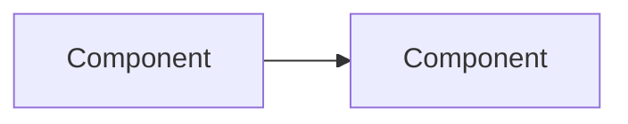

# Feature name

> Copy this file to `docs/features/<feature-slug>.md` when adding a new major feature. Remove this block.

## Overview

What problem this feature solves and who uses it.

## Capabilities

- Bullet list of what works today
- Mark *(partial)* or *(placeholder)* where needed

## Architecture

## Key files

| Layer | Path |
|-------|------|
| Client | `client/src/...` |
| Server | `server/src/...` |
| Shared | `shared/src/...` |
| Migrations | `supabase/migrations/...` |

## API

| Method | Path | Auth |
|--------|------|------|
| | | |

## Database

Tables, RPCs, constraints relevant to this feature.

## Connections

| Feature | Relationship |
|---------|----------------|
| [other-feature.md](./other-feature.md) | How they interact |

## How it works (end-to-end theory in points)

## Other Info only relevant to this feature

## Status

**Complete** | **Partial** | **Placeholder** — one-line summary.
