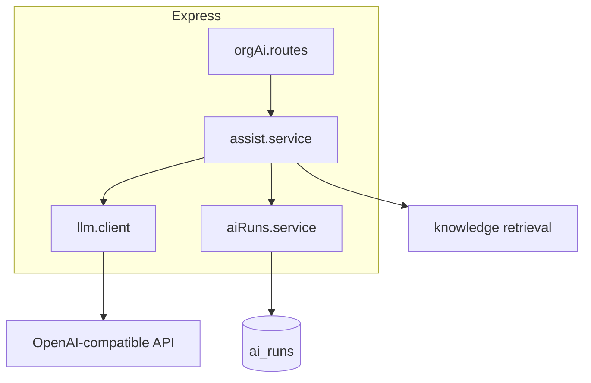

# AI capabilities

## Overview

**Phase 1–2** infrastructure, **Phase 3** copilot/classification, and **Phase 4** workflow automation are shipped: org settings, knowledge RAG, LLM client, `ai_runs`, copilot APIs, deterministic routing rules, and inbox automation segments.

See [ai-features/README.md](../ai-features/README.md), [phase-3-prerequisites.md](../ai-features/phase-3-prerequisites.md), and [workflow-automation.md](./workflow-automation.md).

## Capabilities today

### Configuration & guards

- `LLM_API_KEY`, `LLM_MODEL`, `LLM_BASE_URL` (server env)
- Org `ai_enabled`, `assist_enabled`; per-conversation `ai_enabled`
- **503** when LLM not configured

### Org-scoped API (`/api/org/:orgId/ai/*`)

All routes use Redis **per-org + per-user** rate limits.

| Method | Path | Purpose |
|--------|------|---------|
| GET | `/health` | Health + `llmConfigured` |
| POST | `/assist` | Generic agent prompt |
| POST | `/suggest-reply` | Draft reply from thread (+ optional KB) |
| POST | `/summarize` | Bullet summary of thread |
| POST | `/translate` | Translate text |
| POST | `/rewrite` | Rewrite text tone |
| GET/PUT | `/workflows/rules` | Phase 4 workflow rules (PUT ADMIN) |
| GET | `/workflows/metrics` | Queue depth + workflow event counts |
| POST | `/workflows/dry-run` | Simulate rule match |
| POST | `/workflows/test-notification` | Test staff notify (ADMIN) |

Legacy: `POST /api/ai/assist` (requires `organizationId` in body; per-user limit only).

### Data & analytics

- Every model call writes **`ai_runs`** (`feature`, tokens, latency, `prompt_hash`, status)
- Reports **AI** tab reads `ai_runs` when rows exist

### Workflow automation (Phase 4)

- Rules engine on `automation_jobs` worker (`ai.workflow_*`)
- Settings → **Workflow rules** (`/settings/workflows`): enable/order, dry-run, metrics, test email
- `enqueue_phase6` action is always skipped (structured log + `workflow.action_skipped`)
- See [workflow-automation.md](./workflow-automation.md)

### UI

- Inbox: Copilot, AI styling, assign-to-AI, automation badges, Phase 4 filters
- Knowledge sidebar route
- Settings → AI & Automation, Workflow rules

## Architecture

## Key files

| Layer | Path |
|-------|------|
| LLM | `server/src/services/ai/llm.client.js` |
| Orchestration | `server/src/services/ai/assist.service.js` |
| Logging | `server/src/services/ai/aiRuns.service.js` |
| API | `server/src/controllers/ai.controller.js`, `server/src/routes/orgAi.routes.js` |
| Rate limits | `server/src/middleware/aiRateLimit.js` |
| Shared | `shared/src/aiFeatures.js` |
| Settings | `shared/src/orgSettings.js`, `OrgAiSettingsPage.jsx` |
| Workflows | `shared/src/workflowRules.js`, `workflowRules.service.js`, `OrgWorkflowSettingsPage.jsx` |

## Connections

| Feature | Relationship |
|---------|----------------|
| [Knowledge base](./knowledge-base.md) | RAG for `suggest-reply` |
| [Org AI settings](./org-ai-settings.md) | Feature flags |
| [Operational hardening](./operational-hardening.md) | `RATE_LIMIT_AI_*` |
| [Analytics](./analytics-and-reports.md) | AI tab metrics |
| [Support inbox](./support-inbox.md) | Copilot + Phase 4 inbox segments |
| [Workflow automation](./workflow-automation.md) | Phase 4 rules and worker |

## Status

**Shipped (Phase 3–4)** — Copilot, classification, workflow automation, ingress policy, reports hooks. Autonomous customer replies remain Phase 6.
