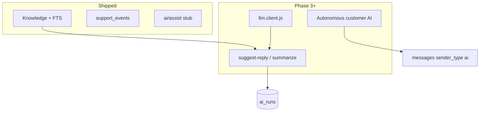

# AI capabilities

## Overview

The product is branded as an AI support copilot. **Phase 1–2** infrastructure is shipped (events, settings, knowledge base, tags). **No LLM provider** is integrated yet—stub assist routes and `ai_runs` schema only. See [ai-features/README.md](../ai-features/README.md).

## Capabilities today

- `POST /api/org/:orgId/ai/assist` — org-scoped stub (rate limited per org + user)
- `POST /api/ai/assist` — legacy global stub (per-user rate limit)
- Inbox: Copilot tab label, AI bubble styles, `assigned_to_ai` assignment option in UI
- Sidebar: **Knowledge** → `/org/:orgId/knowledge` (articles, search, file import)
- Reports: **AI** tab (`ai_runs` when populated); **Knowledge** tab (ingest/search metrics)
- Org AI settings: `GET/PATCH /api/org/:orgId/settings/ai`, Settings → AI & Automation UI
- `conversations.ai_enabled` — default on create; patch on update; gates `assigned_to_ai`
- Schema: `messages.is_ai_generated`, `messages.parent_message_id`, `ai_runs`, `ai_feedback`
- **Knowledge base** — full Phase 2; see [knowledge-base.md](./knowledge-base.md)

## Architecture (target)

## Key files

| Layer | Path |
|-------|------|
| Stub API | `server/src/controllers/ai.controller.js`, `server/src/routes/ai.routes.js`, `server/src/routes/orgAi.routes.js` |
| Org settings | `shared/src/orgSettings.js`, `server/src/services/orgSettings.service.js`, `client/src/pages/OrgAiSettingsPage.jsx` |
| UI | `client/src/pages/InboxPage.jsx`, `HoverSidebar.jsx` |
| Reports | `client/src/pages/OrgReportsPage.jsx` (`AiTabPanel`) |
| Shared | `shared/src/messageSenderTypes.js` (`ai`) |
| Schema | `20260507141500_minimal_future_schema_hooks.sql`, `20260516100000_analytics_tables.sql` |

## Connections

| Feature | Relationship |
|---------|----------------|
| [Messages](./messages.md) | AI replies should use same outbound pipeline as agents |
| [Multi-channel](./multi-channel.md) | Customer-visible AI sends must go through channel router |
| [Support inbox](./support-inbox.md) | Copilot UX lives on inbox thread |
| [Org AI settings](./org-ai-settings.md) | Feature flags and per-conversation defaults |
| [Operational hardening](./operational-hardening.md) | AI rate limits and outbound failure events |
| [Analytics](./analytics-and-reports.md) | `ai_runs` powers AI metrics tab |
| [Knowledge base](./knowledge-base.md) | Phase 2 RAG source for future assist |
| [Notifications](./notifications-and-automation.md) | Worker queue; future AI jobs |
| [Phase 3 prerequisites](../ai-features/ai-stubs-and-phase-3-prerequisites.md) | What is missing before copilot |

## Status

**Partial** — Phase 1–2 shipped; LLM copilot (Phase 3) not implemented. See [ai-stubs-and-phase-3-prerequisites.md](../ai-features/ai-stubs-and-phase-3-prerequisites.md).
