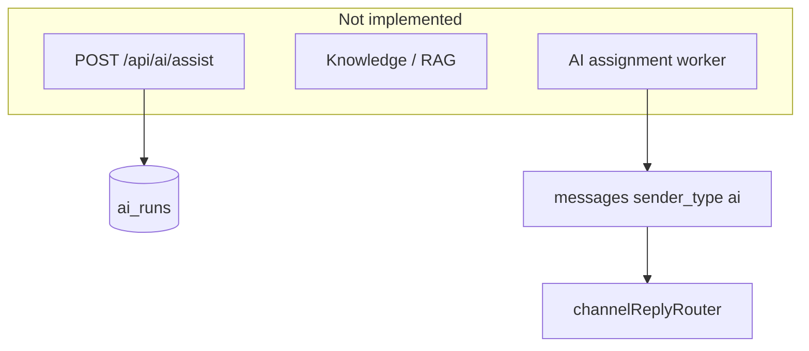

# AI capabilities

## Overview

The product is branded as an AI support copilot, but **no LLM provider is integrated** in the server. Database columns, shared sender types, UI labels, and a stub API exist as **hooks for future phases** (see [AI-FEATURE-DESIGN.md](../../AI-FEATURE-DESIGN.md)).

## Capabilities today

- `POST /api/ai/assist` — returns placeholder JSON
- Inbox: Copilot tab label, AI bubble styles, `assigned_to_ai` assignment option in UI
- Sidebar: “Fin AI Agent”, “Knowledge” — no routes
- Reports AI tab — reads `ai_runs` when rows exist; otherwise “not configured”
- Org AI settings: `GET/PATCH /api/org/:orgId/settings/ai`, Settings → AI & Automation UI
- `conversations.ai_enabled` — default on create from org settings; patch on conversation update
- Schema: `messages.is_ai_generated`, `messages.parent_message_id`, `ai_runs`, `ai_feedback`

## Architecture (target)

## Key files

| Layer | Path |
|-------|------|
| Stub API | `server/src/controllers/ai.controller.js`, `server/src/routes/ai.routes.js` |
| Org settings | `shared/src/orgSettings.js`, `server/src/services/orgSettings.service.js`, `client/src/pages/OrgAiSettingsPage.jsx` |
| UI | `client/src/pages/InboxPage.jsx`, `HoverSidebar.jsx` |
| Reports | `client/src/pages/OrgReportsPage.jsx` (`AiTabPanel`) |
| Shared | `shared/src/messageSenderTypes.js` (`ai`) |
| Schema | `20260507141500_minimal_future_schema_hooks.sql`, `20260516100000_analytics_tables.sql` |

## Connections

| Feature | Relationship |
|---------|----------------|
| [Messages](./messages.md) | AI replies should use same outbound pipeline as agents |
| [Multi-channel](./multi-channel.md) | Customer-visible AI sends must go through channel router |
| [Support inbox](./support-inbox.md) | Copilot UX lives on inbox thread |
| [Org AI settings](./org-ai-settings.md) | Feature flags and per-conversation defaults |
| [Analytics](./analytics-and-reports.md) | `ai_runs` powers AI metrics tab |
| [Notifications](./notifications-and-automation.md) | Future: AI queue distinct from `assigned_to_ai` UI-only state |

## Status

**Placeholder / partial** — do not document AI reply generation as shipped until `ai.controller` calls a real model and writes `ai_runs`.
