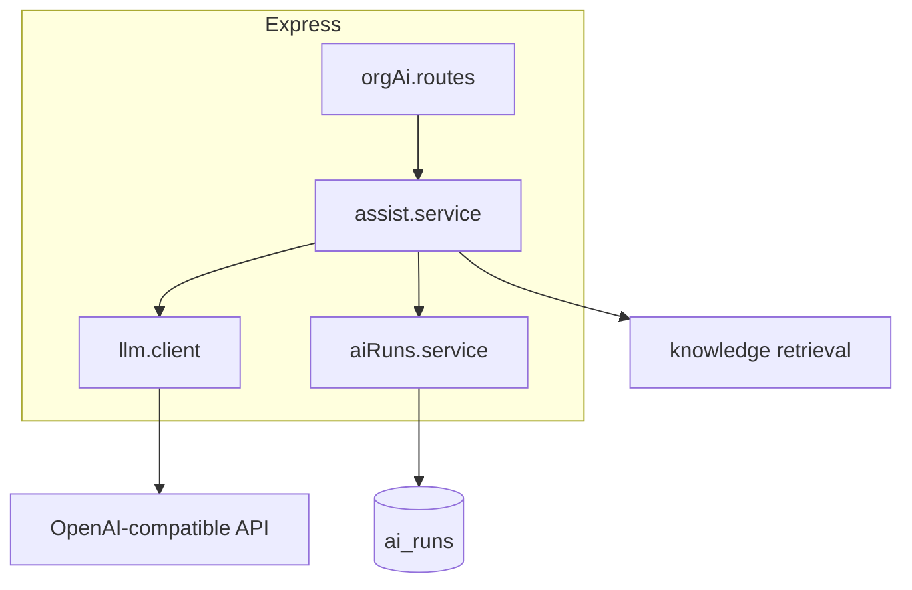

# AI capabilities

## Overview

**Phase 1–2** infrastructure and **Phase 3 Sprint 0–2** are shipped: org settings, knowledge RAG source, OpenAI-compatible LLM client, `ai_runs` audit log, copilot HTTP APIs, and **Inbox Copilot** sidebar (suggest + summarize).

See [ai-features/README.md](../ai-features/README.md) and [phase-3-prerequisites.md](../ai-features/phase-3-prerequisites.md).

## Capabilities today

### Configuration & guards

- `LLM_API_KEY`, `LLM_MODEL`, `LLM_BASE_URL` (server env)
- Org `ai_enabled`, `assist_enabled`; per-conversation `ai_enabled`
- **503** when LLM not configured

### Org-scoped API (`/api/org/:orgId/ai/*`)

All routes use Redis **per-org + per-user** rate limits.

| Method | Path | Purpose |
|--------|------|---------|
| GET | `/health` | Health + `llmConfigured` |
| POST | `/assist` | Generic agent prompt |
| POST | `/suggest-reply` | Draft reply from thread (+ optional KB) |
| POST | `/summarize` | Bullet summary of thread |
| POST | `/translate` | Translate text |
| POST | `/rewrite` | Rewrite text tone |

Legacy: `POST /api/ai/assist` (requires `organizationId` in body; per-user limit only).

### Data & analytics

- Every model call writes **`ai_runs`** (`feature`, tokens, latency, `prompt_hash`, status)
- Reports **AI** tab reads `ai_runs` when rows exist

### UI (partial)

- Inbox: Copilot tab label, AI styling, assign-to-AI
- Knowledge sidebar route
- Settings → AI & Automation

## Architecture

## Key files

| Layer | Path |
|-------|------|
| LLM | `server/src/services/ai/llm.client.js` |
| Orchestration | `server/src/services/ai/assist.service.js` |
| Logging | `server/src/services/ai/aiRuns.service.js` |
| API | `server/src/controllers/ai.controller.js`, `server/src/routes/orgAi.routes.js` |
| Rate limits | `server/src/middleware/aiRateLimit.js` |
| Shared | `shared/src/aiFeatures.js` |
| Settings | `shared/src/orgSettings.js`, `OrgAiSettingsPage.jsx` |

## Connections

| Feature | Relationship |
|---------|----------------|
| [Knowledge base](./knowledge-base.md) | RAG for `suggest-reply` |
| [Org AI settings](./org-ai-settings.md) | Feature flags |
| [Operational hardening](./operational-hardening.md) | `RATE_LIMIT_AI_*` |
| [Analytics](./analytics-and-reports.md) | AI tab metrics |
| [Support inbox](./support-inbox.md) | Target UX for copilot |

## Status

**Shipped (Phase 3)** — Copilot, composer AI, classification, analytics, guardrails. Autonomous customer replies remain Phase 6.
