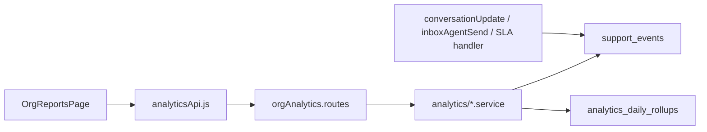

# Analytics & reports

## Overview

Product telemetry is stored in **`support_events`** (and future **`ai_runs`**). The **Reports** page calls org-scoped analytics endpoints and renders KPIs, charts, and breakdowns for a selectable date range.

## Capabilities

- Append-only `support_events` from server (`emitSupportEvent`)
- Analytics endpoints: overview, conversations, team, AI
- UI tabs with `ReportsKpiGrid`, `ReportsLineChart`, `ReportsBreakdownBars`
- AI tab degrades gracefully when no `ai_runs` rows exist
- `analytics_daily_rollups` table scaffold for future pre-aggregation

## Architecture

## Key files

| Layer | Path |
|-------|------|
| Page | `client/src/pages/OrgReportsPage.jsx` |
| Components | `client/src/components/reports/*` |
| Client API | `client/src/services/analyticsApi.js` |
| Routes | `server/src/routes/orgAnalytics.routes.js` |
| Controller | `server/src/controllers/analytics.controller.js` |
| Services | `server/src/services/analytics/overview.service.js`, `metricsQueries.js`, `supportEvents.service.js`, `dateRange.js` |
| Shared | `shared/src/supportEventTypes.js` |
| Migration | `supabase/migrations/20260516100000_analytics_tables.sql` |

## API

| Method | Path |
|--------|------|
| GET | `/api/org/:orgId/analytics/overview` |
| GET | `/api/org/:orgId/analytics/conversations` |
| GET | `/api/org/:orgId/analytics/team` |
| GET | `/api/org/:orgId/analytics/ai` |

Query params include date range (`from`, `to`) parsed in `dateRange.js`.

## Event types (examples)

From `shared/src/supportEventTypes.js`: `message.inbound`, `message.outbound_sent`, `conversation.assigned`, `sla.first_response_breach`, etc.

## Connections

| Feature | Relationship |
|---------|----------------|
| [Support inbox](./support-inbox.md) | Conversation lifecycle emits events |
| [Messages](./messages.md) | Outbound send success/failure events |
| [Notifications](./notifications-and-automation.md) | SLA scan emits breach events |
| [AI capabilities](./ai-capabilities.md) | AI tab reads `ai_runs` when populated |
| [Multi-organization](./multi-organization.md) | All queries filtered by org |

## Status

**Complete** for reports UI and product metrics from `support_events`. Rollups table is mostly unused; AI metrics await LLM integration.
