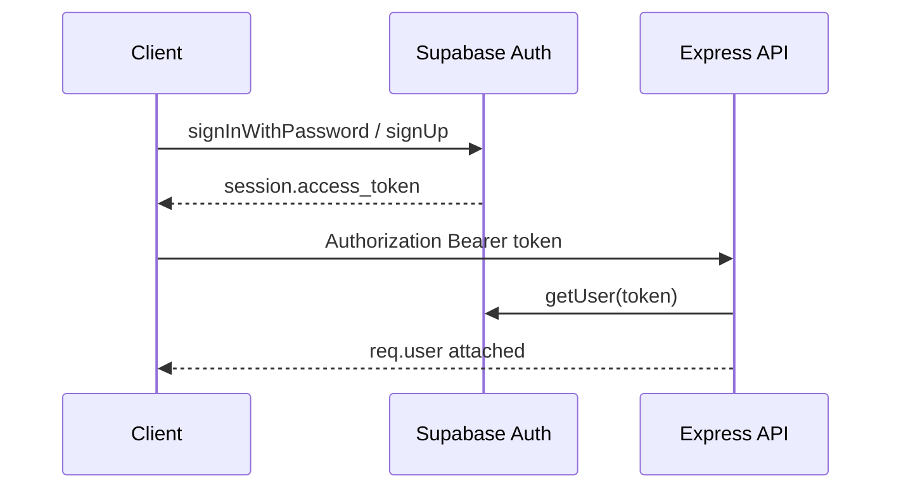

# Authentication & session management

## Overview

End users authenticate with **Supabase Auth** (email/password). The browser holds the session; the Express API validates the **access token JWT** on protected routes.

## Capabilities

- Register, login, logout from client services
- `AuthProvider` + `useAuth` / `useAuthContext` for React
- `RequireAuth` gates authenticated routes
- `GET /api/auth/me` returns the user for the bearer token
- `public.users` synced from auth metadata on signup (DB trigger)

## Architecture

## Key files

| Layer | Path |
|-------|------|
| Client auth | `client/src/services/auth.js`, `client/src/services/supabase.js` |
| API helper | `client/src/services/api.js` (`apiFetch` attaches JWT) |
| Context | `client/src/context/AuthContext.jsx`, `client/src/hooks/useAuth.js` |
| Guard | `client/src/components/ProtectedRoute.jsx` |
| Middleware | `server/src/middleware/auth.js` (`requireAuth`) |
| Controller | `server/src/controllers/auth.controller.js` |
| Routes | `server/src/routes/auth.routes.js` |
| Profile trigger | `supabase/migrations/20260513140000_handle_new_user_profile_names.sql` |

## API

| Method | Path | Auth |
|--------|------|------|
| GET | `/api/auth/me` | Yes |
| GET | `/api/auth/health` | No |

## Connections

| Feature | Relationship |
|---------|----------------|
| [Onboarding](./onboarding-and-registration.md) | After login, `/continue` uses auth user id |
| [Multi-organization](./multi-organization.md) | `requireAuth` runs before `requireOrgAccess` |
| [Support inbox](./support-inbox.md) | All org workspace APIs need JWT |
| [Multi-channel](./multi-channel.md) | Incoming web/email ingress **does not** use JWT (separate security model) |
| [Security](./security-and-access-control.md) | Service role never sent to client |

## Status

**Complete** for email/password flows. `GET /api/auth` returns namespace discovery for `/health` and `/me`.
