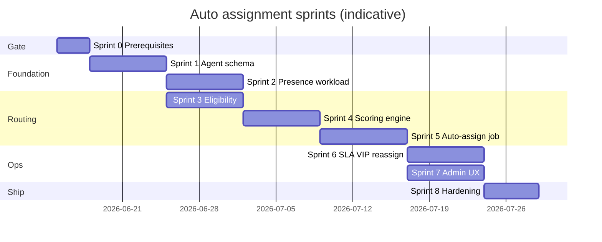

# Auto Assignment — Implementation sprints

Parent: [auto-assignment.md](./auto-assignment.md) (architecture plan)

Prerequisites:

- **Phase 3:** Inbound classification (`intent`, `sentiment`, `language`, `auto_tags`) in `conversations.metadata.ai` via `ai.classify_inbound`.
- **Phase 4:** Workflow rules for inbox routing, priority, and manual `set_assignment` actions (`workflowApply.service.js`); org-scoped automation worker.
- **Platform:** `conversations` workspace (`assignment_type`, `assigned_to_member_id`), `GET .../conversations/members`, `notify.assignment`, Redis (`REDIS_URL`) for locks and hot counters.
- **Inbox today:** Manual assignment + optional client **auto-assign on select** (not server-side intelligent routing).

Last updated: 2026-05-23

**Sprint 0:** Complete — see [auto-assignment-prerequisites.md](./auto-assignment-prerequisites.md).

**Sprint 1:** Complete — agent schema, assignment audit log, admin agent API.

**Sprint 2:** Complete — Redis presence/workload, heartbeat, shift hours helpers.

**Sprint 3:** Complete — inbox routing, eligibility filters, preview API.

**Sprint 4:** Complete — weighted scoring, strategies, round-robin tie-break.

**Sprint 5:** Complete — `assignment.auto_route` job, Redis lock, sticky assign, fallback queue.

**Sprint 6:** Complete — SLA-urgent ranking in preview, VIP proficiency floor, `assignment.reassign` job, offline + SLA-warning triggers.

**Sprint 7:** Complete — Settings → Assignment admin UI, `GET/PUT .../assignment/settings`, agent skills editor, inbox assignment audit hint.

**Sprint 8:** Complete — metrics API, structured logs, preview rate limits, concurrency tests, operations runbook.

---

## Goal (from architecture plan)

**AI-assisted skill-based weighted round robin** — classify and apply org rules first, then deterministically pick the best available agent using skills, workload, SLA signals, presence, and sticky history. AI assists metadata; it does **not** arbitrarily pick agents.

Target lifecycle:

```text
Conversation created / inbound message
        → AI classification
        → Workflow rule evaluation (inbox, priority, tags)
        → Candidate agent filtering
        → Weighted scoring
        → Best agent selection (+ tie-break round robin)
        → Assignment + audit log
        → SLA monitoring → reassignment / escalation
```

---

## Assignment model (target)

| Layer | Responsibility | Primary surface |
|-------|----------------|-----------------|
| **Signals** | Intent, sentiment, language, tags, priority | `metadata.ai`, workflow eval context |
| **Rules** | Inbox/team, VIP queue, priority bumps | `organizations.settings.workflow` (extend or parallel `assignment` settings) |
| **Eligibility** | Active, presence, shift, inbox access, skills, concurrency, permissions | `assignmentEligibility.service.js` |
| **Scoring** | Weighted hybrid (default), configurable strategies | `assignmentScoring.service.js` |
| **Execution** | Lock, assign, log, notify, fallback | `automation_jobs` `assignment.auto_route` |
| **Reassignment** | Offline, SLA risk, transfer, escalation | Worker + existing PATCH assignment |

**Worker stance:** Run auto-assignment on the **existing `automation_jobs` worker** after `ai.classify_inbound` and `ai.workflow_inbound` (same chain as Phase 4). HTTP ingress must not block on scoring.

**AI boundary (plan §22):** AI classifies; routing stays explainable via `assignment_logs.reason` + `strategy`.

---

## Sprint overview

```mermaid
flowchart LR
  S0[Sprint 0 Gate]
  S1[Sprint 1 Agent schema]
  S2[Sprint 2 Presence workload]
  S3[Sprint 3 Eligibility inbox]
  S4[Sprint 4 Scoring engine]
  S5[Sprint 5 Auto-assign job]
  S6[Sprint 6 SLA VIP reassign]
  S7[Sprint 7 Admin config]
  S8[Sprint 8 Hardening]

  S0 --> S1
  S1 --> S2
  S2 --> S3
  S3 --> S4
  S4 --> S5
  S5 --> S6
  S6 --> S7
  S7 --> S8
```



Sprints 2 and 3 can **partially parallelize** after Sprint 1 lands migrations (presence pipeline vs inbox/skill APIs).

---

## Sprint 0 — Prerequisites gate

**Goal:** Confirm inputs and platform guarantees before building intelligent assignment.

**Checklist** — verified in [auto-assignment-prerequisites.md](./auto-assignment-prerequisites.md).

- [x] **Classification** — `ai.classify_inbound` populates `metadata.ai` for test conversations; `getConversationAiSignals` returns intent/sentiment/language/tags.
- [x] **Workflow** — `ai.workflow_inbound` runs after classify; `set_assignment` / `set_priority` / `add_tag` work via `updateConversationFromAutomation`.
- [x] **Members** — `GET /api/org/:orgId/conversations/members` returns assignable agents; roles (`ADMIN` vs agent) documented for assignment permissions.
- [x] **Unassigned path** — `assignment_type = unassigned` visible in inbox filter; manual PATCH assignment enqueues `notify.assignment`.
- [x] **Redis** — `REDIS_URL` configured in non-prod; rate limits already use Redis (no in-memory lock Maps).
- [x] **Worker** — `npm run worker:automation` processes classify + workflow jobs; idempotency keys on enqueue helpers.
- [x] **Tenancy** — All new tables/RPCs filter `organization_id`; assignment mutations go through `conversationUpdate.service.js`.
- [x] **Feature flag** — `organizations.settings.assignment.auto_route_enabled` stubbed in `shared/src/assignmentSettings.js` (default `false`).

**Exit:** Gate signed off; test org has ≥2 agents, classification on, workflow rules optional; Redis + worker verified.

---

## Sprint 1 — Agent profile schema & assignment audit

**Goal:** Persist per-agent routing attributes and an immutable assignment audit trail (plan §18).

**Scope**

- **Migration:** extend `organization_members` or add `agent_profiles` (one row per member): `status`, `max_concurrency`, `shift_start`, `shift_end`, timezone.
- **Tables:** `agent_skills` (`agent_id`, `skill`, `proficiency`), `assignment_logs` (`conversation_id`, `assigned_from`, `assigned_to`, `reason`, `strategy`, `score_snapshot` JSONB optional).
- **Presence storage (DB):** `agent_presence` (`presence`, `last_seen`) — source of truth for admin/history; hot path in Sprint 2.
- **Shared:** enums for `presence` (`online`, `available`, `away`, `busy`, `offline`), assignment strategies (`least_loaded`, `round_robin`, `skill_based`, `weighted_hybrid`).
- **API (ADMIN):** `GET/PUT /api/org/:orgId/assignment/agents/:memberId` — skills, concurrency, shifts (bounded array sizes).
- **Service:** `assignmentLog.service.js` — append-only writes; no PII in logs.

**Key files (target)**

| Layer | Path |
|-------|------|
| Migration | `supabase/migrations/*_agent_assignment_schema.sql` |
| Shared | `shared/src/assignment.js` |
| API | `server/src/routes/assignment.routes.js`, `assignment.controller.js` |
| Log | `server/src/services/assignment/assignmentLog.service.js` |

**Exit:** Admin can configure skills + concurrency for a member; assigning a conversation writes one `assignment_logs` row.

**Shipped (2026-05-23)**

- Migration `20260523120000_agent_assignment_schema.sql` — `agent_profiles`, `agent_skills`, `agent_presence`, `assignment_logs`
- `shared/src/assignment.js` — presence, strategies, limits, skill validation
- `GET/PUT /api/org/:orgId/assignment/agents/:memberId` (**ADMIN**)
- `assignmentLog.service.js` — append on assignment change via `conversationUpdate.service.js`

---

## Sprint 2 — Presence & workload counters

**Goal:** Real-time eligibility inputs: who is available and how loaded they are (plan §19–21, §7.2–7.6).

**Scope**

- **Presence updates:** heartbeat from client (extend inbox session) or Supabase Realtime channel scoped by `organization_id`; map to allowed assign states (`online`, `available` only).
- **Redis:** `presence:{orgId}:{memberId}`, `active_chats:{orgId}:{memberId}` with TTL; increment/decrement on assignment change and conversation close (hook `conversationUpdate.service.js`).
- **Concurrency check:** `active_chats < max_concurrency` before candidate scoring.
- **Working hours:** evaluate `shift_start` / `shift_end` in agent timezone vs UTC; reuse or align with `businessHours.service.js` for org default.
- **Do not assign:** `away`, `busy`, `offline`, `invisible` — filter in eligibility layer.

**Key files (target)**

| Layer | Path |
|-------|------|
| Presence | `server/src/services/assignment/agentPresence.service.js` |
| Redis | `server/src/services/assignment/assignmentRedis.service.js` |
| Client | `client/src/hooks/useAgentPresence.js` (heartbeat on inbox mount) |

**Exit:** Two agents in same org show distinct presence in Redis; active chat count matches open assigned conversations within tolerance.

**Shipped (2026-05-23)**

- `assignmentRedis.service.js` — `asmt:presence:{org}:{member}` (TTL), `asmt:active_chats:{org}:{member}`
- `agentPresence.service.js` — heartbeat → DB + Redis; `GET /assignment/presence` (**ADMIN**)
- `agentWorkload.service.js` — DB-synced active chat counts; `memberHasConcurrencyCapacity`; hooks in `conversationUpdate.service.js`
- `shared/src/agentShiftHours.js` — `isWithinAgentShift`
- Client `useAgentPresence` — 30s heartbeat on inbox mount; `POST .../presence/heartbeat`

---

## Sprint 3 — Inbox selection & candidate filtering

**Goal:** Deterministic shortlist of agents eligible for a conversation (plan §6–7).

**Scope**

- **Inbox/team model:** map conversation → target inbox/team (from workflow metadata, channel, or `organizations.settings.assignment.inboxes` rules).
- **`assignmentEligibility.service.js`:** ALL of:
  1. Agent active
  2. Presence available
  3. Inside working hours
  4. Inbox/team membership
  5. Skill match (intent, tags, language — at least partial match tier)
  6. Under concurrency limit
  7. Role permission for assignment + inbox
- **Integration:** consume workflow outputs (priority, tags, suggested inbox) without re-running LLM.
- **Empty shortlist:** return structured `no_candidates` reason for fallback (Sprint 5).

**Key files (target)**

| Layer | Path |
|-------|------|
| Eligibility | `server/src/services/assignment/assignmentEligibility.service.js` |
| Inbox map | `server/src/services/assignment/assignmentInbox.service.js` |
| Workflow hook | extend `buildWorkflowEvalContext` / assignment metadata on apply |

**Exit:** Unit tests cover each filter dimension; dry-run API `POST .../assignment/preview` returns eligible member ids + drop reasons.

**Shipped (2026-05-23)**

- `assignmentInbox.service.js` — resolve inbox from metadata, channel map, or org rules; workflow sync
- `assignmentEligibility.service.js` + `assignmentEligibility.filters.js` — seven filters, `no_candidates` summary
- `shared/src/assignmentInboxes.js`, `assignmentSkillMatch.js`
- `POST /api/org/:orgId/assignment/preview` — org member; body `{ conversationId, targetInboxId? }`
- `workflowApply` syncs `metadata.assignment.target_inbox_id` after rule apply

---

## Sprint 4 — Weighted scoring & strategy selection

**Goal:** Rank eligible agents and pick a winner with explainable scores (plan §8–11, §17).

**Scope**

- **Default strategy:** `weighted_hybrid` with formula:
  ```text
  FINAL_SCORE =
    (skill_match * 40) + (low_workload * 20) + (sla_performance * 15)
    + (recent_activity * 10) + (customer_history * 10) + (priority_bonus * 5)
  ```
- **Skill tiers:** exact intent 40, related 25, generic 10 (normalized into skill_match factor).
- **Low workload:** `1 - (active_chats / max_concurrency)`.
- **SLA performance:** agent rolling breach rate / median first response (from `support_events` or materialized rollup — bounded query).
- **Sticky bonus:** +10 when `customer.previous_agent_id` matches and agent still eligible.
- **Tie-break:** weighted round robin per inbox (`assignmentRoundRobin.service.js` state in Redis).
- **Configurable strategies:** org setting switches to `least_loaded`, `round_robin`, `skill_based` (weighted_hybrid remains default).

**Key files (target)**

| Layer | Path |
|-------|------|
| Scoring | `server/src/services/assignment/assignmentScoring.service.js` |
| Round robin | `server/src/services/assignment/assignmentRoundRobin.service.js` |
| Shared | strategy + weight caps in `shared/src/assignment.js` |

**Exit:** Preview API returns ordered candidates with per-factor breakdown; ties deterministically resolved across repeated calls.

**Shipped (2026-05-23)**

- `shared/src/assignmentScoring.js` — weights, factor helpers, `computeWeightedHybridScore`
- `assignmentScoring.service.js` — SLA lookback, sticky customer agent, `rankEligibleAgents`
- `assignmentRoundRobin.service.js` — Redis `asmt:rr:{org}:{inbox}` tie-break + `round_robin` strategy
- Preview API returns `rankedCandidates`, `recommendedMemberId`, per-candidate `breakdown`

---

## Sprint 5 — Auto-assign execution pipeline

**Goal:** End-to-end server-side assignment after inbound classification (plan §2–3, §12, §15, §20).

**Scope**

- **Job type:** `assignment.auto_route` in `shared/src/automationJobTypes.js`; handler `jobHandlers/autoRoute.js`.
- **Enqueue:** after successful `ai.workflow_inbound` when conversation still `unassigned` and org `auto_route_enabled`; idempotency `assignment:auto_route:{conversationId}:{messageId}`.
- **Distributed lock:** `lock:conversation:{id}` in Redis during select+assign (short TTL, fail safe if lock held).
- **Apply:** `updateConversationFromAutomation` with `assignment_type: assigned_to_agent`, `assignedToMemberId`, `assignment_logs` reason `auto_route`, strategy + scores.
- **Sticky path:** prefer previous agent when eligible before full scoring (plan §12).
- **Fallback:** no candidates → remain `unassigned`, tag metadata `assignment.fallback = unassigned_queue`, optional `notify` to admins.
- **Notifications:** reuse `scheduleAssignmentWithFallback` for assignee email.
- **Events:** `support_events` `assignment.auto_applied`, `assignment.auto_skipped`, `assignment.auto_failed`.

**Key files (target)**

| Layer | Path |
|-------|------|
| Enqueue | `server/src/services/automation/enqueueAutoRoute.service.js` |
| Handler | `server/src/services/automation/jobHandlers/autoRoute.js` |
| Orchestration | `server/src/services/assignment/autoAssign.service.js` |
| Process job | register in `processJob.service.js` |

**Exit:** New inbound message on unassigned conversation → worker assigns best agent or leaves in unassigned queue with logged reason; no double-assign under concurrent workers.

**Shipped (2026-05-23)**

- Job `assignment.auto_route` + `handleAutoRoute` / `autoAssign.service.js`
- Enqueued from `workflowInbound` when still `unassigned` + `auto_route_enabled`
- Redis lock `asmt:lock:conversation:{id}`; skip when Redis down (`assignment.auto_skipped`)
- Sticky customer agent preferred when eligible; else `recommendedMemberId` from scoring
- Fallback `metadata.assignment.fallback = unassigned_queue`; events `assignment.auto_*`

---

## Sprint 6 — SLA-aware routing, VIP & reassignment

**Goal:** Operational overrides and lifecycle after initial assign (plan §13–16).

**Status:** Complete (2026-05-23).

**Scope**

- **SLA-aware:** when `remaining_sla_time < threshold` (`settings.assignment.sla_routing_enabled`, `sla_remaining_minutes_threshold`), preview re-ranks by lowest `activeChats` (`applySlaUrgentRanking`).
- **VIP / enterprise:** `vip_routing_enabled` + `vip_tag_names` → optional `vip_target_inbox_id` override; agents below `vip_min_proficiency` dropped from shortlist.
- **Reassignment triggers:**
  - Agent offline (`POST .../presence/offline`) → `scheduleReassignForOfflineAgent` when `reassign_on_agent_offline`
  - SLA warning → after `ai.workflow_sla` when `reassign_on_sla_warning`
  - Manual transfer → existing PATCH; log `reason: manual`
  - Sentiment deterioration — deferred (hook when classification delta rules exist)
- **Job:** `assignment.reassign` — excludes current assignee, no sticky; audit `reason: reassign`.

**Org settings** (merged in `mergeOrgAssignmentRouting` via `mergeAssignmentAdvancedSettings`):

| Key | Default |
|-----|---------|
| `sla_routing_enabled` | `false` |
| `sla_remaining_minutes_threshold` | `5` |
| `reassign_enabled` | `false` |
| `reassign_on_sla_warning` | `false` |
| `reassign_on_agent_offline` | `false` |
| `vip_routing_enabled` | `false` |
| `vip_tag_names` | `vip`, `enterprise` |
| `vip_min_proficiency` | `70` |
| `vip_target_inbox_id` | `null` |

**Key files**

| Layer | Path |
|-------|------|
| Shared advanced | `shared/src/assignmentAdvanced.js` |
| SLA boost (shared) | `shared/src/assignmentSlaBoost.js` |
| SLA context (server) | `server/src/services/assignment/assignmentSlaBoost.service.js` |
| Reassign | `server/src/services/assignment/reassign.service.js` |
| Enqueue | `server/src/services/automation/enqueueReassign.service.js` |
| Handler | `server/src/services/automation/jobHandlers/reassignConversation.js` |

**Exit:** Offline agent enqueues reassignment for open threads; SLA-near conversation shows `sla.urgent` + boosted ranking in `POST .../assignment/preview`.

---

## Sprint 7 — Admin configuration & operator visibility

**Goal:** Admins configure routing; agents see why a thread landed where it did (plan §24).

**Status:** Complete (2026-05-23).

**Scope**

- **Settings UI:** `client/src/pages/OrgAssignmentSettingsPage.jsx` — strategy, default concurrency/shift template, VIP rules, fallback notify list, auto-route / SLA / reassign toggles.
- **API:** `GET/PUT /api/org/:orgId/assignment/settings` (**ADMIN**); `buildAssignmentSettingsPatch` + merge into `settings.assignment` (never blind replace JSONB).
- **Agent skills UI:** teammate picker + `PUT .../assignment/agents/:memberId` on same page.
- **Inbox:** `AssignmentAuditHint` from `GET .../assignment/conversations/:id/audit`; admins link to strategy in settings.
- **Docs:** [support-inbox.md](./support-inbox.md), [workflow-automation.md](./workflow-automation.md) **Connections** updated.

**Exit:** Admin toggles strategy and saves; next auto-route uses new strategy; agents see assignment source in conversation details sidebar.

---

## Sprint 8 — Observability & production hardening

**Goal:** Enterprise-safe operations (plan §23, production-readiness rule).

**Status:** Complete (2026-05-23).

**Scope**

- **Metrics:** `GET /api/org/:orgId/assignment/metrics` — latency p50/p95, fallback %, fairness σ, reassign rate, queue depth; embedded in Reports → Overview.
- **Structured logs:** `assignmentStructuredLog.service.js` — JSON one-liners (`organization_id`, `conversation_id`, `strategy`, `error_code`, `duration_ms`).
- **Load tests:** `assignmentConcurrency.test.js` — eligibility drops saturated agents (no over-assign past `max_concurrency`).
- **Rate limits:** `orgAssignmentPreviewRateLimit` on `POST .../assignment/preview` (Redis, env-tunable).
- **Graceful degradation:** Redis down → skip auto-route/reassign (`redis_unavailable`); lock miss → `lock_held` + structured warn (no silent skip).
- **Runbook:** [auto-assignment-operations.md](./auto-assignment-operations.md).

**Exit:** Reports overview shows assignment KPIs; ops runbook documents worker + Redis failures; Phase 6 outbound unchanged.

---

## Sprint map (timeline view)



Dates are placeholders; align with quarter planning.

---

## Definition of done — full auto assignment

| Area | Done when |
|------|-----------|
| **Philosophy** | AI classifies only; agent pick is deterministic and logged |
| **Eligibility** | All seven filters enforced before scoring |
| **Scoring** | Weighted hybrid default; org can select alternate strategy |
| **Execution** | Async job after classify/workflow; Redis lock prevents double assign |
| **Fallback** | No candidate → unassigned queue + admin visibility |
| **Sticky** | Returning customer prefers prior agent when eligible |
| **Reassignment** | Offline + SLA-risk paths tested |
| **Safety** | Org-scoped APIs; ADMIN for settings; generic 5xx in production |
| **Ops** | Metrics, structured logs, worker + Redis failure degradation documented |

---

## Relationship to Phase 4 workflow

| Mechanism | Use |
|-----------|-----|
| **Workflow `set_assignment`** | Explicit target (specific member, team, AI) — runs first |
| **Auto-route job** | Only when still `unassigned` after workflow |
| **Workflow conditions** | Inbox, priority, VIP tags feed eligibility/scoring context |
| **Do not duplicate** | Extend `workflowApply` metadata, not a second rule engine |

---

## Explicitly out of scope

- **Phase 6** autonomous customer-visible AI sends (`assign_to_ai` outbound automation).
- **LLM picks agent** — no “choose agent #3” model output; scores only.
- **New channel ingress** — all channels use existing conversation create + inbound path.
- **Multi-region active-active** — single Redis assignment namespace per deployment assumed v1.
- **Billing / plan-based routing** beyond VIP flags already in metadata/tags.

---

## Architecture reference (parent doc)

| Plan section | Sprint |
|--------------|--------|
| §4 AI classification | Sprint 0 (existing) |
| §5–6 Rules & inbox | Sprint 3 (+ Phase 4 workflow) |
| §7 Candidate filtering | Sprint 3 |
| §8–11 Scoring | Sprint 4 |
| §12 Sticky | Sprint 5 |
| §13–14 SLA & VIP | Sprint 6 |
| §15 Fallback | Sprint 5 |
| §16 Reassignment | Sprint 6 |
| §17 Strategies | Sprint 4, 7 |
| §18 Database | Sprint 1 |
| §19–21 Redis & presence | Sprint 2, 5 |
| §22 AI role | All (enforced) |
| §23 Observability | Sprint 8 |
| §24 Admin config | Sprint 7 |
