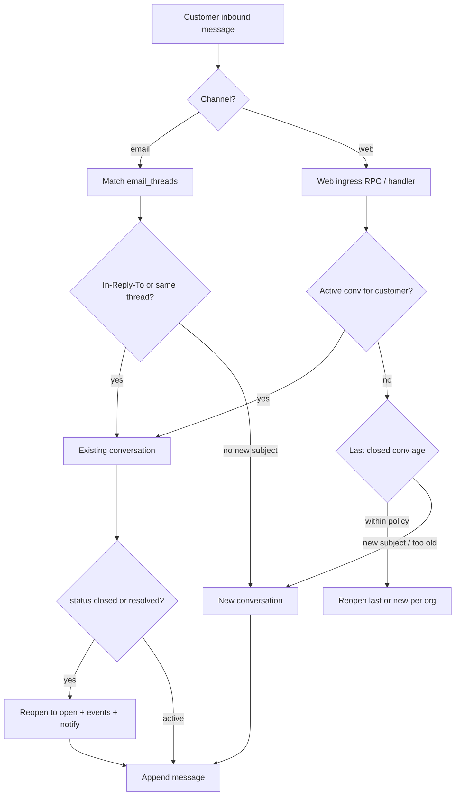
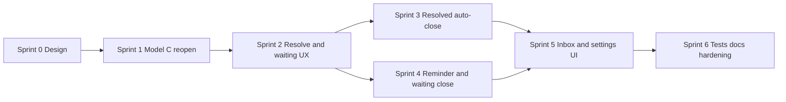

# Conversation status handling — implementation sprints

Parent concepts: [support-inbox.md](./support-inbox.md), [messages.md](./messages.md), [multi-channel.md](./multi-channel.md), [notifications-and-automation.md](./notifications-and-automation.md)

**Status:** Sprints 0–4 complete (schema, reopen, agent lifecycle, auto-close, waiting reminders); Sprints 5–6 planned

Last updated: 2026-05-26

---

## Goal

Implement **Model C** inbound routing plus a clear **lifecycle** for support conversations:

1. **Resolved** — agent marks issue fixed; conversation stays in **Resolved** inbox; customer can still reply on the same thread.
2. **Auto-close (resolved idle)** — after **N days** with no activity, `resolved` → `closed`.
3. **Waiting on customer** — after agent reply, if customer is silent: **reminder email** at **T1**, then **auto-close** at **T2**.
4. **Model C inbound** — same email thread reopens; new subject / stale closed → new conversation; web aligns with email rules.

---

## Status model (target)

| `status` | Agent meaning | In active workload? | Idle automation |
|--------|---------------|---------------------|-----------------|
| `open` / `pending` | Active thread (work in progress) | Yes | SLA / workflow as today |
| `resolved` | Issue considered fixed; thread stays open | No | Auto-close after N days idle |
| `closed` | Archived (manual or auto) | No | None |
| `spam` | Rejected ingress | No | None |

**`waiting_status`** (orthogonal column, empty when resolved/closed):

| `waiting_status` | Meaning | Automation |
|------------------|---------|------------|
| `''` | No explicit “who must act” flag | — |
| `waiting_customer` | Ball with customer (agent spoke last) | Reminder T1 → close T2 |
| `waiting_agent` | Ball with team (customer spoke last) | Future: next-response SLA |

Legacy rows with `status = waiting_customer` are migrated to `status = open` + `waiting_status = waiting_customer`.

**Semantic split (important):**

- Use **`waiting_status`** for “who are we waiting on?” while **`status` stays `open`**.
- Use **`resolved`** for “we’re done” (clears `waiting_status`, drives idle auto-close only).
- Do **not** overload `resolved` for waiting stories.

---

## Model C — inbound routing (target)



| Signal | Action |
|--------|--------|
| Email **In-Reply-To** / thread key matches | Use linked conversation → **reopen** if `resolved` / `closed` |
| Email **new subject** (no thread match) | **New** conversation |
| Web + **active** conversation exists | Reuse (today via RPC) |
| Web + only **closed/resolved** | **New** conversation (default) or reopen if closed &lt; M days (org setting) |
| `closed` older than **M days** | Always **new** conversation (optional org setting) |

**Inbound (Sprint 1):** Email thread hit on `resolved`/`closed` reopens via [`conversationLifecycle.service.js`](../../server/src/services/lifecycle/conversationLifecycle.service.js) before append. Web uses [`inboundWeb.service.js`](../../server/src/services/lifecycle/inboundWeb.service.js): active reuse, optional terminal reopen within `new_conversation_after_closed_days`, else RPC new conversation.

---

## Lifecycle timelines (examples)

### Resolved path (idea #1 + #2)

```text
Agent → Mark resolved
  → status = resolved, resolved_at, resolved_by
  → stays in Resolved inbox filter
  → customer can email/chat on same thread → reopen to open (Model C)

No activity for N days (org.lifecycle.resolved_auto_close_days)
  → status = closed, closed_reason = auto_idle_resolved
  → emit conversation.closed
```

### Waiting on customer path (idea #3)

```text
Agent sends reply (email or web)
  → if org policy: set waiting_customer (when last sender = agent)

T1 days, no customer message (org.lifecycle.waiting_reminder_days)
  → enqueue lifecycle.customer_reminder (one per conversation, idempotent)
  → outbound email to customer (requires sending domain verified)

T2 days after reminder, still no customer message
  → status = closed, closed_reason = auto_no_reply_after_reminder
```

Default example config (org-overridable):

| Setting | Example |
|---------|---------|
| `resolved_auto_close_days` | 14 |
| `waiting_reminder_days` | 3 |
| `waiting_auto_close_after_reminder_days` | 7 |
| `reopen_on_customer_message` | true |
| `new_conversation_after_closed_days` | 90 |

---

## Org settings (target)

Store under `organizations.settings.lifecycle` (merge with shared defaults in `@ai-support/shared`):

```json
{
  "lifecycle": {
    "resolved_auto_close_days": 14,
    "waiting_reminder_days": 3,
    "waiting_auto_close_after_reminder_days": 7,
    "reopen_on_customer_message": true,
    "new_conversation_after_closed_days": 90,
    "set_waiting_customer_on_agent_reply": true,
    "customer_reminder_enabled": true
  }
}
```

Admin UI: Settings → **Lifecycle** or subsection under Assignment / AI (Sprint 5).

---

## Events & analytics (target)

| Event | When |
|-------|------|
| `conversation.resolved` | Agent sets `resolved` (optional split from `conversation.closed`) |
| `conversation.reopened` | Customer message or manual reopen (`conversationUpdate` already emits on status leave closed/resolved) |
| `conversation.closed` | Manual close, auto idle, auto no-reply |
| `lifecycle.reminder_sent` | Customer reminder email succeeded |
| `lifecycle.reminder_skipped` | No outbound email / already sent |

Extend [`supportEventTypes.js`](../../shared/src/supportEventTypes.js) as needed.

---

## Data model additions (target)

**Option A — columns on `conversations` (recommended for cron scans):**

| Column | Purpose |
|--------|---------|
| `resolved_at` | When marked resolved |
| `resolved_by_member_id` | Who resolved |
| `closed_at` | When closed |
| `closed_reason` | `manual` \| `auto_idle_resolved` \| `auto_no_reply_after_reminder` |
| `last_customer_message_at` | Denormalized for idle scans |
| `last_agent_message_at` | Denormalized for waiting_customer scans |
| `customer_reminder_sent_at` | Idempotent reminder |

**Option B — only `metadata` JSON** — faster to ship, worse for indexed cron queries (avoid for production scale).

**New job types on `automation_jobs`:**

- `lifecycle.scan_org` — cron fan-out per org
- `lifecycle.auto_close_resolved`
- `lifecycle.send_customer_reminder`
- `lifecycle.auto_close_waiting`

Pattern: mirror [`sla.scan_org`](../../server/src/services/automation/jobHandlers/slaScanOrg.js) + [`POST /api/internal/cron/sla-scan`](../../server/src/routes/internalCron.routes.js).

---

## Sprint overview



| Sprint | Outcome | Depends on |
|--------|---------|------------|
| **0** | Schema/settings contract, shared constants | — |
| **1** | Unified inbound → reopen; email/web consistent | 0 |
| **2** | Agent resolve / waiting_customer + timestamps | 0 |
| **3** | Cron auto-close idle `resolved` | 0, 2 |
| **4** | Customer reminder + auto-close `waiting_customer` | 0, 2, email outbound |
| **5** | Inbox badges, lifecycle settings UI | 1–4 |
| **6** | Tests, runbook, feature doc finalization | 1–5 |

---

## Sprint 0 — Design gate & schema

**Goal:** Lock contracts before code paths diverge.

### Deliverables

- [x] Migration: lifecycle columns on `conversations` (Option A columns + partial indexes).
- [x] `organizations.settings.lifecycle` defaults in `@ai-support/shared` + merge helper (like assignment settings).
- [x] Document status transitions (state diagram) in this file § **Appendix A**.
- [x] `closed_reason` enum in shared package (`CONVERSATION_CLOSED_REASONS`).
- [x] Feature flag: `organizations.settings.lifecycle.enabled` (default `false` until Sprint 5).

### Key files (new/touch)

| Area | Path |
|------|------|
| Migration | `supabase/migrations/20260526160000_conversation_lifecycle.sql` |
| Shared | `shared/src/lifecycleSettings.js`, `shared/src/lifecycleSettings.test.js` |
| Docs | This file + [support-inbox.md](./support-inbox.md) **Connections** |

### Exit criteria

- [x] Team agrees: `waiting_customer` vs `resolved` agent actions (see Sprint 2 UI).
- [x] Cron can query idle resolved rows with index `(organization_id, status, last_message_at)` — partial index `idx_conversations_org_status_last_message_lifecycle`.

---

## Sprint 1 — Model C inbound (reopen)

**Goal:** One code path decides conversation target before `createMessage` for **email** and **web**.

### Deliverables

- [x] `conversationLifecycle.service.js` + `conversationLifecycle.rules.js`:
  - `isTerminalStatus(status)` → `resolved` \| `closed`
  - `shouldReopenConversation({ conversation, channel, payload, orgSettings })`
  - `reopenConversation({ organizationId, conversationId, reason })` → `open`, emit `conversation.reopened`, optional system message
- [x] Wire **email** [`processInboundEmail`](../../server/src/services/emailWebhook.service.js) after `findOrCreateEmailThread`:
  - Thread hit + terminal → reopen then append
  - New thread → new conversation (existing)
- [x] Wire **web** ingress ([`messages.controller.js`](../../server/src/controllers/messages.controller.js) / [`inboundWeb.service.js`](../../server/src/services/lifecycle/inboundWeb.service.js)):
  - Align with Model C (document divergence from “always new if no active”)
- [x] On reopen: call `scheduleInboundPostCustomerMessage` (notify staff) — same as new inbound
- [x] Skip auto-assign on terminal conversations until reopened (assignment job should ignore non-active)

### Tests

- [x] Unit: `conversationLifecycle.service.test.js` (reopen rules, terminal/active detection)
- [ ] Integration: Email In-Reply-To on `closed` → status `open`, same `conversation_id` *(manual / Sprint 6)*
- [x] Email new subject → new conversation (existing `findOrCreateEmailThread` `matchedBy: new`)
- [x] Web: no active → new conversation via RPC (default path in `processInboundWebMessage`)

### Exit criteria

- [x] No inbound message on `closed`/`resolved` without status → `open` (when `reopen_on_customer_message` true).

---

## Sprint 2 — Agent resolve & waiting on customer

**Goal:** Agents drive lifecycle states; timestamps maintained on every message.

### Deliverables

- [x] On agent outbound send ([`inboxAgentSend.service.js`](../../server/src/services/inboxAgentSend.service.js) / [`EmailAdapter`](../../server/src/adapters/EmailAdapter.js)):
  - Update `last_agent_message_at`
  - If `set_waiting_customer_on_agent_reply`: set `waiting_customer` (unless already terminal by agent choice)
- [x] On customer inbound (after Sprint 1):
  - Update `last_customer_message_at` ([`support.service.js`](../../server/src/services/support.service.js) `createMessage`, [`inboundWeb.service.js`](../../server/src/services/lifecycle/inboundWeb.service.js))
- [x] Extend [`updateConversationFields`](../../server/src/services/conversationUpdate.service.js) / PATCH API:
  - **Mark resolved** → `resolved`, `resolved_at`, `resolved_by_member_id`; keep assignee (configurable later)
  - **Mark closed** → `closed`, `closed_at`, `closed_reason: manual`
  - Emit `conversation.resolved` vs `conversation.closed` distinctly
- [x] Inbox PATCH UI ([`InboxPage.jsx`](../../client/src/pages/InboxPage.jsx)):
  - Separate actions: **Resolve**, **Close**, avoid conflating with generic status dropdown only
  - When last message is agent, suggest **Waiting on customer** vs **Resolve**
- [x] **Resolved** sidebar filter (`filter=resolved`) so resolved rows stay visible in their bucket

### Exit criteria

- [x] Every message updates correct `last_*_message_at`
- [x] Agent can set `resolved` without immediately hiding from Resolved filter

---

## Sprint 3 — Auto-close idle resolved

**Goal:** Idea #2 — `resolved` → `closed` after N days inactive.

### Deliverables

- [x] Cron route `POST /api/internal/cron/lifecycle-scan` (secret header like SLA)
- [x] `lifecycleScanOrg` job handler: find `status = resolved` AND `last_message_at < now - N days`
- [x] `lifecycle.auto_close_resolved` worker handler:
  - `updateConversationFromAutomation({ status: 'closed', closedReason: 'auto_idle_resolved' })`
  - System note on auto-close
- [x] Respect org `lifecycle.enabled` and `resolved_auto_close_days`
- [x] Structured log (`lifecycleStructuredLog.service.js`) + `conversation.closed` support event (with `closed_reason`)

### Exit criteria

- [x] Stale resolved conversations close within one cron period after threshold (15-min cron + worker)
- [x] Customer message resets idle clock (via `last_message_at` on inbound / reopen — Sprint 1–2)

### Ops

- Schedule `POST /api/internal/cron/lifecycle-scan` every **15 minutes** with header `x-automation-cron-secret` (same as SLA scan).
- Set `organizations.settings.lifecycle.enabled` to `true` per org (admin UI in Sprint 5; until then, patch settings JSON).

---

## Sprint 4 — Waiting reminder & auto-close

**Goal:** Idea #3 — reminder email, then close.

### Deliverables

- [x] Scan `waiting_customer` where idle anchor older than T1 and `customer_reminder_sent_at` null (`lifecycleScanOrg`)
- [x] Job `lifecycle.send_customer_reminder`:
  - [`customerReminderEmail.service.js`](../../server/src/services/lifecycle/customerReminderEmail.service.js) + `sendEmailViaProvider` (thread headers)
  - Skip when `sending_verified` false / missing Resend config (`lifecycle.reminder_skipped`, no dead job)
  - Idempotency `lifecycleCustomerReminderIdempotencyKey`
  - Sets `customer_reminder_sent_at` after successful send (conditional claim)
- [x] Scan waiting conversations where reminder sent before T2 cutoff
- [x] Job `lifecycle.auto_close_waiting` → `closed`, `closed_reason: auto_no_reply_after_reminder`
- [x] Customer inbound clears `customer_reminder_sent_at` (new waiting cycle)

### Email content (minimal v1)

- Subject: `Re: {conversation.subject}` or “Following up on your request”
- Body: short text + reply-to thread headers on send

### Exit criteria

- [x] At most one reminder per waiting cycle (`customer_reminder_sent_at` + idempotency key)
- [x] No reminder when outbound email not configured (logged `lifecycle.reminder_skipped`, job completes)

---

## Sprint 5 — Inbox & settings UI

**Goal:** Agents and admins see lifecycle state and configure timers.

### Deliverables

- [x] Settings page or section: **Conversation lifecycle** (ADMIN)
  - Edit `resolved_auto_close_days`, `waiting_reminder_days`, `waiting_auto_close_after_reminder_days`, toggles
  - API: `GET/PATCH /api/org/:orgId/settings/lifecycle`
- [x] Inbox list badges: `Resolved`, `Waiting on customer`, `Reopened`
- [x] Resolved filter shows resolved rows; closed filter shows closed; `waiting_customer` filter + counts
- [x] Conversation detail: show auto-close hint (“Closes in ~X days if no activity”)
- [x] Filter counts include resolved/waiting segments if missing

### Exit criteria

- [x] Admin can enable lifecycle and set days without deploy
- [x] Reopened conversations visible in Open / Inbox

---

## Sprint 6 — Tests, observability, documentation

**Goal:** Production-ready behavior under multi-tenant load.

### Deliverables

- [x] Unit tests: `conversationLifecycle.service.js` (reopen rules, terminal detection, `evaluateEmailThreadReopenDecision`)
- [x] Integration tests: email webhook reopen; cron close sample rows (`lifecycle.integration.test.js`)
- [x] Update [notifications-and-automation.md](./notifications-and-automation.md) **Connections**
- [x] Update [IMPLEMENTED-FEATURES.md](../../IMPLEMENTED-FEATURES.md) when shipped
- [x] Ops notes in [operational-hardening.md](./operational-hardening.md): cron schedule, job dead-letter alerts, reminder runbook

### Exit criteria

- [x] `npm run test` (server) covers lifecycle helpers
- [x] Runbook: “customer didn’t get reminder” → check sending domain + `customer_reminder_sent_at` ([operational-hardening.md](./operational-hardening.md))

---

## Appendix A — Allowed transitions (target)

```text
open / pending
  ↔ waiting_customer     (agent reply policy)
  → resolved             (agent)
  → closed               (agent)
  → spam                 (agent / ingress)

waiting_customer
  → open                 (customer reply)
  → resolved             (agent)
  → closed               (agent or auto_no_reply)

resolved
  → open                 (customer reply / reopen)
  → closed               (agent or auto_idle)

closed
  → open                 (customer reply on same thread if within M days — Model C)
  → (else new conversation)
```

---

## Appendix B — Current codebase touchpoints

| Concern | Today | Sprint |
|---------|-------|--------|
| Lifecycle schema | [`20260526160000_conversation_lifecycle.sql`](../../supabase/migrations/20260526160000_conversation_lifecycle.sql) | 0 ✓ |
| Lifecycle settings merge | [`lifecycleSettings.js`](../../shared/src/lifecycleSettings.js) | 0 ✓ |
| Inbound reopen | [`conversationLifecycle.service.js`](../../server/src/services/lifecycle/conversationLifecycle.service.js) | 1 ✓ |
| Web inbound | [`inboundWeb.service.js`](../../server/src/services/lifecycle/inboundWeb.service.js) | 1 ✓ |
| Message timestamps | [`lifecycleMessageTimestamps.service.js`](../../server/src/services/lifecycle/lifecycleMessageTimestamps.service.js) | 2 ✓ |
| Lifecycle cron | [`lifecycleScanOrg.js`](../../server/src/services/automation/jobHandlers/lifecycleScanOrg.js), [`internalCron.routes.js`](../../server/src/routes/internalCron.routes.js) | 3 ✓ |
| Auto-close resolved | [`lifecycleAutoCloseResolved.js`](../../server/src/services/automation/jobHandlers/lifecycleAutoCloseResolved.js) | 3 ✓ |
| Customer reminder | [`lifecycleSendCustomerReminder.js`](../../server/src/services/automation/jobHandlers/lifecycleSendCustomerReminder.js), [`customerReminderEmail.service.js`](../../server/src/services/lifecycle/customerReminderEmail.service.js) | 4 ✓ |
| Auto-close waiting | [`lifecycleAutoCloseWaiting.js`](../../server/src/services/automation/jobHandlers/lifecycleAutoCloseWaiting.js) | 4 ✓ |
| Status PATCH | [`conversationUpdate.service.js`](../../server/src/services/conversationUpdate.service.js) | 2 ✓ |
| Email inbound | [`emailWebhook.service.js`](../../server/src/services/emailWebhook.service.js) | 1 ✓ |
| Web inbound RPC | `handle_incoming_message` (new conv fallback) | 1 ✓ |
| Active statuses | [`CONVERSATION_ACTIVE_STATUSES`](../../shared/src/conversationWorkspace.js) | 1, 2 |
| Inbox filters | [`conversationInboxFilters.service.js`](../../server/src/services/conversationInboxFilters.service.js) | 5 ✓ |
| Lifecycle settings UI | [`OrgLifecycleSettingsPage.jsx`](../../client/src/pages/OrgLifecycleSettingsPage.jsx), [`orgLifecycleSettings.service.js`](../../server/src/services/lifecycle/orgLifecycleSettings.service.js) | 5 ✓ |
| Inbox badges / hints | [`conversationLifecycleBadges.js`](../../shared/src/conversationLifecycleBadges.js) | 5 ✓ |
| Lifecycle tests + ops | [`lifecycle.integration.test.js`](../../server/src/services/lifecycle/lifecycle.integration.test.js), [operational-hardening.md](./operational-hardening.md) | 6 ✓ |
| Automation worker | [`processJob.service.js`](../../server/src/services/automation/processJob.service.js) | 3, 4 |
| Staff notify | [`scheduleInboundPostCustomerMessage`](../../server/src/services/automation/inboundAutomation.service.js) | 1 |
| Customer outbound | [`emailOutbound.service.js`](../../server/src/services/emailOutbound.service.js) | 4 |

---

## Appendix C — Out of scope (v1)

- CSAT surveys on resolve
- Multiple reminders (only one per waiting cycle)
- Snooze / `snoozed` status (legacy removed from check constraint)
- WhatsApp/Messenger lifecycle (channel types schema-only)
- Auto-reopen closed tickets older than M days (only documented as optional setting)

---

## Connections (after implementation)

| Feature | Relationship |
|---------|----------------|
| [support-inbox.md](./support-inbox.md) | Filters, badges, resolve/close actions |
| [multi-channel.md](./multi-channel.md) | Email thread reopen vs new conversation |
| [notifications-and-automation.md](./notifications-and-automation.md) | Cron + worker jobs |
| [org-email-channel.md](./org-email-channel.md) | Reminder/close emails require sending DNS |
| [auto-assignment.md](./auto-assignment.md) | Auto-route only on active + post-reopen inbound |
