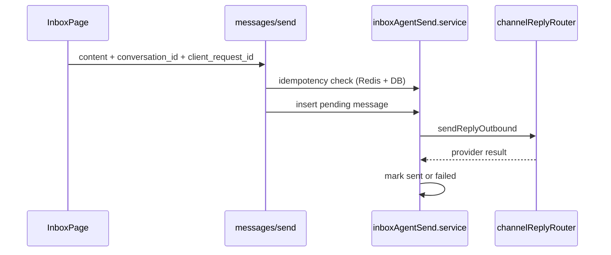

# Messages & composer

## Overview

Messages are rows in `messages` with a **sender_type** (customer, agent, system, ai, internal_note). Agent replies to customers go through a **pending → sent/failed** pipeline and the [multi-channel](./multi-channel.md) reply router.

## Capabilities

- List messages per conversation (paginated)
- Agent send via `POST .../messages/send` (primary inbox path)
- Generic `POST .../messages` for internal notes and advanced cases
- @mention parsing; merge user IDs into `conversations.metadata`
- Delivery states in UI (sending / sent / failed)
- **Collision warning** — if another agent sent within `STALE_THREAD_WINDOW_SEC` (default 30s), API returns `409` with `code: stale_thread`; client may retry with `acknowledge_stale_thread: true`
- **Assignee-only customer replies** — agents cannot send customer-visible messages on threads assigned to someone else (`403`); unassigned or own assignment OK; admins (`assign_others`) may override. Internal notes are not restricted.
- **Email by default** — inbox agent send emails the customer when they have a valid address and the org has an active email channel, regardless of `conversation.channel_type` (email threads require delivery; web threads still update in-app if email sidecar fails).
- Customer upsert API for tests and integrations

## Architecture

## Key files

| Layer | Path |
|-------|------|
| Send client | `client/src/services/conversationSendMessage.js` |
| Controller | `server/src/controllers/messages.controller.js` |
| Routes | `server/src/routes/messagesAuth.routes.js`, `messagesIncoming.routes.js` |
| Outbound | `server/src/services/inboxAgentSend.service.js` |
| Send idempotency | `server/src/services/agentSendIdempotency.service.js` |
| Client send | `client/src/services/conversationSendMessage.js` (`client_request_id`) |
| Ingress | `messages.controller.js` → RPC `handle_incoming_message` |
| Shared | `shared/src/messageSenderTypes.js`, `mentions.js` |
| Validation | `server/src/utils/incomingMessageValidation.js` |
| Migration | `20260515100000_messages_sender_type_internal_note.sql` |

## API

| Method | Path | Auth |
|--------|------|------|
| POST | `/api/org/:orgId/messages/send` | Yes (rate limit; optional `client_request_id`; optional `acknowledge_stale_thread`) |
| POST | `/api/org/:orgId/conversations/:id/claim` | Yes (self-assign unassigned) |
| POST | `/api/org/:orgId/messages` | Yes |
| POST | `/api/org/:orgId/messages/incoming` | No (ingress rate limit) |
| POST | `/api/org/:orgId/customers` | Yes |

## Database

- `messages` — `sender_type`, `delivery_status`, `content`, `metadata`, `organization_id`, `conversation_id`
- Future AI: `is_ai_generated`, `parent_message_id` *(columns exist; app mostly unused)*

## Connections

| Feature | Relationship |
|---------|----------------|
| [Operational hardening](./operational-hardening.md) | Agent send rate limit + outbound failure events on send path |
| [Support inbox](./support-inbox.md) | Composer on `InboxPage` |
| [Multi-channel](./multi-channel.md) | Outbound uses `channel_type` on parent conversation |
| [Realtime](./realtime.md) | New rows published to Realtime |
| [Notifications](./notifications-and-automation.md) | Customer inbound → `notify.staff_inbound` |
| [Analytics](./analytics-and-reports.md) | `emitSupportEvent` on outbound success/failure |
| [AI capabilities](./ai-capabilities.md) | `sender_type: ai` styled in UI; no auto-send yet |

## Status

**Complete** for agent/customer messaging on email and web. AI-authored messages are not generated by the server yet.
