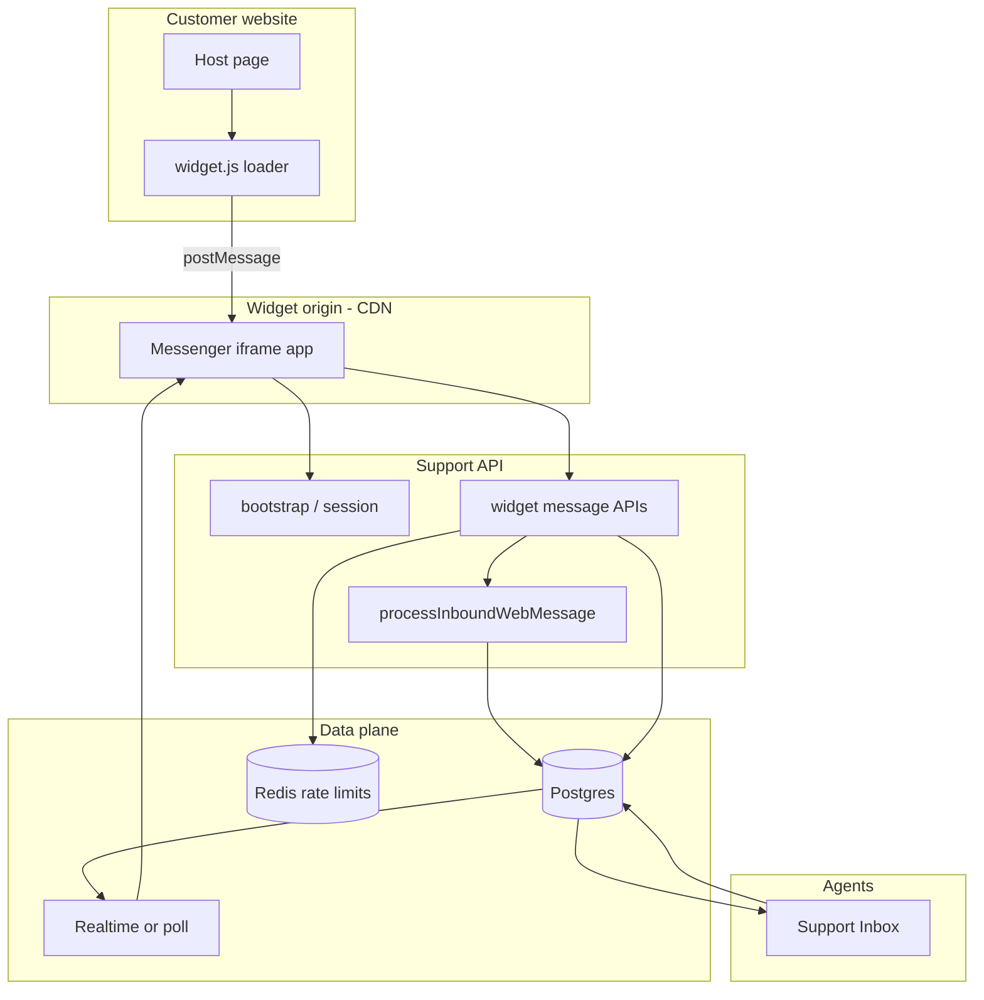

# Embeddable messenger widget — production plan

**Status:** **Shipped (MVP)** — loader, iframe app, widget APIs, admin settings, and test site. Visitor Realtime (Sprint 11) and attachments polish deferred.

**Related shipped code today**

| Area | What exists | Widget impact |
|------|-------------|---------------|
| Web channel | `channel_type = 'web'`, `WebAdapter`, `processInboundWebMessage` | Reuse for message persistence and agent outbound |
| Public ingress | `POST /api/org/:orgId/messages/incoming` (no JWT) | **Do not expose org UUID in embed**; replace with widget-scoped APIs |
| Lifecycle | Model C reopen, idempotency, ingress spam/duplicate | Reuse inside widget send path |
| Customers | `customers` + `customer_type` (`USER`/`LEAD`), `user_id` | Identified / logged-in site users map here |
| Conversations | Multiple open/active threads per customer allowed (`20260602190000`) | Widget can start new threads without uniqueness errors |
| Agent Realtime | Supabase `authenticated` + org membership RLS | **Not** for visitors; separate widget realtime or polling |
| Rate limits | Redis per-org + per-email on ingress | Extend with per-`widget_key`, per-visitor, per-IP |

See also: [multi-channel.md](./multi-channel.md), [security-and-access-control.md](./security-and-access-control.md), [realtime.md](./realtime.md), [messages.md](./messages.md).

**Implementation:** [sprints/messenger-web-sprints.md](./sprints/messenger-web-sprints.md) — Sprint 0–14 breakdown with exit criteria and test matrix.

---

## 1. Goals and non-goals

### Goals

- One-line embed on any customer site: loader script + isolated iframe UI.
- **Anonymous visitors** can open chat, send messages, and resume after refresh (within session/visitor limits).
- **Logged-in / signed-up users** on the host site can be linked via `identify()` (`customers.user_id` + email/name) without using agent JWTs.
- Agents continue to use the existing **Support Inbox**; widget traffic is `channel_type: web`.
- Production tenancy, abuse controls, observability, and key rotation.

### Non-goals (v1)

- WhatsApp/Messenger adapters (schema-only elsewhere).
- Full SDK for React/Vue (loader + iframe first).
- Visitor access to agent Supabase Auth or service role.
- Autonomous AI replies to visitors without existing org AI gates.

---

## 2. High-level architecture



**Principles**

1. **Postgres is source of truth**; Realtime (or polling) is notification only.
2. **Organization is resolved server-side** from `widget_key` / installation record — never authorize from a bare `orgId` in the embed snippet.
3. **Visitors are not agents** — separate identity, session JWT, and RLS (or no direct DB access).
4. **Iframe isolation** — no shared DOM/CSS with host; loader is tiny and versioned.

---

## 3. Embed model

### 3.1 Loader (`widget.js`)

Hosted at a stable versioned URL, e.g. `https://widget.<product-domain>/v1/widget.js`.

Responsibilities:

- Read `data-widget-key` (publishable) from the script tag or `window.SupportWidget.init({ widgetKey })`.
- Optionally read `data-locale`, `data-position`, etc.
- Create a fixed-position iframe pointing at the messenger app origin (different subdomain).
- `postMessage` bridge: open/close, unread badge, `identify`, `shutdown`, theme overrides (allowlisted keys only).
- Persist **first-party visitor token** in `localStorage` (key namespaced by `widget_key`) — not in third-party cookies unless product explicitly supports cookie mode later.
- Target size: **&lt; 20 KB** gzipped; no React on the loader.

### 3.2 Messenger app (iframe)

Hosted at e.g. `https://widget.<product-domain>/v1/messenger/`.

- Separate Vite/React (or lightweight) build from agent `client/`.
- All API calls include **widget session** bearer token (see §6).
- CSP: strict `default-src`; `frame-ancestors` allowlist managed per installation (or `*` only in dev with explicit flag).
- No `VITE_SUPABASE_SERVICE_ROLE` or agent anon key with broad RLS.

### 3.3 Admin-generated snippet

Settings UI (new): **Channels → Web widget** under org settings.

```html
<script
  async
  src="https://widget.<product-domain>/v1/widget.js"
  data-widget-key="wk_live_xxxxxxxx"
></script>
```

- Show **publishable** `widget_key` and one-time **secret** (`wk_secret_...`) for server-side `identify` HMAC (§6.4).
- Domain allowlist editor, appearance JSON, business hours, pre-chat fields.
- Staging keys: `wk_test_...` with separate allowlist (`localhost`, preview URLs).

### 3.4 Versioning

- URL path includes major version (`/v1/`).
- Loader and iframe deployed together; breaking API changes bump `/v2/`.
- Document deprecation window in release notes.

---

## 4. Channel and data model alignment

Use existing **`web`** channel — do **not** add a parallel `widget` channel type in v1.

| Concept | Storage |
|---------|---------|
| Installation | New `widget_installations` |
| Visitor identity | New `widget_visitors` (+ link to `customers`) |
| Session | New `widget_sessions` + signed JWT |
| Conversation | `conversations` with `channel_type = 'web'`, `channel_id` → org web channel row |
| Messages | `messages` with `metadata.channel = 'web'`, `sender_type = 'customer'` |

**Gap vs today’s ingress:** `POST /api/org/:orgId/messages/incoming` requires `customer.email`. The widget must support:

- **Anonymous start** — message allowed with visitor only; email collected when settings require (pre-chat gate or before first outbound email).
- **Identified start** — email/name/`user_id` from `identify()` or pre-chat form.

Implement via **new widget routes** that call the same `processInboundWebMessage` / `findOrCreateCustomer` once a customer row exists.

---

## 5. Database (new tables)

### 5.1 `widget_installations`

| Column | Notes |
|--------|--------|
| `id` | UUID PK |
| `organization_id` | FK, indexed |
| `widget_key` | Unique, public prefix `wk_live_` / `wk_test_` |
| `secret_hash` | bcrypt/argon2 of rotateable secret (never store plaintext) |
| `allowed_domains` | `text[]` — hostnames only, no paths |
| `status` | `active` \| `disabled` |
| `settings` | JSONB: colors, position, greeting, pre_chat_fields, business_hours, require_email, attachment_max_bytes, etc. |
| `created_at`, `updated_at` | |
| `rotated_at` | last key rotation |

Constraints:

- One or more installations per org allowed (e.g. marketing site vs app).
- `widget_key` lookup is indexed; org derived only from this row on widget APIs.

### 5.2 `widget_visitors`

| Column | Notes |
|--------|--------|
| `id` | UUID PK |
| `organization_id` | FK |
| `installation_id` | FK |
| `visitor_token` | Unique per installation (opaque, high entropy) |
| `customer_id` | Nullable FK → `customers` once identified |
| `email`, `name` | Denormalized for display; canonical email on `customers` |
| `metadata` | JSONB (UTM, page URL snapshot — bounded size) |
| `first_seen_at`, `last_seen_at` | |
| `last_ip_hash` | Store hashed IP, not raw (GDPR-friendly) |

### 5.3 `widget_sessions`

| Column | Notes |
|--------|--------|
| `id` | UUID PK |
| `visitor_id` | FK |
| `organization_id` | FK |
| `conversation_id` | Nullable — active thread for this session |
| `expires_at` | |
| `revoked_at` | Nullable |
| `created_at` | |

Indexes: `(visitor_id, expires_at)`, `(organization_id, created_at)` for audit.

### 5.4 RLS

- **No** direct anon/visitor SELECT on `messages` via agent policies.
- Server uses **service role** for widget APIs (same as ingress today).
- If Phase 2 adds Supabase Realtime for visitors, add policies for a dedicated JWT role (§7.2) — do not widen agent policies.

---

## 6. Authentication and identity matrix

Visitors and host-site users are **not** Supabase Auth agent users. Agent JWT path remains unchanged ([authentication.md](./authentication.md)).

| Persona | How host site establishes identity | Customer row | Session |
|---------|--------------------------------------|--------------|---------|
| **Anonymous** | Loader creates/stores `visitor_token`; bootstrap mints session | Created on first email or remain visitor-only until identify | Widget JWT |
| **Known visitor** | Pre-chat form (name/email) in iframe | `findOrCreateCustomer` by email; visitor linked | Widget JWT |
| **Logged-in site user** | `SupportWidget.boot({ userJwt })` or `identify({ userJwt })` (legacy: `userId` + HMAC `hash`) | `customers.user_id` + email (`customer_type: USER`) | Widget session JWT |
| **Returning anonymous** | Same `visitor_token` in localStorage | Same visitor row | New session if expired |

### 6.1 Bootstrap (no secret in browser beyond `widget_key`)

`GET /api/widget/v1/bootstrap`

Query: `widget_key`, `visitor_token` (optional), `Origin` / `Referer` headers.

Server:

1. Resolve installation by `widget_key`; 404 if disabled/unknown.
2. **Domain allowlist** — compare `Origin` host to `allowed_domains` (exact host or registrable domain rules documented in admin UI). Reject with 403 if mismatch (fail closed in production).
3. Create or load `widget_visitors` by `visitor_token` or issue new token.
4. Mint or refresh **widget session** (§6.2).
5. Return public config: branding, pre-chat schema, business hours, feature flags, `visitorToken`, `sessionToken`, `expiresAt`, `apiBase`.

Rate limit: per `widget_key` + per IP (Redis).

### 6.2 Widget session JWT

Issued by API only; signed with `WIDGET_SESSION_JWT_SECRET` (env, rotatable).

Claims (example):

```json
{
  "sub": "<visitor_id>",
  "org": "<organization_id>",
  "inst": "<installation_id>",
  "conv": "<conversation_id|null>",
  "typ": "widget_session",
  "iat": 0,
  "exp": 0
}
```

- TTL: **15–30 minutes**; refresh via `POST /api/widget/v1/session/refresh` with sliding window cap (e.g. 7 days visitor continuity).
- Revoke on abuse (`revoked_at`), org disable, or secret rotation (invalidate all sessions for installation optional).
- Every widget mutation route: `Authorization: Bearer <session>` + validate claims match URL/body resources.

**Do not** put `organization_id` alone in the embed as authorization.

### 6.3 Anonymous messaging without email

When `settings.require_email = false`:

- `POST /api/widget/v1/conversations/:id/messages` accepts content if session valid and conversation belongs to visitor.
- Customer row: create placeholder `LEAD` with synthetic email only if required by DB constraints — **prefer** migration/API change to allow null email on `customers` for pure anonymous web leads, or use `visitor+<visitor_id>@widget.invalid` internal-only addresses (documented, never emailed).

When `require_email = true`, block send until pre-chat completed.

### 6.4 Identified / logged-in users (user JWT + legacy `identify`)

**Recommended (Intercom-style):** host **backend** signs HS256 **user JWT** with installation secret; browser passes `userJwt` only.

```javascript
window.SupportWidget.boot({
  widgetKey: 'wk_live_…',
  iframeOrigin: 'https://api.example/v1/messenger',
  userJwt: '<from your backend>',
});
// Or: SupportWidget.identify({ userJwt: '…' });
```

- JWT: `typ: widget_user`, required `sub` / `user_id`, optional `email`, `name`, `attributes`, `exp` / `iat` (max TTL capped server-side).
- Verified on `GET /bootstrap?user_jwt=…` and `POST /identify` with `{ userJwt }`. Implementation: `server/src/utils/widgetUserJwt.js`.

**Legacy HMAC** (still supported):

```javascript
window.SupportWidget.identify({
  userId: 'acct_123',
  email: 'user@example.com',
  name: 'Jane Doe',
  hash: '<hmac_sha256_hex>',
});
```

`hash = HMAC-SHA256(widget_secret, userId + ':' + email)` — host backend computes; never ship secret to browser.

Both paths call `findOrCreateCustomer(…, customerType: 'USER')` and link `widget_visitors.customer_id`.

**Without verify (dev only):** `identify({ userId, email, name })` when `identifyAllowInsecure` + non-production.

### 6.5 Distinction: agent auth vs widget auth

| | Agent inbox | Widget |
|---|-------------|--------|
| Token | Supabase Auth JWT | Widget session JWT |
| Realtime | `authenticated` + org membership | Custom role or polling (§7) |
| APIs | `/api/org/:orgId/*` + `requireOrgAccess` | `/api/widget/v1/*` |
| Trust | User login | `widget_key` + domain + session |

A user who is both **agent** and **customer** on the same site uses separate tokens in separate apps (iframe vs inbox).

---

## 7. Realtime and delivery

### 7.1 Agent path (unchanged)

Agent replies: inbox → `channelReplyRouter` → `WebAdapter` → `messages` INSERT → Supabase Realtime → inbox clients ([realtime.md](./realtime.md)).

### 7.2 Visitor path — phased

**Phase 1 (recommended ship):** HTTP polling

- `GET /api/widget/v1/conversations/:id/messages?since=<cursor>`
- After send, return message row; poll every 2–5s with backoff when tab visible.
- Typing: optional `POST` + short TTL in Redis, poll or skip in v1.

**Phase 2:** Supabase Realtime for widget

- Edge function or API mints **short-lived Supabase-compatible JWT** with custom claims (`visitor_id`, `conversation_id`, `organization_id`).
- New RLS: `messages` SELECT where `conversation_id` matches claim and `sender_type` in (`customer`,`agent`) for that conversation only.
- Channel: `conversation:<id>:widget` — one channel per open thread.
- On `CHANNEL_ERROR` / timeout: fall back to polling (same as inbox).

Never subscribe visitors to org-wide inbox channels.

### 7.3 Message flows

**Customer → agent**

```text
Iframe → POST widget message API → processInboundWebMessage (or append)
  → messages row → automation enqueue → Realtime → Inbox
```

**Agent → customer**

```text
Inbox send → WebAdapter (metadata channel web) → messages INSERT
  → Realtime/poll → Iframe
```

Email fallback: if `customers.email` is set and org email channel exists, agent send may still email (existing behavior) — widget should show “We'll also email you” when applicable.

---

## 8. Widget API surface (v1)

All routes: CORS allow only messenger iframe origin(s); JSON body max 1mb (existing Express limit).

| Method | Path | Auth | Purpose |
|--------|------|------|---------|
| GET | `/api/widget/v1/bootstrap` | `widget_key` + Origin | Config + visitor + session |
| POST | `/api/widget/v1/session/refresh` | Session JWT | Extend session |
| POST | `/api/widget/v1/identify` | Session JWT (+ HMAC) | Link to `customers.user_id` |
| GET | `/api/widget/v1/conversations` | Session JWT | List visitor's web threads (paginated) |
| POST | `/api/widget/v1/conversations` | Session JWT | New thread (e.g. after closed) |
| GET | `/api/widget/v1/conversations/:id/messages` | Session JWT | History + cursor |
| POST | `/api/widget/v1/conversations/:id/messages` | Session JWT | Send (idempotency key supported) |
| POST | `/api/widget/v1/conversations/:id/typing` | Session JWT | Optional typing signal |

**Org admin (authenticated)**

| Method | Path | Auth | Purpose |
|--------|------|------|---------|
| GET/POST/PATCH | `/api/org/:orgId/widget/installations` | `requireOrgAccess` + permission | CRUD installations |
| POST | `.../installations/:id/rotate-secret` | ADMIN | Rotate secret |
| GET | `.../widget/installations/:id/snippet` | settings read | Embed code |

Reuse internally:

- `processInboundWebMessage`, `evaluateInboundIngressPolicy`, `incoming_message_idempotency`
- `sanitizeMessage`, `MAX_MESSAGE_LENGTH` from incoming validation
- `emitSupportEvent` / `emitIncomingMessageEvent` with `channelType: 'web'`, `source: 'widget'`

**Deprecate for embed:** direct use of `POST /api/org/:orgId/messages/incoming` from the iframe (org UUID enumerable). Keep endpoint for backward-compatible server-to-server integrations until migrated.

---

## 9. Security controls (production checklist)

### 9.1 Tenancy and authorization

- [ ] Resolve `organization_id` only from `widget_installations` or session claims.
- [ ] Every conversation/message access checks `visitor_id` ↔ `conversation.customer_id` path.
- [ ] `requireOrgAccess` on all admin installation routes; org id from URL only.
- [ ] Fail closed: disabled installation → 403; invalid session → 401.

### 9.2 Domain and origin

- [ ] `allowed_domains` enforced on bootstrap (and optionally on each API via `Origin`).
- [ ] `frame-ancestors` on iframe responses matches allowlist.
- [ ] `postMessage` target origin restricted to loader/parent host (loader validates `event.origin`).

### 9.3 Abuse and rate limits (Redis — required)

Extend [incomingRateLimit.js](../../server/src/middleware/incomingRateLimit.js) patterns:

| Key | Limit (example) |
|-----|-----------------|
| `widget:bootstrap:<widget_key>:<ip>` | 30 / min |
| `widget:msg:<visitor_id>` | 20 / min |
| `widget:msg:<installation_id>` | 500 / min |
| `widget:identify:<installation_id>` | 60 / min |

Plus existing ingress spam/duplicate policies per message content.

Optional: Cloudflare Turnstile on bootstrap when `settings.captcha_enabled`.

### 9.4 Secrets and keys

- [ ] `widget_key` public; `widget_secret` only on server + admin UI once.
- [ ] `WIDGET_SESSION_JWT_SECRET` in server env only ([server/.env.example](../../server/.env.example)).
- [ ] Key rotation: new `widget_key` / secret, grace period, audit log entry.
- [ ] Never log session tokens, secrets, or raw PII ([production-readiness rule](../../.cursor/rules/production-readiness.mdc)).

### 9.5 Input and attachments

- [ ] Message length cap (reuse incoming max).
- [ ] HTML stripped/sanitized; link count limits (ingress policy).
- [ ] Attachments (v1.1): presigned upload scoped to `visitor_id` + virus scan hook; store metadata on `messages.metadata` only.

### 9.6 CSRF / cookies

- Widget APIs use **Authorization header**, not cookies — CSRF risk low.
- If cookie-based session added later, require `SameSite=None; Secure` + CSRF token on mutating routes.

### 9.7 Privacy and compliance

- [ ] Privacy notice link in widget footer (org setting).
- [ ] Data retention: document mapping visitor → customer → conversations.
- [ ] Export/delete: hook into future GDPR tooling via `customer_id`.
- [ ] Store hashed IP only; configurable disable analytics cookies.

---

## 10. Conversation lifecycle (widget UX)

Align with [conversation-status-handling.md](./conversation-status-handling.md) and existing lifecycle services.

| Status | Widget behavior |
|--------|-----------------|
| `open` / active | Full composer |
| `waiting` (customer) | Show “Waiting for your reply”; allow send |
| `resolved` | Banner + “Send a new message” → reopen or new conversation per org lifecycle |
| `closed` | Read-only history; **New conversation** creates new row (multiple threads allowed) |

Reuse `shouldReopenConversation` / `reopenConversation` from web ingress when customer returns on same thread.

---

## 11. Connection recovery

| Event | Behavior |
|-------|----------|
| Page refresh | Reload iframe; bootstrap with same `visitor_token`; refresh session |
| Browser restart | `localStorage` visitor token restores history after bootstrap |
| Network loss | Exponential backoff on poll/realtime |
| Session expired | Silent refresh; re-prompt identify if HMAC-required |
| Realtime outage | Polling fallback (mandatory in Phase 2) |

---

## 12. Agent inbox parity

- Widget conversations appear in inbox with `channel_type: web` and source badge **Widget**.
- Assignment, SLA, automation, internal notes: unchanged.
- Typing/presence: agent-side hooks only; customer sees optional “Team is typing” from Redis/widget API.
- New conversation composer ([support-inbox.md](./support-inbox.md)) remains agent-initiated; widget is customer-initiated.

---

## 13. Configuration (per installation)

`settings` JSONB (merge with defaults server-side):

**Appearance:** `brandColor`, `logoUrl`, `position` (`bottom-right`), `launcherIcon`, `darkMode`

**Behavior:** `greeting`, `autoOpen`, `businessHours`, `offlineMessage`, `requireEmail`, `preChatFields[]`, `showConversationList`

**Security:** `allowedDomains[]`, `identifyRequireHmac`, `attachmentMaxBytes`, `captchaEnabled`

**Notifications:** `emailTranscriptOnClose` (future)

Admin UI: extend [settings-and-navigation.md](./settings-and-navigation.md) — new **Web widget** section.

---

## 14. Observability

Structured logs (JSON one-liners):

- `widget.bootstrap`, `widget.session`, `widget.message_sent`, `widget.identify`, `widget.domain_rejected`
- Fields: `organization_id`, `installation_id`, `visitor_id`, `conversation_id`, `error_code` (no email/content)

Product events (`support_events`):

- `widget.opened`, `widget.conversation_started`, `widget.message.sent`, `widget.session.revoked`

Alerts:

- Spike in `widget.domain_rejected` or 401/403 rate
- Message latency p95 widget → inbox
- Realtime disconnect rate (Phase 2)

---

## 15. Implementation phases

### Phase 0 — Prerequisites

- [ ] Migrations: `widget_installations`, `widget_visitors`, `widget_sessions`
- [ ] Env: `WIDGET_SESSION_JWT_SECRET`, `WIDGET_CDN_ORIGIN`, CORS entries for widget origin
- [ ] Redis limiter keys for widget routes

### Phase 1 — MVP (anonymous + email pre-chat)

- [ ] Loader + iframe shell (open/close, single thread)
- [ ] Bootstrap + session + send/list messages (polling)
- [ ] Wire to `processInboundWebMessage` when email known
- [ ] Admin: installation CRUD + snippet + domains
- [ ] Docs: `IMPLEMENTED-FEATURES.md` + update [multi-channel.md](./multi-channel.md)

### Phase 2 — Identified users

- [ ] `identify()` + HMAC + `customers.user_id`
- [ ] Conversation list in iframe
- [ ] Lifecycle/resume closed threads

### Phase 3 — Realtime + polish

- [ ] Visitor Realtime JWT + RLS OR improved poll with cursor SSE
- [ ] Typing indicators
- [ ] Attachments + offline hours form
- [ ] Widget analytics dashboard slice

### Phase 4 — Hardening

- [ ] Load test bootstrap + send
- [ ] Pen-test checklist (origin bypass, JWT tamper, cross-visitor access)
- [ ] Runbook: key rotation, disable installation, incident response

---

## 16. Key files (planned)

| Layer | Path |
|-------|------|
| Loader static | `widget-loader/` or `client/widget/` build to CDN |
| Iframe app | `client-widget/` (new package) |
| Widget routes | `server/src/routes/widget.routes.js` |
| Widget controllers | `server/src/controllers/widget.controller.js` |
| Session service | `server/src/services/widgetSession.service.js` |
| Installation service | `server/src/services/widgetInstallation.service.js` |
| Reuse inbound | `server/src/services/lifecycle/inboundWeb.service.js` |
| Reuse outbound | `server/src/adapters/WebAdapter.js` |
| Rate limits | `server/src/middleware/widgetRateLimit.js` |
| Migrations | `supabase/migrations/*_widget_*.sql` |
| Admin UI | `client/src/pages/OrgWidgetSettingsPage.jsx` |

---

## 17. Testing strategy

| Area | Tests |
|------|--------|
| Domain allowlist | Bootstrap from allowed vs evil origin → 403 |
| Session | Expired JWT, tampered claims, wrong conversation |
| Identify | HMAC valid/invalid; merge to `customers.user_id` |
| Tenancy | Visitor A cannot read visitor B thread |
| Rate limits | 429 with `Retry-After` |
| Idempotency | Duplicate `X-Idempotency-Key` returns same message id |
| E2E | Loader + iframe on static HTML fixture page |

---

## 18. Anti-patterns (reject in review)

- Embedding `organizationId` UUID in the snippet as the only auth mechanism.
- Giving the iframe the Supabase service role or agent session.
- Org-wide Realtime subscription for visitors.
- Sync LLM/email in widget request thread.
- In-memory rate limit Maps (use Redis only).
- Trusting `identify()` without HMAC in production when secret is set.

---

## 19. Open decisions

| Topic | Recommendation |
|-------|----------------|
| Channel name in product UI | “Web chat” / “Messenger widget”; DB stays `web` |
| Anonymous email placeholder | Add nullable `customers.email` for web-only leads **or** internal synthetic email — decide before Phase 1 |
| Single vs multiple open widget threads | Default **multiple** (matches `20260602190000`); org setting to prefer one active optional |
| Public ingress deprecation | Keep `messages/incoming` for API integrators; document widget as preferred for browsers |

---

## 20. Summary diagram (auth paths)

```text
                    ┌─────────────────────────────────────┐
                    │         Customer website             │
                    │  Anonymous        Logged-in user    │
                    │     │                  │             │
                    │     │    identify()    │             │
                    │     └────────┬─────────┘             │
                    │              v                       │
                    │         widget.js (loader)           │
                    └──────────────┬───────────────────────┘
                                   │ postMessage
                                   v
                    ┌──────────────────────────────────────┐
                    │   iframe — widget session JWT        │
                    │   (NOT Supabase agent auth)            │
                    └──────────────┬───────────────────────┘
                                   │
          bootstrap / send / poll  │
                                   v
                    ┌──────────────────────────────────────┐
                    │  API: widget_key → installation → org  │
                    │  validate Origin · rate limit · RLS    │
                    └──────────────┬───────────────────────┘
                                   │
                                   v
              Postgres (messages, conversations, customers)
                                   │
                                   v
                         Agent Inbox (JWT + org access)
```

---

**Document status:** Production-oriented plan aligned with the current codebase. Implementation not started; update [IMPLEMENTED-FEATURES.md](../IMPLEMENTED-FEATURES.md) when Phase 1 ships.
