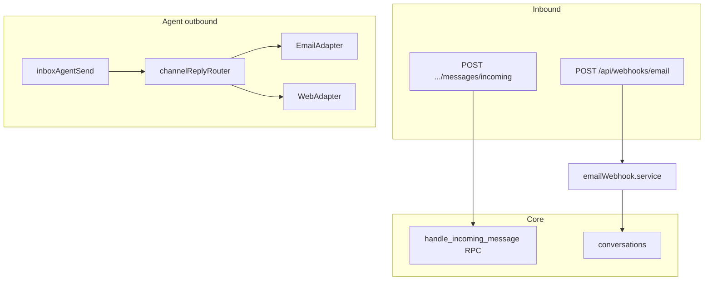

# Multi-channel architecture

## Overview

Each **conversation** belongs to exactly one **channel** (`channel_type` + `channel_id`). Inbound customer traffic enters via **web API** or **email webhook**; agent outbound replies route through **`channelReplyRouter.service.js`** to the correct adapter.

## Capabilities

- Channel registry per org (`email`, `web`, `whatsapp`, `messenger`)
- `channel_integrations` for provider config (e.g. Resend, inbound addresses)
- List channels: `GET /api/org/:orgId/channels`
- **Web**: public incoming POST + web adapter for outbound
- **Email**: inbound webhook, threading, Resend outbound (or mock)
- WhatsApp / Messenger: types in DB only; outbound **501**

## Architecture

## Key files

| Area | Path |
|------|------|
| Incoming routes | `server/src/routes/messagesIncoming.routes.js`, `emailWebhook.routes.js` |
| Email inbound | `server/src/services/emailWebhook.service.js` |
| Email outbound | `server/src/services/emailOutbound.service.js`, `emailReply.service.js` |
| Router | `server/src/services/channelReplyRouter.service.js` |
| Adapters | `server/src/adapters/EmailAdapter.js`, `WebAdapter.js` |
| Rate limit | `server/src/middleware/incomingRateLimit.js` |
| Migrations | `20260509153000_email_channel_support.sql`, `20260509160000_production_channel_architecture.sql`, `20260509200000_conversation_email_reply_routing.sql` |

## API

| Method | Path | Auth |
|--------|------|------|
| POST | `/api/org/:orgId/messages/incoming` | No |
| POST | `/api/webhooks/email` | Provider-specific |
| GET | `/api/org/:orgId/channels` | Yes |

## Database

- `channels`, `channel_integrations`, `email_threads`
- `conversations.channel_type`, `conversations.channel_id`

## Connections

| Feature | Relationship |
|---------|----------------|
| [Messages](./messages.md) | All messages inherit conversation channel |
| [Support inbox](./support-inbox.md) | UI shows channel icon from `source` / `channel_type` |
| [Notifications](./notifications-and-automation.md) | Inbound customer message triggers staff notify job |
| [Multi-organization](./multi-organization.md) | Channels scoped by `organization_id` |
| [Platform](./platform-and-monorepo.md) | `env.emailProvider`, `emailProviderMock` |

## Status

**Complete** for email and web. WhatsApp/Messenger are **schema-only** until adapters are implemented.
