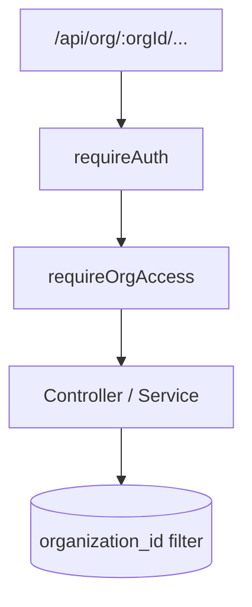

# Multi-organization (SaaS tenancy)

## Overview

Every customer workspace is an **organization**. Users belong via **organization_members** with role and status. All agent product data is scoped by `organization_id`; the API enforces membership from the URL segment `:orgId` only.

## Capabilities

- Create organization; list “my orgs”
- ACTIVE membership required for workspace APIs
- Roles: `ADMIN`, `AGENT`
- Client: org list context, selector, switcher, last-org `localStorage`
- URL pattern: `/org/:orgId/inbox`, `/reports`, `/settings`, etc.

## Architecture

## Key files

| Layer | Path |
|-------|------|
| Middleware | `server/src/middleware/orgAccess.js` (`requireOrgAccess`, `requireRole`) |
| Service | `server/src/services/org.service.js` |
| Controller | `server/src/controllers/org.controller.js` |
| Routes | `server/src/routes/org.routes.js`, `server/src/routes/orgWorkspace.routes.js` |
| Client context | `client/src/context/OrganizationContext.jsx` |
| Layout | `client/src/layouts/OrgWorkspaceLayout.jsx` |
| Storage | `client/src/utils/lastOrgStorage.js` |
| Schema | `supabase/migrations/20260512100000_multi_organization_saas.sql` |

## API

| Method | Path | Auth |
|--------|------|------|
| POST | `/api/org/create` | Yes |
| GET | `/api/org/my` | Yes |
| * | `/api/org/:orgId/*` | Yes + membership |

`orgWorkspace.routes.js` mounts conversations, messages, customers, analytics, members, invites under `:orgId`.

## Database

- `organizations`, `organization_members`, `invites`
- RLS: members see only their org’s data (see [security](./security-and-access-control.md))

## Connections

| Feature | Relationship |
|---------|----------------|
| [Authentication](./authentication.md) | `user_id` on memberships = `auth.users.id` |
| [Team invitations](./team-invitations.md) | Invites reference `organization_id` |
| [Support inbox](./support-inbox.md) | `conversations.organization_id` |
| [Multi-channel](./multi-channel.md) | `channels.organization_id` |
| [Analytics](./analytics-and-reports.md) | All metrics keyed by org |
| [Notifications](./notifications-and-automation.md) | Jobs and settings per org |

## Status

**Complete** for core tenancy and access control.
