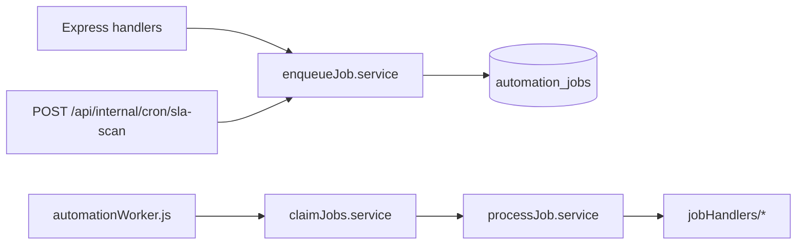

# Notifications & background automation

## Overview

Side effects that must not block HTTP requests (staff email, SLA scanning) run through a **durable `automation_jobs` queue** processed by a **separate worker process**. Enqueue helpers fall back to synchronous notification if the DB insert fails.

## Capabilities

- Job types: `notify.staff_inbound`, `notify.sla_warning`, `notify.assignment`, `sla.scan_org`, `knowledge.ingest_source`, `ai.classify_inbound`, `ai.workflow_inbound`, `ai.workflow_tag_added`, `ai.workflow_sla`, `ai.workflow_schedule_org`
- Worker polls via `claim_automation_jobs` RPC
- Org settings in `organizations.settings.automation` (SLA minutes, notify toggles) — edited via [org-ai-settings](./org-ai-settings.md)
- Optional internal email via Resend env vars
- Cron endpoint enqueues SLA scans for all orgs

**Dev note:** `npm run dev` starts the automation worker. Set `AUTOMATION_PROCESS_INLINE=false` (default in `.env.example`) so assignment/inbound emails are not sent twice (inline API processing + worker). Inline enqueue uses an atomic `pending` claim so a race with the worker cannot double-send if both are enabled.

## Architecture

## Key files

| Layer | Path |
|-------|------|
| Worker | `server/src/workers/automationWorker.js` |
| Enqueue | `server/src/services/automation/enqueueJob.service.js` |
| Notify facade | `server/src/services/automation/automationNotify.service.js` |
| Handlers | `server/src/services/automation/jobHandlers/*.js` |
| Classification | `server/src/services/ai/classification.service.js`, `jobHandlers/classifyInbound.js` |
| Staff email | `server/src/services/customerInboundNotification.service.js`, `conversationAssignmentNotification.service.js`, `internalNotificationMail.service.js` |
| Cron route | `server/src/routes/internalCron.routes.js` |
| Shared types | `shared/src/automationJobTypes.js` |
| Migration | `supabase/migrations/20260516110000_automation_jobs.sql` |
| Env | `AUTOMATION_CRON_SECRET`, `AUTOMATION_POLL_MS` in `server/.env.example` |

## Triggers

| Event | Job / action |
|-------|----------------|
| Customer inbound message | `notify.staff_inbound` (from `messages.controller`, `emailWebhook.service`) |
| Conversation assigned | `notify.assignment` (from `conversations.controller` / `conversationUpdate.service`) |
| Cron SLA scan | `POST /api/internal/cron/sla-scan` → `sla.scan_org` per org per **15-minute UTC bucket** (`slaScanOrgIdempotencyKey`) — run cron **every 15 minutes** → `sla.first_response_breach` + enqueue `ai.workflow_sla` |
| Cron schedule workflow | `POST /api/internal/cron/workflow-schedule-scan` → `ai.workflow_schedule_org` (orgs with `workflow.schedule.enabled`) |
| Knowledge file upload | `knowledge.ingest_source` → article publish + chunks |

## Connections

| Feature | Relationship |
|---------|----------------|
| [Messages](./messages.md) | Inbound path schedules staff notify |
| [Support inbox](./support-inbox.md) | Assignment patch schedules assignment notify |
| [Analytics](./analytics-and-reports.md) | SLA handler writes `sla.first_response_breach` events |
| [Knowledge base](./knowledge-base.md) | Ingest jobs processed by same worker |
| [Org AI settings](./org-ai-settings.md) | Automation toggles and SLA minutes |
| [Multi-organization](./multi-organization.md) | Jobs include `organization_id` |
| [Platform](./platform-and-monorepo.md) | Root `npm run dev` starts worker alongside API |

## Status

**Complete** for Phase 1 automation (notify + SLA event emission). No auto-assign from SLA job yet.
