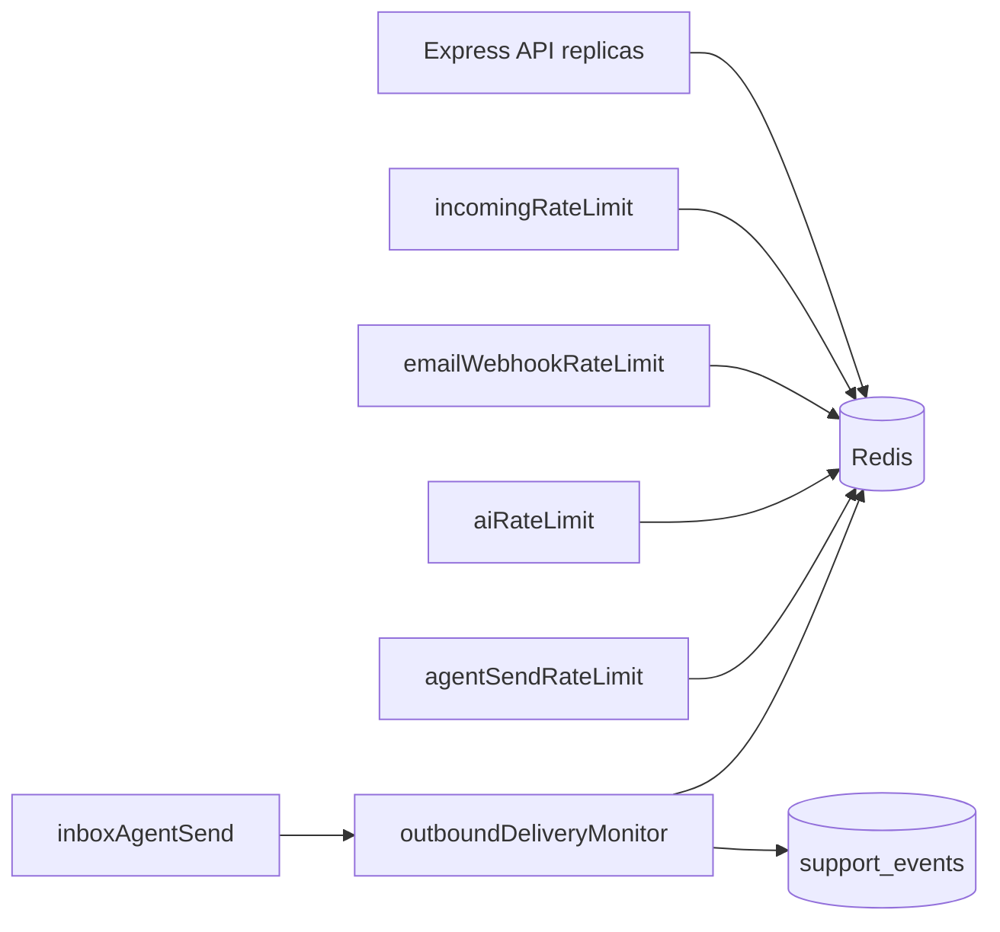

# Operational hardening

## Overview

Production guardrails for **abuse resistance** (Redis rate limits shared across API replicas), **observable outbound failures**, and **operator diagnostics**. The API **requires `REDIS_URL`** and exits on startup if Redis is unreachable.

## Capabilities

| Surface | Protection | Redis key prefix | Config (`server/.env`) |
|---------|------------|------------------|-------------------------|
| `POST /api/org/:orgId/messages/incoming` | Per org + per org+email | `rl:ingress.org:*`, `rl:ingress.email:*` | `RATE_LIMIT_INCOMING_*` |
| `POST /api/webhooks/email` | Per recipient | `rl:webhook.email:*` | `RATE_LIMIT_WEBHOOK_EMAIL_*` |
| `POST /api/org/:orgId/ai/assist` | Per org + per org+user | `rl:ai.org:*`, `rl:ai.org_user:*` | `RATE_LIMIT_AI_*` |
| `POST /api/ai/assist` (legacy) | Per user | `rl:ai.global_user:*` | `RATE_LIMIT_AI_USER_*` |
| `POST /api/org/:orgId/messages/send` | Per org+user + `client_request_id` idempotency | `rl:agent.send:*`, `rl:agent:send:lock:*`, `rl:agent:send:result:*` | `RATE_LIMIT_AGENT_SEND_*` |
| Outbound failure | Deduped stderr logs (Redis `SET NX`) + always-on `support_events` | `rl:outbound:log:*` | `OUTBOUND_FAILURE_LOG_DEDUPE_MS` |

**HTTP headers:** `X-RateLimit-Limit`, `X-RateLimit-Remaining`, `X-RateLimit-Reset`; `Retry-After` on 429.

## Architecture



Fixed-window counters use an atomic Lua script (`INCR` + `PEXPIRE`) in `rateLimitRedis.js`.

## Local Redis setup

```bash
docker compose -f docker-compose.redis.yml up -d
```

In `server/.env`:

```env
REDIS_URL=redis://localhost:6379
```

Start the API (`npm run dev` or `npm run dev:server`). Without Redis, the process **exits on startup**.

## Production deployment

| Item | Guidance |
|------|----------|
| **Managed Redis** | Upstash, ElastiCache, Redis Cloud, etc. Set `REDIS_URL` with TLS if required (`rediss://...`) |
| **Replicas** | All API instances share the same `REDIS_URL` and `RATE_LIMIT_REDIS_KEY_PREFIX` |
| **Fail closed** | `RATE_LIMIT_REDIS_FAIL_CLOSED=true` (default in production) → 503 if Redis errors during a check |
| **Worker** | Automation worker does not use Redis for rate limits; only the HTTP API needs `REDIS_URL` |
| **Edge limits** | Optional extra layer (Cloudflare) in front of public ingress |

## Key files

| Layer | Path |
|-------|------|
| Redis client | `server/src/config/redis.js` |
| Config | `server/src/config/rateLimit.config.js` |
| Limiter | `server/src/middleware/rateLimitRedis.js`, `rateLimitFactory.js` |
| Outbound monitor | `server/src/services/outboundDeliveryMonitor.service.js` |
| Startup | `server/src/server.js` (connect Redis before listen) |
| Compose | `docker-compose.redis.yml` |

## Internal ops API

```http
GET /api/internal/ops/rate-limits
x-automation-cron-secret: <AUTOMATION_CRON_SECRET>
```

Returns Redis ping status and outbound log dedupe settings (`log_dedupe_backend`, window ms).

## Conversation lifecycle operations

Lifecycle automation runs on the **automation worker** (not the HTTP API). Schedule the same cron secret as SLA.

| Item | Value |
|------|--------|
| Cron endpoint | `POST /api/internal/cron/lifecycle-scan` |
| Header | `x-automation-cron-secret: <AUTOMATION_CRON_SECRET>` |
| Schedule | **Every 15 minutes** (UTC 15-minute idempotency buckets) |
| Master switch | `organizations.settings.lifecycle.enabled` (Settings → Conversation lifecycle) |
| Worker | `npm run worker:automation` (separate process from `npm run start`) |

### Job chain (per org, per bucket)

1. `lifecycle.scan_org` — scans DB for candidates, enqueues child jobs (batch limit 200 per category).
2. `lifecycle.auto_close_resolved` — closes idle `resolved` → `closed` (`closed_reason: auto_idle_resolved`).
3. `lifecycle.send_customer_reminder` — one email per waiting cycle (`customer_reminder_sent_at` set on success).
4. `lifecycle.auto_close_waiting` — closes after reminder + silence (`closed_reason: auto_no_reply`).

Structured logs use JSON one-liners via `lifecycleStructuredLog.service.js` (`organization_id`, `conversation_id`, `op`, `outcome`, `reason`).

### Dead-letter / queue alerts

Monitor `automation_jobs` for lifecycle job types:

| Signal | Query / action |
|--------|----------------|
| Stuck work | `status = 'pending'` and `run_at < now() - interval '30 minutes'` for `job_type` like `lifecycle.%` |
| Failures retrying | `status = 'failed'` and `attempts < max_attempts` |
| Dead jobs | `status = 'dead'` — inspect `last_error`, fix root cause, re-enqueue or resolve data manually |
| Scan not running | No `lifecycle.scan_org` completed in 30+ minutes while cron is configured |

Recommended alerts: count of `dead` lifecycle jobs &gt; 0; pending depth &gt; threshold per org; cron HTTP non-2xx from scheduler.

Ops API (shared secret): `GET /api/internal/ops/rate-limits` does not cover the worker queue — use DB/Supabase dashboard or your metrics stack on `automation_jobs`.

### Runbook: customer did not receive a waiting reminder

1. **Lifecycle enabled** — Settings → Conversation lifecycle → “Enable lifecycle automation” and “Customer reminder emails”.
2. **Conversation state** — `waiting_status = waiting_customer`; `customer_reminder_sent_at` still null; agent was last to speak (`last_agent_message_at` &gt; `last_customer_message_at`).
3. **Timers** — `last_customer_message_at` (or anchor) older than `waiting_reminder_days`; cron must have run after that cutoff.
4. **Email sending** — Org must have verified outbound domain ([org-email-channel.md](./org-email-channel.md)). Reminder handler skips without sending config (job completes, `lifecycle.reminder_skipped` event).
5. **Worker + cron** — Automation worker running; `lifecycle-scan` cron every 15 minutes; check `automation_jobs` for `lifecycle.send_customer_reminder` (`dead` / `failed`).
6. **Already reminded** — `customer_reminder_sent_at` set → no second reminder in the same waiting cycle (by design).
7. **Events** — `support_events`: `lifecycle.reminder_sent` vs `lifecycle.reminder_skipped` with `reason` in payload.

### Next-response SLA (`waiting_agent`)

Runs in the same `sla.scan_org` cron (every 15 minutes) when `automation.sla_enabled` is on.

| Item | Value |
|------|--------|
| Candidate rows | `waiting_status = waiting_agent`, `status` in `open`/`pending`, `last_customer_message_at` older than `next_response_sla_minutes` (Settings → AI & Automation), no agent reply after that timestamp |
| Event | `sla.next_response_breach` |
| Workflow job | `ai.workflow_sla` with `breachType: next_response` (idempotency per conv/day) |
| Cleared | Agent outbound clears `metadata.ingress.sla_at_risk` (same as first-response path) |

## Connections

| Feature | Relationship |
|---------|----------------|
| [Multi-channel](./multi-channel.md) | Webhook + ingress limits |
| [Messages](./messages.md) | Agent send limit |
| [Analytics](./analytics-and-reports.md) | Failure events |
| [Security](./security-and-access-control.md) | Ingress abuse controls |
| [Conversation lifecycle](./conversation-status-handling.md) | Cron + worker jobs, reminder runbook |
| [Notifications and automation](./notifications-and-automation.md) | `lifecycle.*` job types |

## Status

**Complete** — Redis for rate limits and outbound log dedupe. `support_events` are never deduped (analytics stay complete). Lifecycle ops runbook included above.
