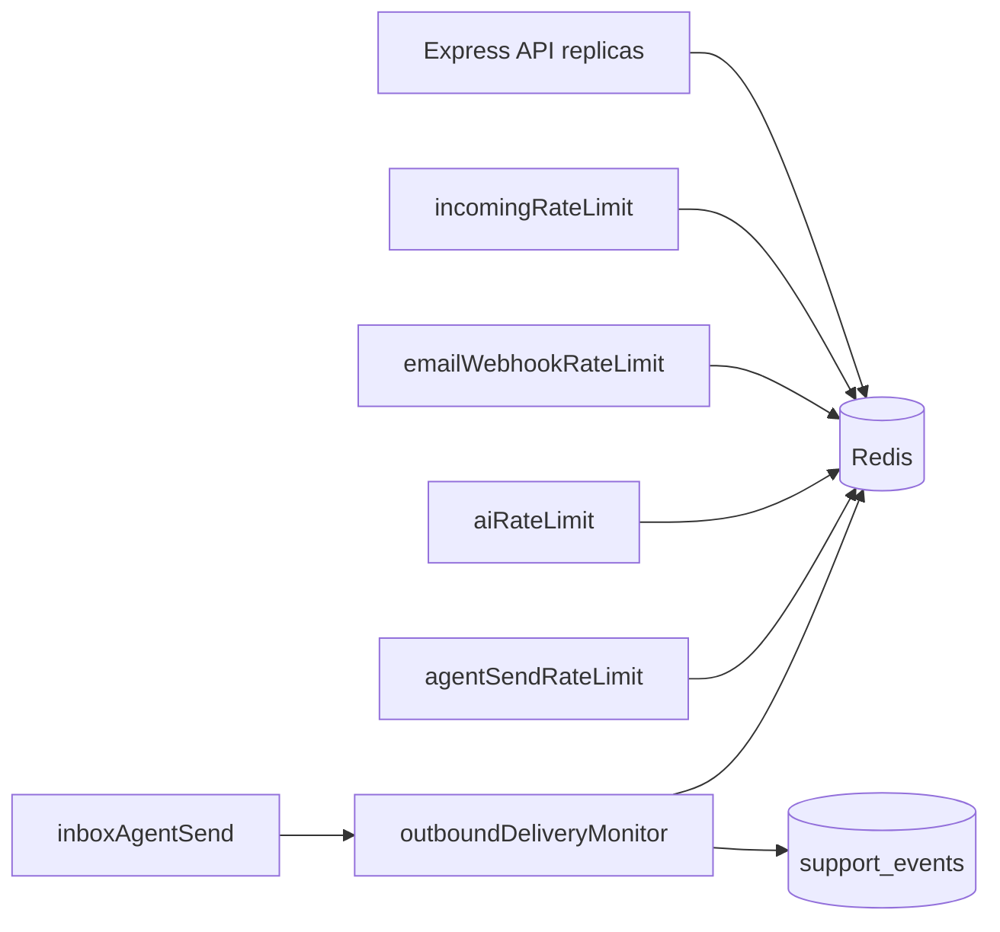

# Operational hardening

## Overview

Production guardrails for **abuse resistance** (Redis rate limits shared across API replicas), **observable outbound failures**, and **operator diagnostics**. The API **requires `REDIS_URL`** and exits on startup if Redis is unreachable.

## Capabilities

| Surface | Protection | Redis key prefix | Config (`server/.env`) |
|---------|------------|------------------|-------------------------|
| `POST /api/org/:orgId/messages/incoming` | Per org + per org+email | `rl:ingress.org:*`, `rl:ingress.email:*` | `RATE_LIMIT_INCOMING_*` |
| `POST /api/webhooks/email` | Per recipient | `rl:webhook.email:*` | `RATE_LIMIT_WEBHOOK_EMAIL_*` |
| `POST /api/org/:orgId/ai/assist` | Per org + per org+user | `rl:ai.org:*`, `rl:ai.org_user:*` | `RATE_LIMIT_AI_*` |
| `POST /api/ai/assist` (legacy) | Per user | `rl:ai.global_user:*` | `RATE_LIMIT_AI_USER_*` |
| `POST /api/org/:orgId/messages/send` | Per org+user + `client_request_id` idempotency | `rl:agent.send:*`, `rl:agent:send:lock:*`, `rl:agent:send:result:*` | `RATE_LIMIT_AGENT_SEND_*` |
| Outbound failure | Deduped stderr logs (Redis `SET NX`) + always-on `support_events` | `rl:outbound:log:*` | `OUTBOUND_FAILURE_LOG_DEDUPE_MS` |

**HTTP headers:** `X-RateLimit-Limit`, `X-RateLimit-Remaining`, `X-RateLimit-Reset`; `Retry-After` on 429.

## Architecture



Fixed-window counters use an atomic Lua script (`INCR` + `PEXPIRE`) in `rateLimitRedis.js`.

## Local Redis setup

```bash
docker compose -f docker-compose.redis.yml up -d
```

In `server/.env`:

```env
REDIS_URL=redis://localhost:6379
```

Start the API (`npm run dev` or `npm run dev:server`). Without Redis, the process **exits on startup**.

## Production deployment

| Item | Guidance |
|------|----------|
| **Managed Redis** | Upstash, ElastiCache, Redis Cloud, etc. Set `REDIS_URL` with TLS if required (`rediss://...`) |
| **Replicas** | All API instances share the same `REDIS_URL` and `RATE_LIMIT_REDIS_KEY_PREFIX` |
| **Fail closed** | `RATE_LIMIT_REDIS_FAIL_CLOSED=true` (default in production) → 503 if Redis errors during a check |
| **Worker** | Automation worker does not use Redis for rate limits; only the HTTP API needs `REDIS_URL` |
| **Edge limits** | Optional extra layer (Cloudflare) in front of public ingress |

## Key files

| Layer | Path |
|-------|------|
| Redis client | `server/src/config/redis.js` |
| Config | `server/src/config/rateLimit.config.js` |
| Limiter | `server/src/middleware/rateLimitRedis.js`, `rateLimitFactory.js` |
| Outbound monitor | `server/src/services/outboundDeliveryMonitor.service.js` |
| Startup | `server/src/server.js` (connect Redis before listen) |
| Compose | `docker-compose.redis.yml` |

## Internal ops API

```http
GET /api/internal/ops/rate-limits
x-automation-cron-secret: <AUTOMATION_CRON_SECRET>
```

Returns Redis ping status and outbound log dedupe settings (`log_dedupe_backend`, window ms).

## Connections

| Feature | Relationship |
|---------|----------------|
| [Multi-channel](./multi-channel.md) | Webhook + ingress limits |
| [Messages](./messages.md) | Agent send limit |
| [Analytics](./analytics-and-reports.md) | Failure events |
| [Security](./security-and-access-control.md) | Ingress abuse controls |

## Status

**Complete** — Redis for rate limits and outbound log dedupe. `support_events` are never deduped (analytics stay complete).
