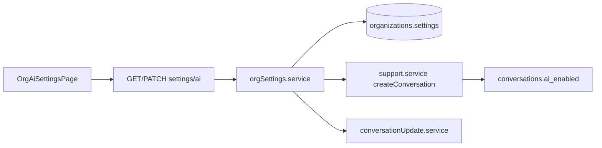

# Org AI & automation settings

## Overview

Workspace admins configure org-level **AI feature flags** and **automation toggles** (staff email notifications, SLA monitoring) from Settings → **AI & Automation**. Values persist in `organizations.settings` JSONB (`ai`, `automation`). New conversations inherit `conversations.ai_enabled` from org defaults when created.

## Capabilities

- View and edit AI master switch, phase-labeled toggles (assist, auto-tag, auto-route, workflow automation, autonomous replies), default per-conversation AI flag, model tier placeholder
- View and edit automation: inbound/assignment email notifications, SLA enable + first-response minutes
- Non-admins can view settings; only `ADMIN` can `PATCH`
- Master AI off disables dependent toggles in the UI and blocks `assigned_to_ai` assignment server-side

## Architecture

## Key files

| Layer | Path |
|-------|------|
| Shared defaults | `shared/src/orgSettings.js` |
| Service | `server/src/services/orgSettings.service.js` |
| API | `server/src/controllers/orgSettings.controller.js`, `server/src/routes/orgSettings.routes.js` |
| Mount | `server/src/routes/orgWorkspace.routes.js` → `/settings` |
| Client API | `client/src/services/orgSettingsApi.js` |
| UI | `client/src/pages/OrgAiSettingsPage.jsx` |
| Nav | `client/src/pages/settings/settingsNav.js`, `OrgSettingsLayout.jsx` |
| Conversation flag | `server/src/services/support.service.js`, `conversationUpdate.service.js` |

## API

| Method | Path | Auth |
|--------|------|------|
| `GET` | `/api/org/:orgId/settings/ai` | Org member |
| `PATCH` | `/api/org/:orgId/settings/ai` | `ADMIN` |

Body shape (PATCH): `{ ai?: Partial<OrgAiSettings>, automation?: Partial<OrgAutomationSettings> }`

**LLM health:** `GET /api/org/:orgId/ai/health` — `llmConfigured`, provider label, model (server env). Settings UI includes **Test AI connection**.

## Database

- `organizations.settings` — JSONB; keys `ai`, `automation` (see migration `20260516110000_automation_jobs.sql`)
- `conversations.ai_enabled` — boolean per thread; default from `ai.default_conversation_ai_enabled` when org `ai.ai_enabled` is true

## Connections

| Feature | Relationship |
|---------|----------------|
| [Settings & navigation](./settings-and-navigation.md) | Route `/org/:orgId/settings/ai`, nav item `ai` |
| [AI capabilities](./ai-capabilities.md) | Toggles gate future LLM phases; no model calls yet |
| [Notifications & automation](./notifications-and-automation.md) | Worker reads `settings.automation` for notify/SLA jobs |
| [Support inbox](./support-inbox.md) | Per-conversation `ai_enabled` on create/update |
| [AI-FEATURE-DESIGN.md](../AI-FEATURE-DESIGN.md) | Phase 1 checklist: org settings + `ai_enabled` wiring |

## Status

**Complete (Phase 1 scope)** — API, UI, persistence, and `conversations.ai_enabled` defaults/updates wired. Phase 3+ features respect toggles in UI; server enforces org master switch for AI assignment only until LLM workers exist.
