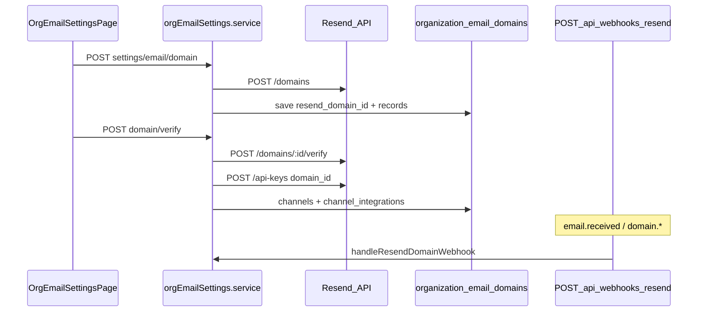

# Org email channel (Resend DNS setup)

## Overview

Workspace **admins** set up email in two steps (Intercom-style + Resend):

1. **Receive** — forward from their existing `support@company.com` (Google/Microsoft) to `RESEND_INBOUND_ADDRESS` (e.g. `support@wemelovora.resend.app`) or a per-org address on `RESEND_INBOUND_DOMAIN`. No customer inbound MX.
2. **Send** — verify **SPF/DKIM** on a customer subdomain via Resend; domain-scoped API key powers agent replies.

**Advanced:** full DNS mode (send + receive MX on customer subdomain) remains available in the email settings UI.

## Capabilities

- Settings UI: **Settings → Channels** (`/org/:orgId/settings/email`)
- Enter subdomain → copy DNS records → verify → set sending/receiving local-parts
- Separate **From** (outbound) and **inbound** addresses on the same subdomain
- Status: sending ready / receiving ready (MX record)
- Disconnect: deactivates channel and removes `organization_email_domains` row

## Architecture

## Key files

| Area | Path |
|------|------|
| UI | `client/src/pages/OrgEmailSettingsPage.jsx`, `client/src/services/orgEmailSettingsApi.js` |
| API routes | `server/src/routes/orgSettings.routes.js` |
| Controllers | `server/src/controllers/orgEmailSettings.controller.js` |
| Domain lifecycle | `server/src/services/orgEmailSettings.service.js` |
| Resend HTTP | `server/src/services/resend/resendDomain.service.js`, `resendHttp.service.js` |
| Webhook | `server/src/controllers/resendWebhook.controller.js`, `server/src/utils/resendWebhookVerify.js` |
| Secrets | `server/src/utils/secretsCrypto.js` |
| Migration | `supabase/migrations/20260526120000_organization_email_domains.sql` |

## API

| Method | Path | Auth |
|--------|------|------|
| GET | `/api/org/:orgId/settings/email` | Member |
| POST | `/api/org/:orgId/settings/email/forwarding` | ADMIN |
| POST | `/api/org/:orgId/settings/email/forwarding/confirm` | ADMIN |
| POST | `/api/org/:orgId/settings/email/sending-domain` | ADMIN |
| POST | `/api/org/:orgId/settings/email/domain` | ADMIN (`setupMode: dns` or sending) |
| POST | `/api/org/:orgId/settings/email/domain/verify` | ADMIN |
| PATCH | `/api/org/:orgId/settings/email/addresses` | ADMIN |
| DELETE | `/api/org/:orgId/settings/email` | ADMIN |

## Environment (server)

| Variable | Purpose |
|----------|---------|
| `RESEND_API_KEY` | Platform key for domain + API key creation |
| `RESEND_INBOUND_ADDRESS` | Fixed receiving address for all orgs (e.g. `support@wemelovora.resend.app`) |
| `RESEND_INBOUND_DOMAIN` | Optional; per-org `org.*@domain` when address env is unset |
| `RESEND_WEBHOOK_SECRET` | Svix secret (`whsec_…`) for webhook verification (required in production) |
| `SECRETS_ENCRYPTION_KEY` | Optional; encrypts per-org API keys in `channel_integrations.config` |

Configure Resend dashboard webhook: `POST {API_URL}/api/webhooks/resend` with events `email.received`, `domain.updated`, `domain.verified`.

Legacy URL `POST /api/webhooks/email` remains an alias.

## Database

- `organization_email_domains` — one row per org (`resend_domain_id`, `subdomain`, `status`, `dns_records`, addresses, `channel_id`, encrypted API key)
- `channels` / `channel_integrations` — provisioned on verified domain

## Connections

| Feature | Relationship |
|---------|----------------|
| [Multi-channel](./multi-channel.md) | Email ingress/outbound uses provisioned integration |
| [Settings](./settings-and-navigation.md) | Settings nav **Channels** → email page |
| [Security](./security-and-access-control.md) | ADMIN-only mutations; webhook signature verification |
| [Operational hardening](./operational-hardening.md) | Webhook rate limit (`emailWebhookRateLimit`) |

## Status

**Complete** for platform-managed Resend v1 (single email channel per org). Not included: BYOK Resend accounts, DNS provider automation, multiple email inboxes per org.
