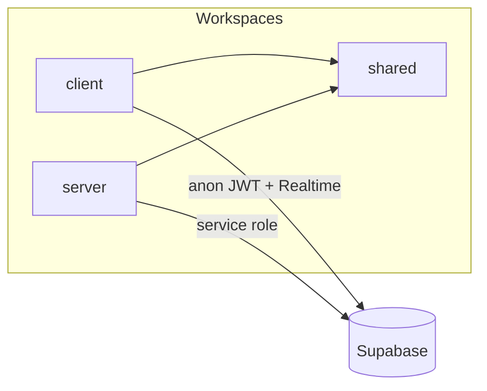

# Platform & monorepo

## Overview

The repo is an **npm workspaces** monorepo: React (Vite) client, Express 5 API, and `@ai-support/shared` for cross-package constants. Supabase provides PostgreSQL, Auth, and Realtime.

## Capabilities

- Single `npm install` at root; `npm run dev` runs client, API, and automation worker together
- Shared types/constants consumed by both client and server
- Standard API middleware: CORS, JSON, logging, centralized errors
- `GET /health` liveness check

## Architecture

## Key files

| Area | Path |
|------|------|
| Root scripts | `package.json` |
| Client entry | `client/src/main.jsx`, `client/src/App.jsx` |
| API entry | `server/src/server.js`, `server/src/app.js` |
| Env (server) | `server/src/config/env.js`, `server/.env.example` |
| Env (client) | `client/.env.example` |
| Shared exports | `shared/src/index.js` |
| Migrations | `supabase/migrations/*.sql` |

## API surface

- Global: `GET /health`
- All product APIs under `/api/*` (see [multi-organization.md](./multi-organization.md))

## Connections

| Feature | Relationship |
|---------|----------------|
| [Authentication](./authentication.md) | Client uses Supabase anon; server uses service role from `env.js` |
| [Multi-organization](./multi-organization.md) | All domain routes mount under `/api/org/:orgId` |
| [Notifications & automation](./notifications-and-automation.md) | Worker is a separate process started via root `dev` script |
| Every feature | May add rows to `shared/` and SQL migrations |

## Status

**Complete** — foundation is stable; extend via new workspace packages only when needed.
