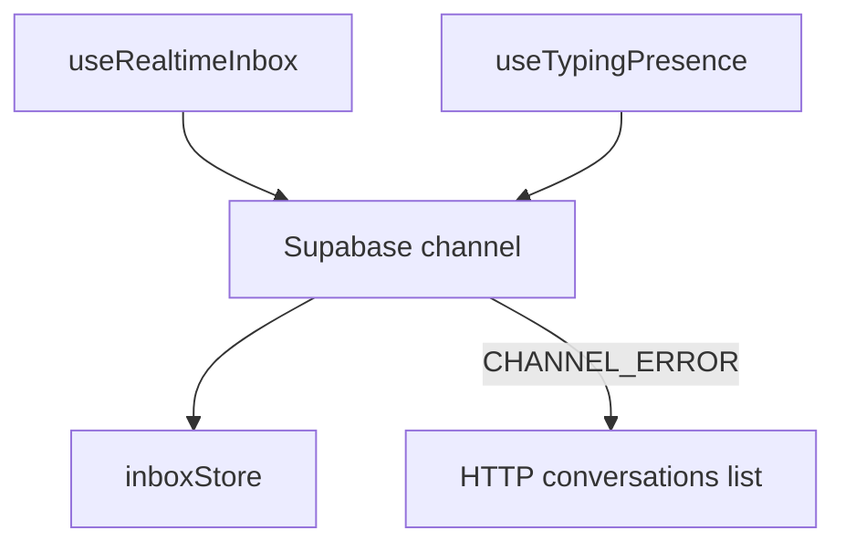

# Real-time communication

## Overview

The inbox stays fresh via **Supabase Realtime** subscriptions (conversations/messages). When the socket drops, the client **reconnects with backoff** and **refetches via HTTP** to avoid missed events. **Typing presence** uses Realtime broadcast on the active channel.

## Capabilities

- Per-org (and per-user) subscription keyed in a module-level map (single channel per workspace session)
- Merge INSERT/UPDATE into `inboxStore`
- Reconnect → debounced full or partial HTTP sync (`useInboxPeriodicSync` as additional safety)
- Typing indicators in thread header
- RLS ensures users only receive events for their org

## Architecture

## Key files

| Layer | Path |
|-------|------|
| Hook | `client/src/hooks/useRealtimeInbox.js` |
| Config | `client/src/config/realtimeInbox.config.js` |
| Typing | `client/src/hooks/useTypingPresence.js` |
| Periodic sync | `client/src/hooks/useInboxPeriodicSync.js` |
| Store | `client/src/stores/inboxStore.js` |
| Client | `client/src/services/supabase.js` |
| Migration | `20260508113000_enable_realtime_publication_for_inbox.sql`, `20260509140000_secure_messages_rls_realtime.sql` |

## Connections

| Feature | Relationship |
|---------|----------------|
| [Support inbox](./support-inbox.md) | `InboxPage` mounts `useRealtimeInbox` |
| [Messages](./messages.md) | Message INSERT/UPDATE drives thread pane |
| [Authentication](./authentication.md) | Realtime uses logged-in Supabase session |
| [Multi-organization](./multi-organization.md) | Filters/subscriptions must match `organization_id` |
| [Platform](./platform-and-monorepo.md) | Anon key + RLS, not service role, on client |

## Status

**Complete** for inbox list and thread updates. Mention sidebar “flash” is client-only cue driven from store epoch, not a separate Realtime event type.
