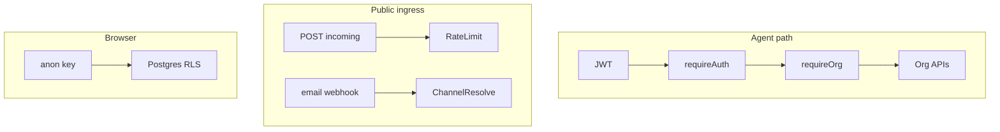

# Security & access control

## Overview

Security layers: **Supabase Auth JWT** for agents, **org membership** for workspace APIs, **RLS** for client/Realtime data access, and **separate rules** for public ingress (web incoming, email webhooks).

## Capabilities

- Bearer token validation on protected Express routes
- `requireOrgAccess` — org id from URL only (no body override)
- `requireRole('ADMIN')` for legacy admin-only settings routes
- **`requirePermission(...)`** — capability flags on `req.orgPermissions` (role preset ⊕ `organizations.settings.permissions`)
- **Assignment policy** — human PATCH cannot steal threads; automation (`automationSource`) bypasses
- Service role on server only; anon key + RLS on client
- Rate limiting on public incoming messages
- Email webhook resolves channel by recipient address (tenant isolation)
- Production 5xx messages sanitized in `errorHandler`

## Architecture

## Key files

| Layer | Path |
|-------|------|
| Auth middleware | `server/src/middleware/auth.js` |
| Org middleware | `server/src/middleware/orgAccess.js` |
| Permissions | `shared/src/orgPermissions.js`, `server/src/services/orgPermissions.service.js` |
| Assignment policy | `server/src/services/conversationAssignmentPolicy.service.js` |
| Rate limit | `server/src/middleware/incomingRateLimit.js` |
| Errors | `server/src/middleware/errorHandler.js` |
| Supabase admin | `server/src/config/supabase.js` |
| RLS migrations | `20260507134500_conversation_rls.sql`, `20260512100000_multi_organization_saas.sql`, `20260509140000_secure_messages_rls_realtime.sql` |

## Threat model notes

| Surface | Control |
|---------|---------|
| Agent REST | JWT + active membership for `:orgId` |
| Realtime | Same user session; RLS on tables |
| Web incoming | Knows `orgId` in URL — ingress rate limits (org + email), optional channel secrets |
| Agent send | JWT + membership; per-org+user send rate limit; optional `stale_thread` collision warning |
| Conversation assign | Policy in `conversationUpdate.service.js`; `POST .../conversations/:id/claim` |
| Org analytics / audit | `analytics.view_org` for overview; audit `GET .../audit/events` |
| Invites | `team.invite` permission (ADMIN preset) |
| Ops | `GET /api/internal/ops/rate-limits` requires `x-automation-cron-secret` |
| Email webhook | Match `to` address to `channel_integrations` config |
| Cron | `x-automation-cron-secret` header |
| Service role key | Server env only; never `VITE_*` |

## Connections

| Feature | Relationship |
|---------|----------------|
| [Authentication](./authentication.md) | JWT issuance and validation |
| [Multi-organization](./multi-organization.md) | Membership and roles |
| [Multi-channel](./multi-channel.md) | Ingress without end-user JWT |
| [Platform](./platform-and-monorepo.md) | CORS origins from `env.corsOrigins` |
| [RBAC sprints](./rba-sprints.md) | Sprint plan and capability matrix |
| [Search infra baseline](./search-infra-baseline.md) | Tenant-safe search scope and API contracts (S0) |
| [Search infra sprints](./sprints/search-infra-sprints.md) | Search implementation sprint plan |

## RBAC (ADMIN / AGENT)

| Layer | Behavior |
|-------|----------|
| DB role | `organization_members.role` remains `ADMIN` \| `AGENT` |
| Capabilities | `permissionsForRole` + optional `organizations.settings.permissions` overrides |
| Middleware | `requireOrgAccess` loads `req.orgPermissions`; routes use `requirePermission('dotted.key')` |
| Assignment | Agents: self-claim unassigned, own unassign; no steal. Admins: `assign_others` / override |
| Customer reply | Assignee (or unassigned queue) only; admins may reply on any thread. Internal notes unrestricted |
| Automation | `updateConversationFromAutomation` skips human assignment rules |
| AI copilot | `ai.use_copilot` checked in `aiGuards.service.js` |

`GET /api/org/:orgId/settings/permissions` returns effective permissions for the signed-in member.

## Search: tenant-safe before ranking

Search endpoints (`/api/org/:orgId/search*`, future semantic/advanced routes) MUST enforce tenancy and visibility **before** ranking, highlighting, facets, or hydration — not as a post-filter on scored results.

| Control | Requirement |
|---------|-------------|
| Org scope | `requireOrgAccess`; `organization_id` from URL param only |
| SQL/RPC filter | `WHERE organization_id = :orgId` (and inbox visibility) applied first |
| Inbox ACL | Same rules as conversation list: `listAccessibleInboxIds` / `canAccessInboxId` |
| Internal notes | Respect `messages.internal_note`; omit or redact snippets when denied |
| Cross-org leakage | Facet counts and semantic vector search must never aggregate across tenants |

Full scope inventory, API contracts, and S0 checklist: [search-infra-baseline.md](./search-infra-baseline.md). Sprint plan: [search-infra-sprints.md](./sprints/search-infra-sprints.md).

## Status

**Complete** for current agent and ingress models, including capability-based RBAC (Sprints 1–6). Review RLS policies when adding new tables. Team/VIP visibility (Sprint 7) deferred. Search S0 baseline documented (2026-06-07).
