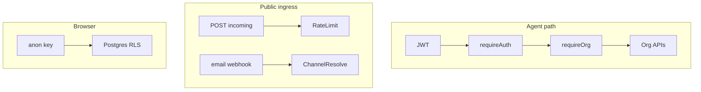

# Security & access control

## Overview

Security layers: **Supabase Auth JWT** for agents, **org membership** for workspace APIs, **RLS** for client/Realtime data access, and **separate rules** for public ingress (web incoming, email webhooks).

## Capabilities

- Bearer token validation on protected Express routes
- `requireOrgAccess` — org id from URL only (no body override)
- `requireRole('ADMIN')` for invite mutations
- Service role on server only; anon key + RLS on client
- Rate limiting on public incoming messages
- Email webhook resolves channel by recipient address (tenant isolation)
- Production 5xx messages sanitized in `errorHandler`

## Architecture

## Key files

| Layer | Path |
|-------|------|
| Auth middleware | `server/src/middleware/auth.js` |
| Org middleware | `server/src/middleware/orgAccess.js` |
| Rate limit | `server/src/middleware/incomingRateLimit.js` |
| Errors | `server/src/middleware/errorHandler.js` |
| Supabase admin | `server/src/config/supabase.js` |
| RLS migrations | `20260507134500_conversation_rls.sql`, `20260512100000_multi_organization_saas.sql`, `20260509140000_secure_messages_rls_realtime.sql` |

## Threat model notes

| Surface | Control |
|---------|---------|
| Agent REST | JWT + active membership for `:orgId` |
| Realtime | Same user session; RLS on tables |
| Web incoming | Knows `orgId` in URL — protect with rate limits + optional channel secrets |
| Email webhook | Match `to` address to `channel_integrations` config |
| Cron | `x-automation-cron-secret` header |
| Service role key | Server env only; never `VITE_*` |

## Connections

| Feature | Relationship |
|---------|----------------|
| [Authentication](./authentication.md) | JWT issuance and validation |
| [Multi-organization](./multi-organization.md) | Membership and roles |
| [Multi-channel](./multi-channel.md) | Ingress without end-user JWT |
| [Platform](./platform-and-monorepo.md) | CORS origins from `env.corsOrigins` |

## Status

**Complete** for current agent and ingress models. Review RLS policies when adding new tables.
