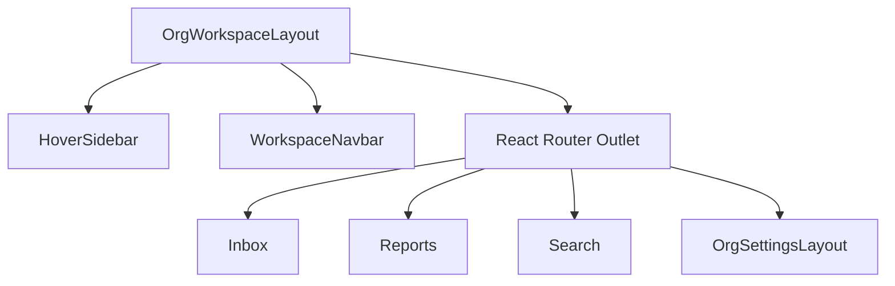

# Settings & workspace navigation

## Overview

Authenticated workspace UX uses a **collapsible hover sidebar**, **workspace navbar**, and nested **settings routes**. Most settings sections are **navigation placeholders**; **Teammates** and **AI & Automation** are fully implemented (see [team-invitations](./team-invitations.md), [org-ai-settings](./org-ai-settings.md)).

## Capabilities

- Sidebar: Inbox, Reports, Search, Settings (plus non-routed labels: Fin AI, Knowledge, Outbound, Contacts)
- `OrgWorkspaceLayout` wraps all `/org/:orgId/*` child routes
- Settings home card grid (Teammates + AI & Automation linked; other cards stubbed)
- Settings nav taxonomy in `settingsNav.js`
- Teammates nested routes under `/settings/teammates`

## Architecture

## Key files

| Layer | Path |
|-------|------|
| Layout | `client/src/layouts/OrgWorkspaceLayout.jsx` |
| Sidebar | `client/src/components/HoverSidebar.jsx` |
| Navbar | `client/src/components/WorkspaceNavbar.jsx` |
| Org switch | `client/src/components/OrgSwitcher.jsx` |
| Settings | `client/src/pages/OrgSettingsLayout.jsx`, `OrgSettingsHomePage.jsx`, `settings/settingsNav.js` |
| Routes | `client/src/App.jsx` |

## Routes (under `/org/:orgId`)

| Path | Page |
|------|------|
| `inbox` | InboxPage |
| `reports` | OrgReportsPage |
| `search` | InboxSearchPage |
| `settings` | OrgSettingsLayout (+ children) |
| `settings/teammates` | OrgTeammatesPage |
| `settings/teammates/invite/new` | OrgInviteTeammatesPage |
| `settings/ai` | OrgAiSettingsPage |

## Connections

| Feature | Relationship |
|---------|----------------|
| [Multi-organization](./multi-organization.md) | All paths include `:orgId` |
| [Team invitations](./team-invitations.md) | Teammates settings is the admin UI for invites |
| [Support inbox](./support-inbox.md) | Default landing after org select |
| [Search](./search.md) | Search route shares inbox sidebar |
| [Org AI settings](./org-ai-settings.md) | `/settings/ai` page and API |
| [AI capabilities](./ai-capabilities.md) | Sidebar labels for Fin/Knowledge without routes |

## Status

**Partial** — shell, teammates, and AI/automation settings are wired; most other settings cards (billing, channels config UI, etc.) are not connected to APIs yet.
