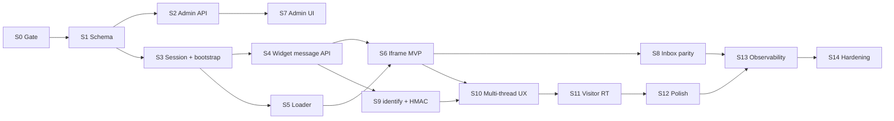

# Embeddable messenger widget — Implementation sprints

Production-grade **embeddable web messenger** (loader + iframe) for customer sites: anonymous visitors, pre-chat identification, and host-site logged-in users via `identify()` — without exposing org UUIDs or agent credentials in the embed.

**Parent:** [messenger-web-plan.md](../messenger-web-plan.md) (architecture, security, API contract)

**Related:**

- [multi-channel.md](../multi-channel.md) — `channel_type: web`, `WebAdapter`, legacy `messages/incoming`
- [security-and-access-control.md](../security-and-access-control.md) — tenancy, Redis rate limits, no service role on client
- [realtime.md](../realtime.md) — agent Realtime; widget uses polling first, visitor Realtime in Sprint 11
- [messages.md](../messages.md) — send pipeline, idempotency, ingress policy
- [support-inbox.md](../support-inbox.md) — agent UI; widget threads appear as web channel
- [settings-and-navigation.md](../settings-and-navigation.md) — admin shell for widget settings
- [operational-hardening.md](../operational-hardening.md) — rate limits, runbooks
- [conversation-status-handling.md](../conversation-status-handling.md) — reopen/close behavior in widget UX

**Last updated:** 2026-06-02

---

## Product stance (from parent plan)

| Principle | Sprint implication |
|-----------|-------------------|
| **Tenant from `widget_key`** | Never authorize embed using bare `organizationId` in HTML |
| **Visitors ≠ agents** | Widget session JWT only; no Supabase agent session in iframe |
| **DB is source of truth** | Polling (Sprint 6) then Realtime (Sprint 11) are notification layers |
| **Reuse web channel** | `channel_type: web`, `processInboundWebMessage`, `WebAdapter` |
| **Anonymous + identified** | Pre-chat / optional email (Sprint 6); `identify()` + HMAC (Sprint 9) |
| **Domain allowlist mandatory** | Bootstrap fails closed on bad `Origin` (Sprint 3) |
| **Redis rate limits only** | Extend `rateLimitFactory`; no in-memory Maps |

---

## Current baseline (pre–Sprint 0)

| Area | Shipped today | Gap vs widget plan |
|------|---------------|-------------------|
| Web ingress | `POST /api/org/:orgId/messages/incoming` — requires email, org UUID in URL | Not suitable for browser embed |
| Inbound service | `processInboundWebMessage`, idempotency, lifecycle Model C | Widget APIs should call same paths |
| Outbound | `WebAdapter` + Realtime to inbox | Agent → customer delivery works; widget needs poll/RT |
| Customers | `customer_type`, `user_id`, `findOrCreateCustomer` | Wire via `identify()` in Sprint 9 |
| Conversations | Multiple active/open per customer (`20260602190000`) | Widget “new conversation” supported |
| Agent Realtime | RLS for `authenticated` org members | Visitors cannot reuse; Sprint 11 adds narrow path |
| Rate limits | Per-org + per-email on ingress | Need per-widget-key, visitor, IP |
| Admin UI | No widget installation settings | Sprint 7 |
| Embed assets | None | Sprint 5 (loader) + Sprint 6 (iframe app) |

---

## Target data model (Sprint 1 deliverable)

```text
widget_installations
  id, organization_id, widget_key (unique), secret_hash,
  allowed_domains text[], status, settings jsonb,
  created_at, updated_at, rotated_at

widget_visitors
  id, organization_id, installation_id, visitor_token (unique per installation),
  customer_id nullable, email, name, metadata jsonb,
  first_seen_at, last_seen_at, last_ip_hash

widget_sessions
  id, visitor_id, organization_id, conversation_id nullable,
  expires_at, revoked_at, created_at
```

**Customer email for anonymous leads (Sprint 0 decision):** either nullable `customers.email` migration **or** internal synthetic `visitor+<uuid>@widget.invalid` — implement in Sprint 4 before anonymous send ships.

---

## Sprint overview



**MVP ship path (minimum customer-visible):** S0 → S1 → S2 → S3 → S4 → S5 → S6 → S7 → S8 (≈ 8 sprints).

**Production-identified users:** add S9 → S10 before GA if host sites use `identify()`.

**Realtime upgrade:** S11 after MVP is stable in production with polling.

---

## Sprint 0 — Prerequisites gate

**Goal:** Lock open decisions and confirm platform readiness before migrations.

**Checklist**

- [ ] **Redis** — `REDIS_URL` required locally (same as ingress); document widget limit env vars in `server/.env.example`.
- [ ] **Web channel row** — Each org has a `channels` / integration row for `web` (or create on first installation).
- [ ] **Anonymous email strategy** — Product picks one:
  - **Option A:** Migration `customers.email` nullable for `customer_type = 'LEAD'` widget-only rows.
  - **Option B:** Synthetic internal email pattern; document “never outbound email to this address.”
- [ ] **Widget origins** — Agree hostnames: `widget.<app-domain>`, API `api.<app-domain>`, CORS + CSP plan.
- [ ] **CDN / static deploy** — Where `widget.js` and iframe bundle ship (S3+CloudFront, same monorepo CI job, etc.).
- [ ] **Permissions** — New capability keys e.g. `widget.manage` (ADMIN preset), `widget.view` (read snippet); stub in `shared/src/orgPermissions.js` if not yet present.
- [ ] **No org UUID in embed** — Sign-off: snippet contains only `data-widget-key`.
- [ ] **Security review** — Read parent plan §9; assign owner for pen-test in Sprint 14.

**Deliverables**

- [ ] Short **gate note** appended to [messenger-web-plan.md](../messenger-web-plan.md) §19 (decision recorded).
- [ ] Env var list drafted for Sprint 1: `WIDGET_SESSION_JWT_SECRET`, `WIDGET_CDN_ORIGIN`, `WIDGET_IFRAME_ORIGIN`, rate limit overrides.

**Exit:** Anonymous email strategy chosen; widget hostnames in infra checklist; no Sprint 1 migration blocked.

---

## Sprint 1 — Schema, shared types & environment

**Goal:** Persist installations, visitors, sessions; wire server config.

**Database (migrations)**

- [ ] `widget_installations` + indexes (`widget_key` unique, `organization_id`).
- [ ] `widget_visitors` + unique `(installation_id, visitor_token)`.
- [ ] `widget_sessions` + indexes `(visitor_id, expires_at)`, `(organization_id, created_at)`.
- [ ] FK cascades: installation delete → visitors/sessions (or soft-disable only — document choice).
- [ ] **RLS:** enable on new tables; **no** policies granting `anon` / `authenticated` direct access (server service role only for widget APIs).
- [ ] If Option A from Sprint 0: `customers.email` nullable constraint update + comment.
- [ ] Seed helper: create default test installation for dev org (optional SQL seed, not production).

**Shared**

- [ ] `shared/src/widgetSettings.js` — defaults merge (`brandColor`, `requireEmail`, `allowedDomains`, …), max domain count, key prefixes `wk_live_` / `wk_test_`.
- [ ] `shared/src/widgetLimits.js` — max message length (reuse incoming), max metadata bytes, max pre-chat fields.
- [ ] Export from `shared/src/index.js`.

**Server config**

- [ ] `server/src/config/widget.config.js` — JWT issuer, TTL (15–30 min), refresh sliding max (7d), origins.
- [ ] `server/.env.example` — document all `WIDGET_*` and rate limit keys.

**Exit:** Migrations apply cleanly; shared merge returns sane defaults; no public API yet.

---

## Sprint 2 — Installation service & admin API

**Goal:** Orgs create and manage widget installations; generate keys and snippet payload.

**Server**

- [ ] `widgetInstallation.service.js` — CRUD, `generateWidgetKey()`, `hashSecret()`, `rotateSecret()`, domain list validation (hostname only, max N).
- [ ] `widget.routes.js` mounted at `/api/org/:orgId/widget` behind `requireOrgAccess`.
- [ ] `requirePermission('widget.manage')` on POST/PATCH/rotate; read on GET/snippet.

**API**

| Method | Path | Purpose |
|--------|------|---------|
| `GET` | `/api/org/:orgId/widget/installations` | List (paginated) |
| `POST` | `/api/org/:orgId/widget/installations` | Create; return `widget_key` + **one-time** `secret` |
| `PATCH` | `/api/org/:orgId/widget/installations/:id` | `allowed_domains`, `settings`, `status` |
| `POST` | `/api/org/:orgId/widget/installations/:id/rotate-secret` | New secret; optional invalidate sessions |
| `GET` | `/api/org/:orgId/widget/installations/:id/snippet` | HTML snippet + test key hint |

**Rules**

- [ ] Max installations per org (e.g. 10) — configurable constant.
- [ ] Cannot disable last active installation without confirmation (product rule).
- [ ] `settings` merged with `mergeWidgetSettings()`; reject unknown keys over size cap.
- [ ] Audit: `support_events` `widget.installation_created` / `widget.secret_rotated` (no secret in payload).

**Tests**

- [ ] Org A cannot read org B installations (403).
- [ ] Non-admin without permission cannot create (403).

**Exit:** Installation row creatable via API; secret shown once; domains stored.

---

## Sprint 3 — Session JWT, bootstrap & domain validation

**Goal:** Public widget bootstrap mints visitor + session; all later routes use bearer token.

**Server**

- [ ] `widgetSession.service.js` — create/refresh/revoke session; sign/verify JWT (`typ: widget_session`).
- [ ] `widgetVisitor.service.js` — create/load by `visitor_token`; update `last_seen_at`, `last_ip_hash`.
- [ ] `widgetDomain.service.js` — parse `Origin` / `Referer`; match `allowed_domains` (exact host + optional `*.domain` rule documented).
- [ ] `widgetAuth.middleware.js` — `requireWidgetSession` attaches `req.widgetVisitor`, `req.widgetInstallation`, `req.widgetSession`.
- [ ] Mount public routes: `/api/widget/v1/*` (no `orgId` in path).

**API**

| Method | Path | Auth | Purpose |
|--------|------|------|---------|
| `GET` | `/api/widget/v1/bootstrap` | `widget_key` query + Origin | Config + `visitorToken` + `sessionToken` |
| `POST` | `/api/widget/v1/session/refresh` | Bearer session | Sliding refresh |

**Rate limits** (`widgetRateLimit.js`)

- [ ] `widget:bootstrap:<widget_key>:<ip>` — 30/min default.
- [ ] `widget:refresh:<visitor_id>` — 60/min.

**Security**

- [ ] Disabled installation → 403.
- [ ] Domain mismatch → 403 + structured log `widget.domain_rejected`.
- [ ] JWT tamper / expired → 401.
- [ ] CORS: allow `WIDGET_IFRAME_ORIGIN`; `GET bootstrap` may allow null Origin only in dev flag.

**Tests**

- [ ] Bootstrap from `allowed_domains` host succeeds.
- [ ] Bootstrap from `evil.com` fails.
- [ ] Same `visitor_token` returns same visitor row.

**Exit:** Postman/curl can bootstrap and refresh; JWT validates on a stub protected route.

---

## Sprint 4 — Widget conversation & message APIs

**Goal:** Visitor can start/continue web conversations and send messages; agents see them in inbox.

**Server**

- [ ] `widgetConversation.service.js` — list/create conversations for visitor (via `customer_id` or visitor-only path); assert visitor owns thread.
- [ ] `widgetMessage.service.js` — list messages (cursor), send message.
- [ ] Send path calls `processInboundWebMessage` when customer has email; else visitor-only append path (per Sprint 0 decision).
- [ ] Pre-chat endpoint: `POST /api/widget/v1/pre-chat` — sets visitor email/name, `findOrCreateCustomer`, links `customer_id`, creates conversation if needed.
- [ ] Reuse: `sanitizeMessage`, `MAX_MESSAGE_LENGTH`, `evaluateInboundIngressPolicy`, `incoming_message_idempotency`, `scheduleInboundPostCustomerMessage`.
- [ ] Set `messages.metadata.source = 'widget'` (and `channel: 'web'`).
- [ ] Update `widget_sessions.conversation_id` on active thread.

**API**

| Method | Path | Purpose |
|--------|------|---------|
| `GET` | `/api/widget/v1/conversations` | Paginated list for visitor |
| `POST` | `/api/widget/v1/conversations` | New thread (`channel_type: web`) |
| `GET` | `/api/widget/v1/conversations/:id/messages` | `?since=` cursor |
| `POST` | `/api/widget/v1/conversations/:id/messages` | Send; `X-Idempotency-Key` |
| `POST` | `/api/widget/v1/pre-chat` | Email/name gate when `requireEmail` |

**Rate limits**

- [ ] `widget:msg:<visitor_id>` — 20/min.
- [ ] `widget:msg:inst:<installation_id>` — 500/min.

**Authorization**

- [ ] Every `:id` route verifies conversation’s customer linked to `req.widgetVisitor` (direct or via `customer_id`).
- [ ] Cross-visitor access returns 404 (not 403) to avoid enumeration.

**Agent path**

- [ ] No change to `WebAdapter`; agent reply inserts message → visible on widget poll.

**Tests**

- [ ] Send → row in `messages`; inbox list includes conversation.
- [ ] Idempotent retry returns same `messageId`.
- [ ] Visitor A cannot read visitor B conversation.

**Exit:** End-to-end message flow works via API only (no UI); inbox shows new web conversation.

---

## Sprint 5 — Widget loader (`widget.js`)

**Goal:** Host sites embed one script; loader creates iframe and exposes JS API.

**Package**

- [ ] `widget-loader/` — Vite/rollup IIFE build, target &lt; 20 KB gzipped.
- [ ] Versioned output: `/v1/widget.js` (deploy to CDN).

**Behavior**

- [ ] Read `data-widget-key` from script tag; `SupportWidget.init({ widgetKey, … })`.
- [ ] Generate or read `visitor_token` from `localStorage` key `sw:<widgetKey>:visitor`.
- [ ] Inject iframe → `WIDGET_IFRAME_ORIGIN/v1/messenger/?key=...&visitor=...`.
- [ ] Launcher button (position from settings after bootstrap or defaults).
- [ ] `postMessage` protocol (versioned):
  - Host → iframe: `SW_OPEN`, `SW_CLOSE`, `SW_IDENTIFY`, `SW_SHUTDOWN`
  - Iframe → host: `SW_READY`, `SW_UNREAD`, `SW_ERROR`
- [ ] Validate `event.origin` === iframe origin on loader side.

**Public API**

```javascript
SupportWidget.init({ widgetKey })
SupportWidget.open() / .close() / .toggle()
SupportWidget.identify({ userId, email, name, hash }) // forwards to iframe; full impl Sprint 9
SupportWidget.shutdown()
```

**Security**

- [ ] No secrets in loader bundle except public `widget_key`.
- [ ] `identify` payloads forwarded only after iframe ready.

**Exit:** Static HTML test page opens/closes iframe; bootstrap succeeds on localhost if domain allowlisted.

---

## Sprint 6 — Iframe messenger MVP (polling)

**Goal:** Customer-facing UI: greeting, pre-chat (if required), thread, composer, agent replies via poll.

**Package**

- [ ] `client-widget/` — separate Vite React app (or Preact for size).
- [ ] Build output deployed to `WIDGET_IFRAME_ORIGIN/v1/messenger/`.
- [ ] CSP headers: strict `default-src`; `frame-ancestors` from installation domains (or dynamic middleware).

**Screens**

- [ ] Bootstrap on load (store session in memory; refresh before expiry).
- [ ] Pre-chat form when `settings.requireEmail` (name/email fields from `preChatFields`).
- [ ] Single active conversation view (latest or create).
- [ ] Message list + composer; optimistic send with rollback on error.
- [ ] **Polling:** 3s interval when open and visible; exponential backoff when hidden/tab blur.
- [ ] Connection banner: offline / reconnecting.
- [ ] Branding: `brandColor`, logo, greeting from bootstrap config.

**UX**

- [ ] Empty state, error toasts (generic copy in production).
- [ ] Privacy link footer when `settings.privacyUrl` set.

**Loader integration**

- [ ] Iframe sends `SW_UNREAD` when new agent message and panel closed.

**Exit:** Manual test: visitor sends message → agent replies in inbox → message appears in widget within poll window.

---

## Sprint 7 — Admin UI (settings & snippet)

**Goal:** Admins manage widget without raw API calls.

**Client**

- [ ] `OrgWidgetSettingsPage.jsx` under Settings → Channels → **Web widget** (or Integrations).
- [ ] List installations; create flow shows key + secret once with copy buttons.
- [ ] Domain editor (tag input + validation).
- [ ] Appearance form: color, position, greeting, require email, business hours (basic).
- [ ] Snippet preview component.
- [ ] Rotate secret with confirmation modal.
- [ ] Route + nav link in [settings-and-navigation.md](../settings-and-navigation.md).

**API client**

- [ ] `client/src/services/widgetApi.js` — wrap Sprint 2 endpoints.

**Exit:** ADMIN creates installation, copies snippet, adds `localhost` for dev; widget loads on fixture page.

---

## Sprint 8 — Agent inbox parity & documentation

**Goal:** Agents recognize widget threads; docs reflect shipped MVP.

**Inbox UI**

- [ ] Channel/source badge **Widget** when `metadata.source === 'widget'` (fallback: web channel + widget session exists).
- [ ] Customer sidebar shows visitor metadata if present (UTM, first seen — bounded).
- [ ] No regression on existing web/email threads.

**Docs**

- [ ] [IMPLEMENTED-FEATURES.md](../../../IMPLEMENTED-FEATURES.md) — widget MVP bullets.
- [ ] [multi-channel.md](../multi-channel.md) — widget ingress path; deprecate browser use of raw `messages/incoming`.
- [ ] [messenger-web-plan.md](../messenger-web-plan.md) — **Status:** MVP shipped (Sprint 8).
- [ ] [security-and-access-control.md](../security-and-access-control.md) — widget threat row in table.

**Exit:** Agent can reply to widget conversation; docs index updated; feature flag optional `organizations.settings.widget.enabled`.

---

## Sprint 9 — `identify()` & logged-in host users

**Goal:** Host-site authenticated users map to `customers.user_id` with HMAC verification.

**Server**

- [ ] `POST /api/widget/v1/identify` — body `{ userId, email, name, hash? }`.
- [ ] HMAC: `HMAC-SHA256(secret, userId + ':' + email)` constant-time compare when `settings.identifyRequireHmac` or production.
- [ ] `findOrCreateCustomer({ userId, email, name, customerType: 'USER' })`; link `widget_visitors.customer_id`.
- [ ] Optional: merge duplicate visitor rows (same customer) — document idempotency.
- [ ] Rate limit `widget:identify:<installation_id>` — 60/min.

**Loader**

- [ ] `SupportWidget.identify()` → postMessage → iframe calls API with session bearer.

**Iframe**

- [ ] After identify, refresh conversation list; show logged-in name in header.

**Dev-only bypass**

- [ ] `settings.identifyAllowInsecure` only when `wk_test_` key + non-production env.

**Tests**

- [ ] Valid hash links customer; invalid hash 401.
- [ ] Same `userId` second call idempotent.

**Exit:** Demo page with fake “Log in” button calls `identify()`; agent sees USER customer with `user_id`.

---

## Sprint 10 — Conversation list & lifecycle UX

**Goal:** Multiple threads, resolved/closed states, reopen — aligned with Model C.

**Iframe**

- [ ] Conversation list when `settings.showConversationList` or &gt;1 thread.
- [ ] Status banners: resolved, closed (read-only), waiting on customer.
- [ ] **New conversation** CTA when closed (creates new row; respects multi-active DB).
- [ ] Reopen on send to resolved thread (server `shouldReopenConversation` / `reopenConversation`).

**Server**

- [ ] `GET /conversations` returns status, `last_message_at`, preview snippet.
- [ ] `POST /conversations` sets subject optional from first message.

**Loader**

- [ ] Persist unread across conversations; badge sum on launcher.

**Exit:** Visitor with two threads can switch; resolving in inbox updates widget banner.

---

## Sprint 11 — Visitor Realtime (optional upgrade)

**Goal:** Sub-second agent replies with polling fallback.

**Approach (pick one in Sprint 0 follow-up)**

- [ ] **A — Supabase Realtime:** API mints short-lived JWT with claims `{ visitor_id, conversation_id, org }`; new RLS policy `messages_select_widget_visitor` on single `conversation_id`.
- [ ] **B — SSE:** `GET /api/widget/v1/conversations/:id/stream` from API (simpler ops, no RLS change).

**Iframe**

- [ ] Subscribe on thread open; on `CHANNEL_ERROR` / SSE drop → fall back to Sprint 6 polling.
- [ ] Debounce reconnect (match `useRealtimeInbox` patterns).

**Server**

- [ ] Token endpoint `POST /api/widget/v1/realtime/token` — session required; short TTL (e.g. 5 min).

**Guardrails**

- [ ] Never org-wide channel for visitors.
- [ ] Revoke token on session revoke.

**Exit:** Agent reply appears in &lt;1s with Realtime on; polling still works when disabled.

---

## Sprint 12 — Polish: typing, attachments, offline, captcha

**Goal:** Production UX parity with common messenger widgets (post-MVP).

**Typing**

- [ ] `POST /api/widget/v1/conversations/:id/typing` — Redis TTL 5s.
- [ ] Agent typing: hook from inbox `useTypingPresence` → Redis or broadcast endpoint widget polls.
- [ ] Iframe shows “Team is typing…”

**Attachments (v1.1)**

- [ ] Presigned upload URL scoped to visitor + conversation; max size from `settings.attachmentMaxBytes`.
- [ ] Message `metadata.attachments[]`; virus scan hook stub.
- [ ] UI: file picker + progress.

**Offline / business hours**

- [ ] Bootstrap returns `isWithinBusinessHours`; outside hours show offline form (creates conversation + message like pre-chat).
- [ ] `settings.offlineMessage` displayed.

**Captcha**

- [ ] Optional Turnstile on bootstrap when `settings.captchaEnabled`.

**Exit:** At least typing OR attachments shipped; offline hours tested.

---

## Sprint 13 — Observability & analytics

**Goal:** Operate widget in production with metrics and alerts.

**Logging** (structured JSON)

- [ ] `widget.bootstrap`, `widget.session.refresh`, `widget.message_sent`, `widget.identify`, `widget.domain_rejected`, `widget.rate_limited`.

**Product events** (`support_events`)

- [ ] `widget.opened`, `widget.conversation_started`, `widget.message.sent`, `widget.session.revoked`.

**Reports (minimal)**

- [ ] API or reports slice: conversations with `metadata.source = 'widget'` per date range (reuse analytics patterns).
- [ ] Admin UI: widget opens / conversations started (7d) on settings page.

**Alerts (document in runbook)**

- [ ] Spike in `widget.domain_rejected` / 401 / 403.
- [ ] p95 bootstrap latency; message send failures.

**Exit:** Dashboard or SQL queries documented; logs contain no raw email/message body.

---

## Sprint 14 — Hardening, pen-test & runbook

**Goal:** Safe rollout at scale; incident procedures.

**Load & reliability**

- [ ] k6 or artillery: bootstrap 100 rps, send 20 rps per visitor — Redis and DB healthy.
- [ ] Verify indexes used on `widget_key`, `(installation_id, visitor_token)`.

**Security**

- [ ] Pen-test checklist from parent plan §18:
  - Origin bypass attempts
  - JWT alg none / wrong signature
  - Cross-visitor conversation IDOR
  - Org UUID in embed (should not work)
- [ ] Rotate secret drill documented.

**Runbook** (`docs/features/widget-operations.md` optional)

- [ ] Disable installation (status=disabled).
- [ ] Rotate keys; invalidate sessions.
- [ ] Block abusive visitor (revoke sessions + rate limit ban key).

**Feature flag rollout**

- [ ] `organizations.settings.widget.enabled` default false → enable per org in staging → prod.

**Final docs pass**

- [ ] All connection sections in related feature docs.
- [ ] `docs/README.md` row points to plan + sprints.

**Exit:** Staging soak complete; runbook reviewed; known issues logged.

---

## Definition of done — messenger widget v1

| Area | Done when |
|------|-----------|
| **Embed** | Snippet with `widget_key` only; loader + iframe on CDN |
| **Security** | Domain allowlist; widget JWT; no service role in browser; Redis limits |
| **Anonymous** | Visitor can chat (with or without pre-chat email per settings) |
| **Identified** | `identify()` + HMAC links `customers.user_id` |
| **Messages** | Customer send → inbox; agent reply → widget (poll min; RT optional) |
| **Admin** | CRUD installations, domains, snippet, rotate secret |
| **Tenancy** | Cross-org and cross-visitor access impossible |
| **Ops** | Logs, events, runbook, rate limit 429s |
| **Docs** | IMPLEMENTED-FEATURES + multi-channel + plan status updated |

---

## Explicitly out of scope (v1)

- React/Vue/npm SDK (loader API only).
- WhatsApp / Facebook Messenger channel adapters.
- Autonomous AI replies to visitors without existing org AI gates.
- Customer email transcript on close (settings placeholder only).
- Widget-side Supabase agent login.
- Per-installation custom CSS injection from host (use settings JSON only).
- Multi-language CMS for help articles inside widget (link out only v1).
- Replacing `POST /messages/incoming` for server-to-server integrators.

---

## Architecture reference (parent plan → sprint)

| Parent section | Sprint |
|----------------|--------|
| Embed loader + iframe | 5, 6 |
| `widget_installations` / visitors / sessions | 1 |
| Bootstrap + session JWT | 3 |
| Widget message APIs | 4 |
| Anonymous vs email | 0 (decision), 4, 6 |
| `identify()` + HMAC | 9 |
| Polling delivery | 6 |
| Visitor Realtime | 11 |
| Domain / origin security | 3, 14 |
| Rate limits | 3, 4, 14 |
| Admin UI | 7 |
| Inbox parity | 8 |
| Lifecycle UX | 10 |
| Observability | 13 |
| Hardening | 14 |

---

## Suggested implementation order

### Team of one

1. **Sprint 0 → 1 → 2** — data model + admin API  
2. **Sprint 3 → 4** — public widget API (curl-testable)  
3. **Sprint 5 → 6** — loader + iframe MVP  
4. **Sprint 7 → 8** — admin UI + inbox + docs (**internal beta**)  
5. **Sprint 9 → 10** — identified users + multi-thread (**public beta**)  
6. **Sprint 11** — Realtime (if latency requirement)  
7. **Sprint 12 → 13 → 14** — polish, metrics, ship  

### Parallel tracks

| Track | Sprints | Owner hint |
|-------|---------|------------|
| Backend API | 1–4, 9–11 | Server |
| Static embed | 5–6 | Frontend |
| Admin / inbox | 7–8 | Frontend |
| Infra/CDN/CSP | 0, 5–6, 14 | DevOps |
| Security review | 3, 9, 14 | Security |

---

## Environment variables (cumulative)

| Variable | Sprint | Purpose |
|----------|--------|---------|
| `WIDGET_SESSION_JWT_SECRET` | 1 | Sign session JWT |
| `WIDGET_SESSION_TTL_SEC` | 1 | Access token TTL (default 1800) |
| `WIDGET_SESSION_REFRESH_MAX_SEC` | 1 | Sliding window cap |
| `WIDGET_CDN_ORIGIN` | 5 | Loader script URL |
| `WIDGET_IFRAME_ORIGIN` | 6 | Iframe app URL |
| `WIDGET_CORS_ORIGINS` | 3 | Extra allowed origins if needed |
| `RATE_LIMIT_WIDGET_BOOTSTRAP_MAX` | 3 | Per-key+IP bootstrap |
| `RATE_LIMIT_WIDGET_MSG_VISITOR_MAX` | 4 | Per-visitor send |
| `RATE_LIMIT_WIDGET_MSG_INST_MAX` | 4 | Per-installation send |
| `RATE_LIMIT_WIDGET_IDENTIFY_MAX` | 9 | identify() cap |
| `WIDGET_DEV_ALLOW_INSECURE_IDENTIFY` | 9 | Dev only — never prod |

---

## Test matrix (by sprint)

| Sprint | Automated | Manual |
|--------|-----------|--------|
| 2 | Org isolation on CRUD | Create installation in UI |
| 3 | Domain allow/deny | Bootstrap from fixture HTML |
| 4 | IDOR, idempotency | Agent sees message in inbox |
| 5–6 | postMessage unit tests | Full embed on static page |
| 9 | HMAC verify | identify() from host button |
| 10 | Reopen lifecycle | Two threads, resolve one |
| 11 | Token expiry | Agent reply &lt;1s |
| 14 | Load script | Secret rotation drill |

---

## Permissions (RBAC)

Add to `shared/src/orgPermissions.js` (coordinate with [rba-sprints.md](./rba-sprints.md)):

| Key | ADMIN | AGENT (default) |
|-----|-------|-----------------|
| `widget.manage` | ✓ | — |
| `widget.view` | ✓ | ✓ (read snippet only) |

Routes: `widget.manage` for POST/PATCH/rotate; `widget.view` for GET list/snippet.
