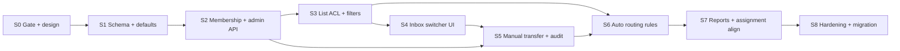

# Multiple Inboxes — Implementation sprints

Production-grade **customer-facing inbox queues** per organization: separate operational ownership (Support, Sales, CS, Enterprise) without turning inboxes into internal ticket boards.

**Parent:** [multiple-inbox.md](../multiple-inbox.md) (product philosophy & principles)

**Related:**

- [support-inbox.md](../support-inbox.md) — today’s single org-wide inbox UI and filters
- [auto-assignment.md](../auto-assignment.md) / [auto-assignment-sprint.md](./auto-assignment-sprint.md) — `organizations.settings.assignment.inboxes` routing (migrate/align in Sprint 1–6)
- [workflow-automation.md](../workflow-automation.md) — rule actions for inbox targeting
- [rba-sprints.md](./rba-sprints.md) — ADMIN/AGENT capabilities; inbox membership ACLs extend RBAC
- [notifications-and-automation.md](../notifications-and-automation.md) — scoped notify jobs per inbox (optional v2)
- [analytics-and-reports.md](../analytics-and-reports.md) — per-inbox reporting (Sprint 7)
- [realtime.md](../realtime.md) — org-scoped subscriptions; may add inbox filter client-side first

**Last updated:** 2026-05-29

---

## Product stance (from parent doc)

| Principle | Implementation implication |
|-----------|------------------------------|
| **One active inbox per conversation** | `conversations.inbox_id` (FK, NOT NULL after backfill); no multi-inbox membership on a thread |
| **Inbox = customer-facing team** | Not Engineering/Legal boards — those stay internal (future boards feature) |
| **Inbox owns customer comms** | Agent reply permissions scoped to inbox members; transfer changes owner, not history |
| **History survives transfer** | Messages unchanged; activity log records inbox moves |
| **Non-members denied by default** | List/detail/send gated unless ADMIN override or explicit “view all inboxes” capability |

---

## Current baseline (pre–Sprint 0)

| Area | Shipped today | Gap vs multiple-inbox plan |
|------|---------------|----------------------------|
| UI | Single `/org/:orgId/inbox` with filters (`all`, `unassigned`, `mentions`, …) | No inbox switcher; filters are org-wide |
| Routing config | `organizations.settings.assignment.inboxes[]` (JSON: id, name, memberIds, rules) | Settings-only; not a first-class DB entity; used for auto-route scoring |
| Conversation row | `assignment_type`, `assigned_to_member_id`, channel, metadata | No `inbox_id` column |
| Permissions | Org membership + `organizations.settings.permissions` | No per-inbox membership ACL |
| Workflow | Can set assignment/priority/tags | Inbox move not a first-class workflow action yet |
| Activity | `support_events`, assignment logs | No `conversation.inbox_moved` event type |
| Reports | Org-scoped metrics | No inbox dimension |

**Important:** Assignment routing inboxes (Sprint 3+ auto-assignment) are a **partial overlap**. This program introduces **authoritative inbox entities** and migrates routing config to reference them (Sprint 1 + 6), rather than maintaining two parallel models indefinitely.

---

## Target data model (Sprint 1 deliverable)

```text
inboxes
  id, organization_id, name, slug, status (active|archived),
  is_default, settings (jsonb), created_at, updated_at

inbox_members
  inbox_id, organization_member_id, role (member|lead), created_at
  UNIQUE (inbox_id, organization_member_id)

conversations
  inbox_id  -- FK → inboxes, indexed (organization_id, inbox_id, last_message_at)
```

**Defaults:** Every org has exactly one `is_default` inbox (created on org bootstrap / migration backfill).

---

## Sprint overview



Sprints **4** and **5** can overlap after **3** exposes API contracts. **6** depends on **1** and workflow hooks.

---

## Sprint 0 — Prerequisites gate

**Goal:** Confirm platform readiness and resolve overlap with assignment routing JSON before schema work.

**Checklist**

- [ ] **Tenancy** — All new tables include `organization_id`; APIs under `/api/org/:orgId/*` + `requireOrgAccess`.
- [ ] **RBAC baseline** — [rba-sprints.md](./rba-sprints.md) Sprint 1+ permission object available or stubbed (`organizations.settings.permissions`).
- [ ] **Conversation updates** — All inbox mutations go through `conversationUpdate.service.js` (audit + realtime-friendly).
- [ ] **Worker** — `automation_jobs` worker running for workflow/auto-route (inbox routing jobs reuse queue).
- [ ] **Assignment routing inventory** — Document orgs using `settings.assignment.inboxes`; plan ID mapping to new `inboxes.id` (Sprint 8).
- [ ] **Product sign-off** — Confirm v1 excludes internal team boards; Engineering/Billing stay out of scope.
- [ ] **Realtime** — Agree v1 strategy: client filters org stream by `inbox_id` vs server-side publication filter (prefer client filter first).

**Exit:** Gate doc linked from [multiple-inbox.md](../multiple-inbox.md); default inbox naming convention agreed (`General` vs `Support`).

---

## Sprint 1 — Inbox schema & org defaults

**Goal:** Persist inboxes and attach every conversation to exactly one inbox.

**Database (migrations)**

- [ ] `inboxes` table + RLS (org members read; ADMIN write).
- [ ] `inbox_members` table + RLS.
- [ ] `conversations.inbox_id` nullable → backfill → NOT NULL + FK.
- [ ] Indexes: `(organization_id, inbox_id, last_message_at DESC)`, `(inbox_id, status)`.
- [ ] Trigger or migration: create default inbox per org; set `is_default = true`.
- [ ] Backfill existing conversations to default inbox.

**Shared**

- [ ] `shared/src/inboxes.js` — limits (max inboxes/members), merge helpers, status enum.
- [ ] Export types from `shared/src/index.js`.

**Server**

- [ ] `getDefaultInboxId(organizationId)` helper.
- [ ] New conversations (all channels) set `inbox_id` on create (ingress + API).

**Exit:** All new conversations have `inbox_id`; legacy rows backfilled; no user-facing UI change required yet.

---

## Sprint 2 — Inbox admin API & membership

**Goal:** Admins manage inboxes and membership; agents discover inboxes they belong to.

**API** (`requireOrgAccess`; ADMIN for mutations)

| Method | Path | Purpose |
|--------|------|---------|
| `GET` | `/api/org/:orgId/inboxes` | List inboxes (agents: member inboxes only; ADMIN: all) |
| `POST` | `/api/org/:orgId/inboxes` | Create inbox |
| `PATCH` | `/api/org/:orgId/inboxes/:inboxId` | Rename, archive, settings |
| `GET` | `/api/org/:orgId/inboxes/:inboxId/members` | List members |
| `PUT` | `/api/org/:orgId/inboxes/:inboxId/members` | Replace member set (bounded) |

**Rules**

- [ ] Cannot archive the last active inbox or the `is_default` inbox without reassigning default.
- [ ] Archived inboxes: no new conversations; existing threads readable per policy.
- [ ] Input bounds: name length, max members (reuse `ASSIGNMENT_INBOX_LIMITS` or new caps).

**Client (settings)**

- [ ] Settings page: **Inboxes** — create, rename, archive, manage members (ADMIN only).
- [ ] Link from [settings-and-navigation.md](../settings-and-navigation.md).

**Exit:** ADMIN can create “Sales” and “Support” inboxes and assign members; agents see only member inboxes from `GET /inboxes`.

---

## Sprint 3 — Inbox-scoped conversation list & access control

**Goal:** Sidebar queues are per inbox; non-members cannot load conversations outside their inboxes.

**API**

- [ ] `GET /api/org/:orgId/conversations` accepts required or default `inboxId` query param.
- [ ] All existing filters (`unassigned`, `assigned_to_me`, `sla_risk`, `spam`, lifecycle, `mentions`, …) apply **within** the inbox scope.
- [ ] `GET /api/org/:orgId/conversations/:id` — 403 if conversation’s `inbox_id` not in caller’s accessible set (ADMIN bypass optional via permission).
- [ ] `PATCH` assignment/status/tags — unchanged paths but enforce inbox access on conversation row.
- [ ] Message send / internal-note — `assertInboxAccess(conversationId)`.

**Server services**

- [ ] `inboxAccess.service.js` — `listAccessibleInboxIds(userId, orgId)`, `assertCanAccessConversation`.
- [ ] Integrate with [messages.md](../messages.md) send and claim-on-reply policies.

**Client store**

- [ ] `inboxStore` — `activeInboxId` (URL `?inbox=` alongside `?conversation=`).
- [ ] List fetch includes `inboxId`; clearing conversation on inbox switch.

**Exit:** API returns only conversations for the selected inbox; agent not in Sales cannot open Sales threads (403).

---

## Sprint 4 — Inbox switcher & scoped sidebar UI

**Goal:** Agents operate inside one inbox at a time with familiar queue views.

**UI** ([support-inbox.md](../support-inbox.md))

- [ ] Inbox dropdown or tabs in inbox chrome (persist `?inbox=` in URL).
- [ ] Sidebar filters unchanged by name but scoped to active inbox.
- [ ] Empty states: no inboxes (ADMIN setup CTA), no conversations in filter.
- [ ] Badge counts per inbox (optional v1: total open only; full filter counts in Sprint 7).

**Realtime**

- [ ] On `INSERT` messages / `UPDATE` conversations: drop events where `inbox_id` not in accessible set (client-side v1).
- [ ] Reconnect refetch passes active `inboxId`.

**Exit:** Two agents in different inboxes see different sidebar lists; same conversation updates in realtime only for members of that inbox.

---

## Sprint 5 — Manual inbox transfer & activity history

**Goal:** Agents with permission can move conversations between inboxes; ownership change is auditable.

**API**

- [ ] `POST /api/org/:orgId/conversations/:id/transfer-inbox` body `{ target_inbox_id, reason? }`.
- [ ] Permission: `conversations.transfer_inbox` (ADMIN true; AGENT configurable) or inbox `lead` role.
- [ ] Updates `conversations.inbox_id` only; does not clear assignee unless product rule says so (document: **v1 keeps assignee**; unassign optional v2).
- [ ] Emit `support_events` type `conversation.inbox_transferred` with `{ from_inbox_id, to_inbox_id, actor_id }`.
- [ ] Show transfer in thread activity / system message row (customer-visible: **no** — internal activity only).

**Client**

- [ ] Transfer action in conversation header menu (permission-gated).
- [ ] After transfer: redirect to same conversation if still accessible, else back to list.

**Exit:** Manual move Sales → Support appears in activity; history intact; customer does not see an automatic message unless explicitly designed later.

---

## Sprint 6 — Automatic routing & workflow integration

**Goal:** New and updated conversations land in the correct inbox by rules (parent doc § Conversation Routing).

**Routing inputs (v1)**

- [ ] Channel → inbox map (per org + per inbox `settings.channels`).
- [ ] AI intent → inbox map (reuse `metadata.ai.intent` from classification).
- [ ] Customer attributes / tags (VIP → Enterprise inbox).
- [ ] Workflow rule action: `set_inbox` (extend `workflowApply.service.js`).

**Execution order (documented)**

```text
Conversation created / inbound
  → classify (existing)
  → workflow rules (set_inbox, set_priority, set_assignment, …)
  → if inbox still default only: assignment.routing rules (migrate from settings.assignment)
  → auto_route job (eligible agents limited to inbox members)
```

**Server**

- [ ] `resolveInboxForConversation({ orgId, conversation, customer, channel })` — deterministic, logged.
- [ ] Migrate `organizations.settings.assignment.inboxes` to reference `inboxes.id` (UUID), not string slugs.
- [ ] `assignmentEligibility` — restrict candidates to `inbox_members` for conversation’s inbox.

**Exit:** Demo request routes to Sales; login issue routes to Support; workflow can override; auto-assign only picks agents in that inbox.

---


## Sprint 7 — Hardening, migration & documentation

**Goal:** Production-safe rollout, no dual routing models, ops runbook.

**Migration**

- [ ] One-shot script: settings `assignment.inboxes[]` → `inboxes` rows + member links; map old ids to UUIDs.
- [ ] Feature flag `organizations.settings.inboxes.enabled` (default false → true per org).

**Reliability**

- [ ] Rate limits on transfer + admin inbox mutations.
- [ ] Idempotency on transfer (duplicate POST does not double-log).
- [ ] Tests: access control, backfill, routing resolution, transfer audit.
- [ ] Load: list query plans with `(organization_id, inbox_id, …)` verified.

**Observability**

- [ ] Structured logs: `inbox_id` on conversation create, transfer, routing decisions.
- [ ] Alerting doc: spike in `conversation.inbox_transferred` or unroutable conversations.

**Documentation**

- [ ] [multiple-inbox.md](../multiple-inbox.md) — **Status** section updated.
- [ ] [IMPLEMENTED-FEATURES.md](../../../IMPLEMENTED-FEATURES.md) + [docs/README.md](../../README.md) index row.
- [ ] Cross-link **Connections** in [support-inbox.md](../support-inbox.md), [workflow-automation.md](../workflow-automation.md).

**Exit:** Staging org migrated; flag enabled; runbook reviewed; no orphaned `assignment.inboxes` string ids.

---

## Definition of done — multiple inboxes v1

| Area | Done when |
|------|-----------|
| **Model** | Every conversation has exactly one `inbox_id`; inboxes have members |
| **Access** | Non-members cannot list/open/reply in foreign inbox conversations |
| **UI** | Inbox switcher + scoped filters (`All`, `Unassigned`, `Assigned to me`, …) |
| **Transfer** | Manual move with activity history; customer thread preserved |
| **Routing** | Channel/intent/workflow/auto-route respect inbox boundaries |
| **Assignment** | Auto-route candidates ⊆ inbox members |
| **Admin** | Create/rename/archive inboxes and manage membership |
| **Safety** | Org-scoped APIs; bounded inputs; production 5xx generic |
| **Ops** | Migration from assignment JSON; metrics and logs include `inbox_id` |

---

## Explicitly out of scope (v1)

- **Internal team boards** (Engineering, Legal, Billing) — separate product surface later.
- **Multiple simultaneous inbox membership on one conversation** — violates Principle 1.
- **Customer-visible “your ticket was transferred”** emails — optional later via lifecycle templates.
- **Cross-org inbox templates** — enterprise multi-brand deferred.
- **Separate email address per inbox** — [org-email-channel.md](../org-email-channel.md) remains one channel per org unless extended in a channel sprint.
- **Replacing Supabase Realtime with per-inbox channels** — optimize only if org-wide fan-out becomes a bottleneck.

---

## Architecture reference (parent doc)

| Parent section | Sprint |
|----------------|--------|
| Principle 1 — one inbox per conversation | Sprint 1 |
| Principle 2 — inbox owns customer comms | Sprint 3, 5 |
| Principle 3 — internal teams not inboxes | Sprint 0 (scope) |
| Principle 4 — move between inboxes | Sprint 5 |
| Inbox membership | Sprint 2 |
| Automatic routing | Sprint 6 |
| Manual routing | Sprint 5 |
| Inbox views (filters) | Sprint 3, 4 |
| Activity history | Sprint 5 |
| Permissions | Sprint 2, 3, 8 |

---

## Suggested implementation order (team of one)

1. Sprint 0 → 1 → 2 (data + admin)
2. Sprint 3 → 4 (agent-facing value)
3. Sprint 5 (transfers)
4. Sprint 6 (routing; coordinate with workflow owner)
5. Sprint 7 → 8 (metrics + ship)

**Parallel track:** RBAC sprint permissions for `conversations.transfer_inbox` and `inboxes.manage` can land in Sprint 2–3 from [rba-sprints.md](./rba-sprints.md).
