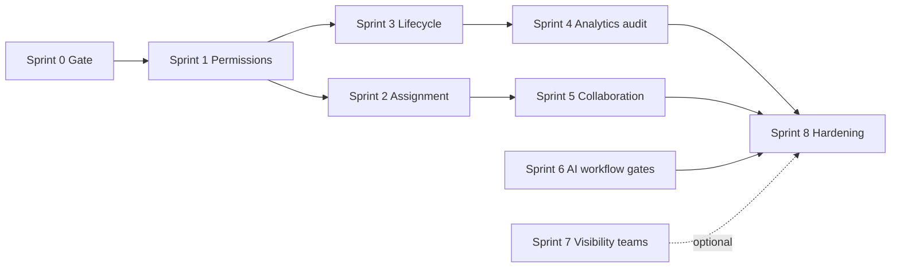

# RBAC & collaboration — Implementation sprints

Production-grade **ADMIN ↔ AGENT** and **agent ↔ agent** rules for the shared inbox (Intercom/Zendesk-style patterns, adapted to Support Copilot).

**Parents:**

- [security-and-access-control.md](./security-and-access-control.md) — JWT, `requireOrgAccess`, RLS
- [multi-organization.md](./multi-organization.md) — `ADMIN` \| `AGENT` today
- [support-inbox.md](./support-inbox.md) — filters, assignment, lifecycle
- [auto-assignment-sprint.md](./auto-assignment-sprint.md) — intelligent routing (orthogonal; RBAC wraps PATCH + settings)

**Related plans (source matrices):** ADMIN/AGENT interaction tables + agent collaboration rules (conversation access, assignment, lifecycle, AI, workflow, team, analytics, channels, audit).

**Last updated:** 2026-05-27

---

## Product stance

| Principle | For this codebase |
|-----------|-------------------|
| **Two DB roles first** | Keep `organization_members.role` as `ADMIN` \| `AGENT`; add **capabilities**, not five roles yet |
| **Server is source of truth** | UI `isAdmin` is not enough — enforce in `conversationUpdate.service.js` and route middleware |
| **Automation bypasses human rules** | `automationSource: true` on `updateConversationFromAutomation` — document and audit |
| **Human-first copilot** | Agent AI = assist; admin AI = configure; Phase 6 autonomous stays gated |
| **Defer enterprise** | Team/VIP/private inboxes, billing OWNER, export/compliance — later sprints |

---

## Current baseline (pre–Sprint 0)

| Area | Shipped | Gap vs target plan |
|------|---------|-------------------|
| Roles | `ADMIN`, `AGENT` | No `TEAM_LEAD`, `OWNER` |
| Admin-only routes | Invites, email, AI settings, workflows, tags CRUD, assignment settings | No unified permission object |
| Conversation PATCH | Any member can assign/status/priority/tags | **No steal / override policy** |
| Auto-assign on select | Client opt-in (`inbox-auto-assign-on-select`) | Can take threads assigned to others |
| Visibility | Org-wide RLS + filters (`all`, `inbox`, `unassigned`, …) | No “view all” toggle; no private/VIP ACLs |
| Collaboration | Typing, viewers, mentions | No send collision warning |
| Audit | `support_events`, `assignment_logs` | No admin audit UI; not all actions emit events |
| Analytics | Team metrics scoped to self for `AGENT` | Overview/AI reports still org-wide for agents |
| Messages | No edit/delete APIs | Plan rows already satisfied by absence |

---

## Target capability model (Sprint 1 deliverable)

Store presets under `organizations.settings.permissions` (or `organization_members.permissions` overrides later). Middleware: `requirePermission('conversations.assign_others')`.

```ts
// shared — illustrative; implement as frozen defaults + merge helper
permissions = {
  conversations: {
    view_all: true,           // AGENT default true until team ACLs
    view_unassigned: true,
    assign_self: true,
    assign_others: false,     // ADMIN true
    unassign: false,          // ADMIN true; AGENT: own thread only
    close: true,
    mark_spam: false,         // ADMIN true
    merge: false,             // ADMIN true (when feature exists)
  },
  messages: {
    reply: true,
    internal_note: true,
    retry_failed: true,       // ADMIN: any; AGENT: own sends only (optional v2)
  },
  ai: {
    use_copilot: true,
    manage_settings: false,
    manage_workflows: false,
    enable_autonomous: false,
  },
  automation: {
    manage_assignment: false,
    manage_sla: false,
    view_logs: false,         // ADMIN true (workflow metrics / assignment audit)
  },
  team: {
    invite: false,
    manage_members: false,
    configure_permissions: false,
  },
  analytics: {
    view_org: false,
    view_self: true,
    export: false,
  },
  channels: {
    manage_email: false,
    manage_webhooks: false,
  },
}
```

**Role presets:** `ADMIN` → all org-scoped `true` except platform secrets; `AGENT` → table above.

---

## Sprint overview



Sprints **2** and **3** can run in parallel after Sprint 1. Sprint **7** is optional until multi-team customers exist.

---

## Matrix → sprint mapping

| Plan section | Primary sprint |
|--------------|----------------|
| §1 Conversation access | S1 (flags), S7 (team/VIP) |
| §2 Assignment rules | **S2** |
| §3 Conversation lifecycle | **S3** |
| §4 Message-level | S2/S3 (retry failed = existing send path) |
| §5 AI permissions | **S6** (verify + document) |
| §6 Workflow & automation | **S6** |
| §7 Team management | S1 + existing `requireRole('ADMIN')` |
| §8 Analytics & monitoring | **S4** |
| §9 Channel & system config | S6 (already ADMIN routes) |
| §10 Admin restrictions | S4, S8 (policy docs + no impersonation APIs) |
| Agent ↔ agent visibility | S1, S5 |
| Agent ↔ agent assignment | **S2** |
| Reply collision | **S5** |
| Internal collaboration | Shipped (mentions, notes); S5 watchers optional |
| Presence & ownership | Shipped + **S2** enforce one assignee |
| Escalation | Shipped (SLA, notify); S4 events |
| Audit rules | **S4** |

---

## Sprint 0 — Prerequisites gate

**Goal:** Confirm platform ready for permission enforcement without regressing automation or RLS.

**Checklist**

- [ ] Document current `requireRole('ADMIN')` route inventory (`orgSettings`, `orgWorkflow`, `orgTags`, `assignment`, `orgWorkspace` invites, `orgKnowledge` archive).
- [ ] Document human PATCH path: `patchConversationController` → `updateConversationFields` (no role checks today).
- [ ] Document automation path: `updateConversationFromAutomation` (`automationSource: true`) — must remain exempt from human steal rules.
- [ ] Redis + worker running for assignment locks (auto-route must not break when RBAC lands).
- [ ] RLS: all new permission reads use service role on server; client continues anon + membership policies.
- [ ] Test org: ≥2 `AGENT` members + 1 `ADMIN` for steal/override scenarios.

**Exit:** Signed-off baseline doc section in [security-and-access-control.md](./security-and-access-control.md) (RBAC subsection) or this file’s baseline table accepted by team.

---

## Sprint 1 — Permission foundation

**Goal:** Capability-based authorization alongside `ADMIN` \| `AGENT` (plan §1 configurable `view_all`, §7 configure permissions).

**Scope**

| Layer | Work |
|-------|------|
| `shared/` | `ORG_PERMISSION_KEYS`, `mergeOrgPermissions()`, `permissionsForRole('ADMIN' \| 'AGENT')`, tests |
| `organizations.settings` | `permissions` JSONB defaults merged on read (like `assignment`, `ingress`) |
| Server | `getOrgPermissions(organizationId, membership)` — role preset ⊕ org overrides |
| Middleware | `requirePermission(...keys)` in `orgAccess.js` (after `requireOrgAccess`) |
| API | Extend `GET /api/org/:orgId/settings/ai` meta or add `GET .../settings/permissions` with `{ permissions, role, canEdit }` |
| Client | Replace boolean `isAdmin` checks with `permissions.*` where it improves UX (keep `isAdmin` as shortcut for settings nav) |

**Policy defaults (AGENT)**

| Capability | Default |
|------------|---------|
| `conversations.view_all` | `true` (until S7) |
| `conversations.assign_others` | `false` |
| `conversations.mark_spam` | `false` |
| `analytics.view_org` | `false` |

**Exit**

- [ ] Non-admin receives `403` on `requirePermission('team.invite')` test route or existing invite POST.
- [ ] `GET` permissions payload matches role preset.
- [ ] No change to automation worker behavior.

**Maps to plan:** §1 (configurable view all), §7 (configure permissions — admin only).

---

## Sprint 2 — Assignment & ownership enforcement

**Goal:** One primary assignee with explicit rules; stop agents stealing threads (plan §2, agent §2, §7).

**Scope**

| Rule | ADMIN | AGENT | Implementation |
|------|-------|-------|----------------|
| Assign to self (unassigned) | Yes | Yes | Allow PATCH `assignedToMemberId = self` when prior assignee null |
| Reassign own | Yes | Yes | Allow when prior assignee = actor member |
| Reassign / steal other | Yes | No | Deny unless `assign_others` |
| Remove assignment | Yes | Limited | AGENT: only own thread → set null; ADMIN: any |
| Bulk assign | Yes | No | Defer API until bulk exists |
| Configure auto-route | Yes | No | Already `requireRole('ADMIN')` on assignment settings |

**Implementation**

- `assertConversationAssignmentAllowed({ actorMember, prior, next, permissions, automationSource })` in `conversationUpdate.service.js`.
- **Claim endpoint (optional):** `POST /api/org/:orgId/conversations/:id/claim` — idempotent self-assign if unassigned; else `409`.
- **Client:** `InboxPage` auto-assign-on-select — only call assign when `!assigned_to_member_id` OR user has `assign_others` (fixes steal via UI).
- Emit `support_events` `conversation.assigned` with `actor_member_id`, `prior_member_id`, `reason: manual | claim | admin_override`.
- Append `assignment_logs` with reason `manual_assign` / `claim` / `admin_override` on human assign.

**Automation:** `assignment.auto_route`, workflow `set_assignment` — unchanged (`automationSource`).

**Exit**

- [ ] Agent A cannot PATCH assignee from Agent B to self (403).
- [ ] Admin can override.
- [ ] Auto-assign on select does not steal when flag on and thread assigned to peer.
- [ ] Integration test: claim + steal denial.

**Maps to plan:** §2 Assignment, agent §2–§3, §7 ownership, Recommended “explicit reassignment”.

---

## Sprint 3 — Conversation lifecycle RBAC

**Goal:** Align resolve/reopen/spam/close with ADMIN vs AGENT matrix (plan §3).

**Scope**

| Action | ADMIN | AGENT | Enforcement |
|--------|-------|-------|-------------|
| Reply / internal note | Yes | Yes | Existing send + `createMessage` |
| Resolve / reopen | Yes | Yes | `updateConversationFields` status — no extra gate |
| Close (terminal) | Yes | Limited | Optional: `conversations.close` permission; or allow all agents for `closed` today |
| Mark spam | Yes | Limited | `requirePermission('conversations.mark_spam')` on `patchConversationSpamController` |
| Delete conversation | Restricted | No | **Out of scope** until product defines delete |
| Merge | Yes | No | **Out of scope** until merge API exists |

**Exit**

- [ ] Agent without `mark_spam` gets 403 on spam PATCH.
- [ ] Admin can spam/unspam.
- [ ] `support_events` for `conversation.spam_changed` (new type) or reuse ingress events + conversation patch audit.

**Maps to plan:** §3 Lifecycle, agent §5 (no workflow/SLA policy edits — already admin-only).

---

## Sprint 4 — Analytics scope & audit expansion

**Goal:** Org analytics for admins; self for agents; immutable trail for critical actions (plan §8, §9 audit, admin §10).

**Scope**

| Action | ADMIN | AGENT | Work |
|--------|-------|-------|------|
| Org-wide overview | Yes | No | `getAnalyticsOverview` — pass membership; filter or 403 for agents |
| Team / AI reports | Yes | Self only | Extend pattern from `getAnalyticsTeam` |
| SLA dashboards | Yes | Limited | SLA filter in inbox already; reports TBD |
| Export reports | Yes | No | Defer until export endpoint exists |
| Audit logs | Yes | No | `GET /api/org/:orgId/audit/events?cursor=` — admin-only, reads `support_events` |

**New / expanded `support_events`**

- `conversation.assigned` (human)
- `conversation.status_changed`
- `conversation.spam_changed`
- `permissions.updated` (admin)
- `member.invited` / `member.role_changed` (when built)

**Exit**

- [ ] Agent receives 403 or self-scoped payload on overview if `analytics.view_org` false.
- [ ] Admin audit GET returns paginated events for org.
- [ ] Assignment/status changes emit events (verify in tests).

**Maps to plan:** §8 Analytics, §9 audit table, §10 immutable events.

---

## Sprint 5 — Agent collaboration & collision prevention

**Goal:** Professional shared-inbox feel without over-building (plan agent §3–§6).

**Scope**

| Feature | Status | Sprint work |
|---------|--------|-------------|
| Typing indicators | Shipped | — |
| Active viewers | Shipped | — |
| Mentions / internal notes | Shipped | — |
| “Teammate is replying” | Partial | Surface viewer + typing in thread header copy |
| Simultaneous send warning | Missing | Before `sendInboxAgentOutboundMessage`, if another agent message `created_at` within N sec and `sender_member_id !== self` → return warning payload or 409 with `code: stale_thread` (client confirm) |
| View teammate assigned threads | Configurable | Honor `conversations.view_all`; else restrict list queries (S7) |
| View teammate workload | Limited | Already: self or ADMIN on `GET .../agents/:id/workload` |
| Watchers / follow | Optional | Defer `conversation_watchers` table unless required |
| Export conversations | Restricted | Defer with export API |

**Exit**

- [ ] Optional client confirm when `stale_thread` returned.
- [ ] No regression on typing/realtime tests.
- [ ] Document collision policy in [messages.md](./messages.md).

**Maps to plan:** Agent §3 reply collision, §4 collaboration, §6 presence.

---

## Sprint 6 — AI, workflow & channel gates (verification sprint)

**Goal:** Close gaps between plan matrices and routes (plan §5–§6, §9).

**Audit checklist** (fix any missing `requireRole` or `requirePermission`)

| Surface | Expected |
|---------|----------|
| `PATCH .../settings/ai` | ADMIN / `ai.manage_settings` |
| `PUT .../ai/workflows/rules` | ADMIN |
| `POST .../ai/*` copilot | Member + `ai.use_copilot` + org assist flags |
| Email channel mutations | ADMIN |
| Assignment settings | ADMIN |
| Workflow test notification | ADMIN |
| Phase 6 `enqueue_phase6` | Blocked in worker (keep) |

**Agent restrictions (confirm)**

- Cannot patch `autonomous_replies_enabled`, workflow rules, ingress blocklist via non-admin paths.
- Cannot access Resend secrets or `channel_integrations.config` api keys from client (RLS + no API).

**Exit**

- [ ] Route audit table committed in this doc or security doc.
- [ ] All gaps fixed or filed as issues.

**Maps to plan:** §5 AI, §6 Workflow, §9 Channels.

---

## Sprint 7 — Scoped visibility & TEAM_LEAD (optional)

**Goal:** Enterprise-ready inbox segmentation when product needs it (plan §1 private/VIP/team).

**Deferred until customer requirement**

| Feature | Notes |
|---------|--------|
| `teams`, `team_members` | Link to assignment inboxes |
| `conversations.visibility` | `org` \| `team` \| `assignee_plus_admin` |
| RLS policy updates | High risk — dedicated migration + test plan |
| `TEAM_LEAD` role | Preset: `assign_others`, `analytics.view_team`, no `channels.manage` |
| VIP inboxes | Filter + permission `conversations.view_vip` |

**Exit:** N/A until prioritized.

**Maps to plan:** §1 restricted rows, agent §1 teammate visibility configurable.

---

## Sprint 8 — Hardening, docs & production checklist

**Goal:** Operable RBAC in production.

**Scope**

- [ ] E2E scenarios: steal denial, admin override, claim, spam 403, analytics scope.
- [ ] Load: permission read cached per request (avoid N+1 on settings).
- [ ] Update [security-and-access-control.md](./security-and-access-control.md) — permissions, assignment policy, audit.
- [ ] Update [IMPLEMENTED-FEATURES.md](../IMPLEMENTED-FEATURES.md) when sprints ship.
- [ ] Ops: monitor `403` rate on conversation PATCH (permission denials).
- [ ] Admin restrictions (plan §10): confirm no impersonation, message edit, or audit delete APIs exist.

**Production policies (from plan)**

| Recommended | Avoid |
|-------------|-------|
| One conversation owner | Multiple equal owners |
| Soft collaboration (mentions, notes, presence) | Silent admin edits |
| Admin override with audit | Agents deleting messages |
| Immutable `support_events` / `assignment_logs` | Hidden reassignment |
| Explicit reassignment reasons | Invisible AI customer sends |

---

## ADMIN ↔ AGENT quick reference (target end state)

After Sprints 1–6 (excluding S7):

| § | ADMIN | AGENT (default) |
|---|-------|-----------------|
| 1 Access | All + future team/VIP | All conversations (configurable later) |
| 2 Assignment | Full + auto-route config | Self-claim, own reassign, no steal |
| 3 Lifecycle | Full spam/close | Resolve/reopen/reply; spam off |
| 4 Messages | Reply, note, retry | Reply, note; no edit/delete |
| 5 AI | Configure | Copilot only |
| 6 Automation | Workflows, SLA, override | Use inbox only |
| 7 Team | Invite, roles | View members |
| 8 Analytics | Org + audit | Self team metrics |
| 9 Channels | Email, webhooks | None |

---

## AGENT ↔ AGENT quick reference (target end state)

| Rule | Enforcement sprint |
|------|-------------------|
| No steal | S2 |
| Self-claim unassigned | S2 |
| Typing / viewers | Shipped |
| Send collision warning | S5 |
| Mentions / notes | Shipped |
| No edit/delete peer messages | By omission |
| One assignee | Shipped + S2 audit |
| SLA → admin notify | Shipped (automation) |

---

## Out of scope (explicit)

Not in Sprints 0–8 unless product asks:

- Billing / **OWNER** role / delete organization
- Conversation **merge** and **hard delete**
- **Export** all customer data
- **Impersonation** / invisible admin send
- **AI Agent** as `organization_members` role
- **Macros** / canned responses
- **Vacation** auto-unassign policy (use existing reassign jobs + manual admin)
- Full Intercom role parity

---

## Suggested execution order (team capacity)

| Week | Sprint | Outcome |
|------|--------|---------|
| 1 | 0 + 1 | Permissions in shared + middleware + API meta |
| 2 | 2 | Assignment steal prevention + claim + events |
| 3 | 3 + 4 (parallel) | Spam RBAC + analytics scope + audit API |
| 4 | 5 + 6 | Collision warning + route audit |
| 5 | 8 | Tests, docs, production checklist |

---

## Status

| Sprint | Status |
|--------|--------|
| 0 — Gate | Complete (baseline documented in this file + [security-and-access-control.md](./security-and-access-control.md)) |
| 1 — Permissions | Complete — `shared/orgPermissions`, `req.orgPermissions`, `GET/PATCH .../settings/permissions` |
| 2 — Assignment | Complete — policy service, claim endpoint, enriched `conversation.assigned` events |
| 3 — Lifecycle | Complete — `conversations.mark_spam` on spam PATCH; `conversation.spam_changed` events |
| 4 — Analytics & audit | Complete — `analytics.view_org` gate; `GET .../audit/events` |
| 5 — Collaboration | Complete — `stale_thread` send warning + client confirm |
| 6 — AI & workflow gates | Complete — `ai.use_copilot` in guards; invites use `team.invite` |
| 7 — Teams & visibility | Deferred |
| 8 — Hardening | Partial — unit tests + docs; client `RestrictedControl` + `OrgPermissionsProvider` UX |

### Client UX (permission-aware UI)

- `OrgPermissionsProvider` loads effective capabilities once per workspace (`GET .../settings/permissions`).
- `RestrictedControl` — disables or hides controls; hover/focus shows denial reason tooltip.
- **Inbox** — reply composer, send, AI menu, copilot tab, assignment menu (per-member rules), spam, close, auto-assign checkbox.
- **Nav** — Reports icon disabled for agents without `analytics.view_org`.
- **Settings** — home cards and sidebar links hidden when capability missing; teammates invite gated on `team.invite`.
