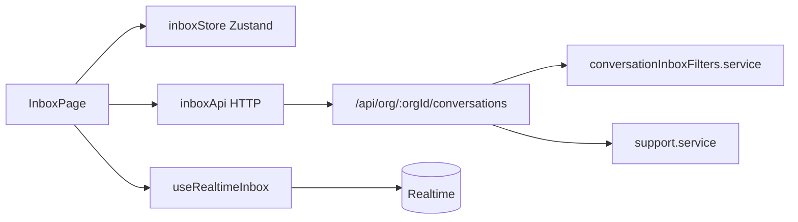

# Support inbox (conversations)

## Overview

Agents work customer issues in a **conversation-centric inbox**: list threads by filter, open a thread, change status/priority/assignment, and read/send messages (see [messages](./messages.md)).

## Capabilities

- CRUD-style conversation APIs with inbox filters and pagination
- Sidebar filters: your inbox, mentions, created by you, all, unassigned, spam, closed
- Per-filter counts; debounced refetch and short-lived cache
- Workspace fields: status, priority, assignment type (+ optional assignee member)
- Spam flag; auto-assign on select (client preference)
- `InboxPage` UI with list + thread + composer shell

## Architecture

## Key files

| Layer | Path |
|-------|------|
| Page | `client/src/pages/InboxPage.jsx` |
| Store | `client/src/stores/inboxStore.js` |
| Config | `client/src/config/inboxFilters.js` |
| API client | `client/src/services/inboxApi.js` |
| Sidebar | `client/src/components/InboxSidebar.jsx` |
| Controller | `server/src/controllers/conversations.controller.js` |
| Routes | `server/src/routes/conversations.routes.js` |
| Filters | `server/src/services/conversationInboxFilters.service.js` |
| Updates | `server/src/services/conversationUpdate.service.js` |
| Core data | `server/src/services/support.service.js` |
| Shared | `shared/src/conversationWorkspace.js`, `inboxSort.js`, `mentions.js` |
| Migrations | `20260507133000_conversation_core.sql`, `20260510140000_conversation_inbox_filters.sql`, `20260511120000_conversation_mentions_filter.sql`, `20260515120000_conversation_workspace_states.sql` |

## API

| Method | Path | Notes |
|--------|------|-------|
| GET | `.../conversations?filter=` | Paginated list |
| GET | `.../conversations/counts` | Sidebar badges |
| POST | `.../conversations` | Create thread |
| PATCH | `.../conversations/:id` | Status, priority, **assignment** (`assignedToMemberId`, `assignmentType`), `aiEnabled`, `tagIds` |
| PATCH | `.../conversations/:id/spam` | Spam bucket |
| GET | `.../conversations/:id/messages` | Thread history |
| GET | `.../conversations/members` | Assignee picker |
| GET/PUT | `.../assignment/settings` | Org assignment toggles + strategy (**ADMIN**) — Sprint 7 |
| GET/PUT | `.../assignment/agents/:memberId` | Agent routing profile + skills (**ADMIN**) — Sprint 1 |
| GET | `.../assignment/metrics` | Ops metrics — latency, fallback %, fairness, queue (Sprint 8) |
| GET | `.../assignment/conversations/:id/audit` | Latest `assignment_logs` row for inbox badge (Sprint 7) |
| POST | `.../assignment/preview` | Eligible agents + drop reasons (rate-limited per org, Sprint 8) |

## Database

- `conversations` — `status`, `priority`, `assignment_type`, `assigned_to_member_id`, `metadata` (mentions), `last_message_at`, `channel_type`, `channel_id`
- Constraint: one open conversation per customer (email/web)
- RPC/index migrations for active-thread performance

## Connections

| Feature | Relationship |
|---------|----------------|
| [Messages](./messages.md) | Thread content and outbound send |
| [Realtime](./realtime.md) | Live list/thread updates |
| [Multi-channel](./multi-channel.md) | Each conversation bound to one channel |
| [Multi-organization](./multi-organization.md) | All queries scoped by `organization_id` |
| [Notifications](./notifications-and-automation.md) | Assignment changes enqueue `notify.assignment` |
| [Auto assignment](./auto-assignment-sprint.md) | `assignment_logs` on PATCH assign; Settings → Assignment UI; audit hint in conversation details |
| [Workflow automation](./workflow-automation.md) | `set_assignment` = explicit target; auto-route scores agents after rules |
| [Analytics](./analytics-and-reports.md) | Lifecycle events via `conversationUpdate.service` |
| [AI capabilities](./ai-capabilities.md) | `assigned_to_ai`, Copilot tab *(partial)* |

## Status

**Complete** for agent inbox workflows. Search across conversations is *(partial)* — see [search](./search.md).
