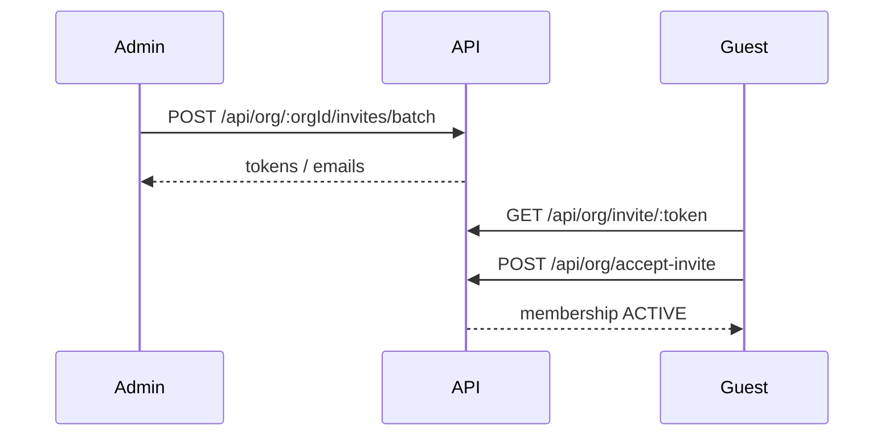

# Team invitations & membership

## Overview

**Admins** invite teammates by email. Invitees preview the invite (public), register or sign in, and accept to gain `organization_members` access on the **existing** workspace only (no new `organizations` or `super_organizations` row for the invitee).

## Capabilities

- Single and batch invite creation with **transactional invite email** (Resend via `NOTIFICATION_RESEND_API_KEY` / `NOTIFICATION_EMAIL_FROM`)
- Rejects invites for emails that are **already ACTIVE teammates** or have a **pending invite** in the same org
- List pending invites (settings + API)
- Public preview by token (no auth)
- Accept invite (authenticated)
- Teammates UI: search members, invite form, deep links
- **Permission roles** — Admins create named templates on Teammates → Roles; invite flow picks a template (read-only) or **Custom** (editable). On accept, capabilities are stored on **`organization_members.permissions`**; `inbox_members` rows (when inboxes are selected) are queue membership only.
- Pending token in `localStorage` across register/login

## Architecture

## Key files

| Layer | Path |
|-------|------|
| Pages | `client/src/pages/InvitePage.jsx`, `OrgTeammatesPage.jsx`, `OrgInviteTeammatesPage.jsx`, `OrgInviteTeammatePermissionsPage.jsx`, `TeammatesInviteDeepLink.jsx` |
| Roles UI | `client/src/components/settings/OrgTeammateRolesPanel.jsx` |
| Roles API | `server/src/services/orgTeammatePermissionRoles.service.js` |
| Utils | `client/src/utils/pendingInviteStorage.js`, `parseInviteEmails.js` |
| Service | `server/src/services/org.service.js` (`createInviteRecord`, `acceptInviteForUser`, …) |
| Invite email | `server/src/services/orgInviteEmail.service.js` → `internalNotificationMail.service.js` |
| Controller | `server/src/controllers/org.controller.js` |
| Routes | `server/src/routes/org.routes.js`, `orgWorkspace.routes.js` (invite endpoints) |
| Schema | `invites.permissions` (pending); `organization_members.permissions` (on accept); `20260601140000_organization_members_permissions.sql`; `org_teammate_permission_roles` (templates) |
| Repair SQL | `supabase/scripts/repair-invite-inbox-schema.sql` — run in Supabase SQL Editor if invites fail with missing `inbox_id` / `permissions` in schema cache |

## API

| Method | Path | Auth | Role |
|--------|------|------|------|
| POST | `/api/org/:orgId/invite` | Yes | ADMIN |
| POST | `/api/org/:orgId/invites/batch` | Yes | `team.invite` | `inboxIds` when org has team inboxes (workspace-only invite if none), `permissions` |
| GET | `/api/org/:orgId/invites` | Yes | Member |
| GET | `/api/org/invite/:token` | No | — |
| POST | `/api/org/accept-invite` | Yes | — |
| GET | `/api/org/:orgId/members` | Yes | Member |
| GET | `/api/org/:orgId/teammate-permission-roles` | Yes | Member |
| POST/PATCH/DELETE | `/api/org/:orgId/teammate-permission-roles` | Yes | ADMIN |

## Connections

| Feature | Relationship |
|---------|----------------|
| [Multi-organization](./multi-organization.md) | Invites tied to `organization_id`; `requireRole('ADMIN')` |
| [Onboarding](./onboarding-and-registration.md) | New org flow may create invites; register respects pending token |
| [Support inbox](./support-inbox.md) | `GET .../conversations/members` lists assignable agents |
| [Authentication](./authentication.md) | Accept requires logged-in user matching invite email rules |

## Status

**Complete** for invite lifecycle and teammates settings UI.
