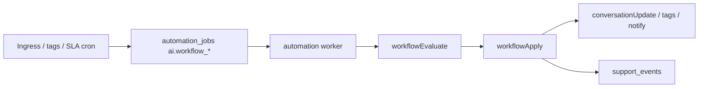

# Workflow automation (Phase 4)

## Overview

Org-scoped **deterministic routing rules** run on the automation worker after classification, tag changes, SLA breaches, and scheduled scans. Rules can change assignment, priority, tags, and staff notifications — **not** customer-visible AI sends (Phase 6).

## Capabilities

- Triggers: `inbound_message`, `sla_warning`, `tag_added`, `schedule`
- Actions: `set_assignment`, `set_priority`, `add_tag`, `notify`, `assign_to_ai`, `enqueue_phase6` (always skipped until Phase 6)
- Admin UI: **Settings → Workflow rules** — enable/order rules, JSON conditions/actions, dry-run, test email, queue metrics
- Inbox segments: SLA risk, spam flagged, AI intent filter; list badges from `metadata.ingress` / `metadata.ai`
- Ops: `GET .../ai/workflows/metrics`, `support_events` (`workflow.action_*`), structured `workflow` logs

## Architecture

## Key files

| Layer | Path |
|-------|------|
| Rules schema | `shared/src/workflowRules.js` |
| Evaluate / apply | `server/src/services/ai/workflowEvaluate.service.js`, `workflowApply.service.js` |
| Persistence | `server/src/services/ai/workflowRules.service.js` |
| Gates | `server/src/services/ai/workflowAiGates.service.js` |
| Metrics | `server/src/services/ai/workflowMetrics.service.js` |
| API | `server/src/routes/orgWorkflow.routes.js` |
| UI | `client/src/pages/OrgWorkflowSettingsPage.jsx` |

## API (`/api/org/:orgId/ai/workflows`)

| Method | Path | Auth | Purpose |
|--------|------|------|---------|
| GET | `/rules` | Member | Load rules + schedule |
| PUT | `/rules` | ADMIN | Save rules + schedule |
| GET | `/metrics` | Member | Queue depth + event counts |
| POST | `/dry-run` | Member | Simulate match (no mutations) |
| POST | `/test-notification` | ADMIN | Test staff email path |

Org toggles: `PATCH .../settings/ai` — `workflow_automation_enabled`, `ai_enabled`, `autonomous_replies_enabled` (Phase 6 only).

## Database

- Rules: `organizations.settings.workflow` (JSONB)
- Jobs: `automation_jobs` (`ai.workflow_inbound`, `ai.workflow_tag_added`, `ai.workflow_sla`, `ai.workflow_schedule_org`)
- Events: `support_events` (`workflow.action_applied`, `workflow.action_skipped`, `workflow.action_failed`, …)

## Connections

| Feature | Relationship |
|---------|----------------|
| [Org AI settings](./org-ai-settings.md) | Master switches and link to workflow UI |
| [Notifications and automation](./notifications-and-automation.md) | Worker queue, `notify` actions |
| [Analytics and reports](./analytics-and-reports.md) | Overview includes workflow KPIs |
| [Support inbox](./support-inbox.md) | Phase 4 inbox filters and badges |
| [Phase 4 sprints](../ai-features/phase-4-sprint.md) | Implementation breakdown |

## Status

**Phase 4 complete** (Sprints 0–6). Phase 6 autonomous outbound remains disabled; `enqueue_phase6` is a guarded no-op.
